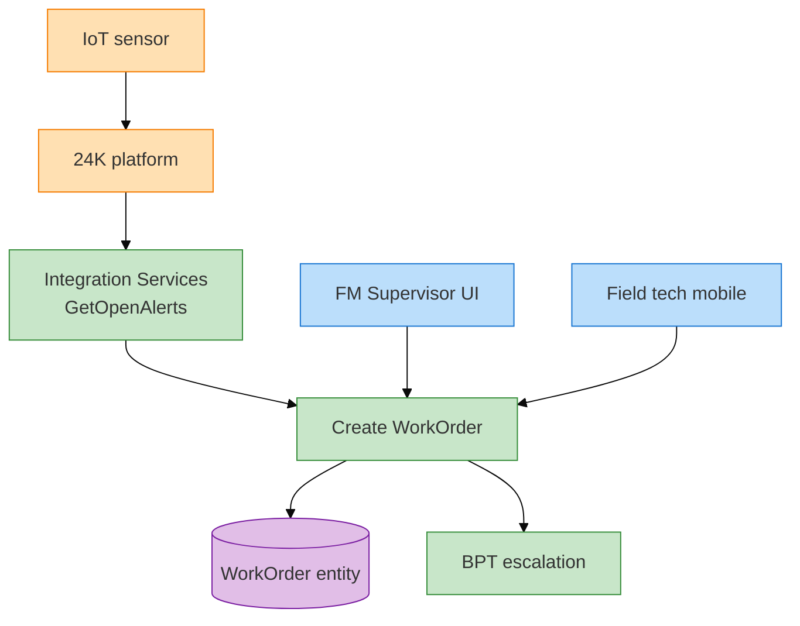

# Day 2 — Interview prep & mock scenarios (Surbana Jurong)

---

## 60–90 minute interview agenda (typical Senior)

| Block | ~min | What they test |
|-------|------|----------------|
| Intro + CV deep dive | 8–10 | 3+ years OSE, enterprise, SJ fit |
| System design whiteboard | 15–20 | 24K + OutSystems — **not replace core** |
| Platform technical | 15 | Entity, REST, aggregate, BPT |
| Code review scenario | 10 | Spot anti-patterns |
| Production / troubleshooting | 10 | Performance, integration down |
| Agile + documentation | 5 | Scrum, spec quality |
| Your questions | 5–10 | Squad, roadmap, Azure |

---

## Whiteboard case 1 — FM campus + 24K (primary)

**Prompt:** "University campus uses 24K for IoT. Design FM work order system on OutSystems."

### Expected flow (draw this)



**Say out loud (English):**

1. **24K stays system of record** for telemetry; OutSystems holds operational WO subset.  
2. **Integration Services** — one REST module, all apps consume.  
3. **SiteId security** on every aggregate.  
4. **Idempotency** on SourceAlertId.  
5. **Phasing:** Foundation → MVP portal → mobile → client read-only.  

Refs: [`docs/03-to-be-architecture.md`](docs/03-to-be-architecture.md), [`docs/04-as-is-to-be-summary.md`](docs/04-as-is-to-be-summary.md)

---

## Whiteboard case 2 — Multi-tenant client portal

**Prompt:** "Two campus clients on same OutSystems install — how prevent data leak?"

**Answer skeleton:**

- `Site` entity + `SiteUser` mapping  
- `GetSiteIdForUser()` in **every** aggregate filter  
- Roles: `ClientReadOnly` scoped to site  
- Code review checklist item  
- Test: user A must never see site B asset count  

---

## Code review scenario (verbal)

Pseudo-action with bugs — find 5+: [`interview/01-senior-round-prep.md`](interview/01-senior-round-prep.md) §3

Practice saying fixes in **priority order** (security first).

---

## Production troubleshooting scenario

**Prompt:** "Work order list timeout for one campus only after release."

Structured answer: [`interview/01-senior-round-prep.md`](interview/01-senior-round-prep.md) §4

Keywords: SiteId, data volume spike, missing pagination, index, alert storm.

---

## STAR stories — templates (fill your experience)

### Story A — Integration failure

| | |
|--|--|
| **S** | Vendor API changed response; FM alerts stopped creating work orders |
| **T** | Restore within SLA; no duplicate tickets |
| **A** | Error mapping, idempotency check, manual reconcile screen, APIM contract test |
| **R** | MTTR X hours; zero duplicate WOs |

### Story B — Performance / mentoring

| | |
|--|--|
| **S** | Junior's aggregate fetched all columns + 50k rows |
| **T** | Fix before client UAT in 2 days |
| **A** | Code review, pagination pattern doc, pair session |
| **R** | Load 28s → 1.8s; reused on second SJ-style app |

Map to SJ: "Same pattern I'd apply on asset list for campus FM."

---

## 20 câu practice — pick random (2 ngày)

From [`interview/02-practice-questions.md`](interview/02-practice-questions.md):

| # | Topic | Must answer |
|---|-------|-------------|
| 1 | OutSystems runtime stack | §A.1 |
| 10 | OSE on top of 24K | §A.10 |
| 17 | Paginated REST alerts | §C.17 |
| 19 | HTTP 429 handling | §C.19 |
| 27 | 100k work orders list | §D.27 |
| 31 | BPT vs timer | §E.31 |
| 38 | SiteId security | §F.38 |
| 49 | What is 24K | §H.49 |
| 51 | Alert → WO pain | §H.51 |

---

## Mock 45 phút (self-run)

1. **Pitch EN** — 90s from [`README.md`](README.md)  
2. **Whiteboard** case 1 — 12 min  
3. **Technical** — "Walk through GetOpenAlerts server action" — 8 min  
4. **Code review** — 8 min  
5. **STAR** one story — 5 min  
6. **Your questions** — 3 min ([`interview/01-senior-round-prep.md`](interview/01-senior-round-prep.md) §7)  
7. **Debrief** — ghi 3 weak points  

---

## Questions to ask SJ (show research)

1. How is OutSystems positioned vs 24K for **client delivery** vs internal tools?  
2. Current OSE squad size — mentoring expectation for associates?  
3. Standard stack: Azure APIM + AD already in place?  
4. Typical engagement: fixed price FM portal or multi-tenant product?  
5. Next 12 months for Surbana Technologies digital revenue?  

---

## Red flags to avoid

- "Replace 24K with OutSystems database"  
- Ignore multi-tenant SiteId  
- "Low-code = no code review"  
- No mention of documentation / SDLC  
- Cannot explain one performance fix  

---

## Demo flow (if interviewer asks "show something")

**ODC:**

1. Open published app URL (`*.outsystems.app`)  
2. WorkOrderList — open tickets  
3. AlertConsole — CRITICAL alert (mock via ngrok)  
4. Create WO → show on list  
5. Portal → **Deliver → Deployments** + **Monitor → Logs** (senior touch)  

**O11:** Same screens + Service Center publish time.

Backup: screenshots if environment unreachable.

---

## Night before checklist

```text
[ ] PE awake + app published
[ ] mock-server tested OR explain ngrok
[ ] Pitch EN recorded once
[ ] To-Be diagram sketched on paper
[ ] 2 STAR stories written
[ ] Business numbers: ~S$2.3B, 16k staff, partner 2018
[ ] Clothes / link / Teams ready
```

---

## Pitch one-liner (English)

> "I standardize Surbana Jurong's client and field experience on OutSystems while integrating responsibly with 24K — the same full SDLC rigor I apply to performance, security, and code review."

Spec depth reference: [`samples/rest-integration-24k-iot.spec.md`](samples/rest-integration-24k-iot.spec.md)
