# OutSystems Senior — Prep 7 ngày (Surbana Jurong)

**Gấp 2 ngày?** Dùng [`OUTSYSTEMS-SENIOR-Sach-2-Ngay.md`](OUTSYSTEMS-SENIOR-Sach-2-Ngay.md) — gộp business + arch + lab + mock vào 48h.

**Giả định:** Bạn có **≥3 năm OutSystems** hoặc mạnh full-stack + 1 năm OSE — cần **depth senior** (architecture, review, production).

**Sơ đồ màu (dev env + lộ trình practice):** [`resources/dev-environment-and-practice-diagrams.md`](resources/dev-environment-and-practice-diagrams.md)

---

## Tổng quan — 7 ngày (visual)

```mermaid
%%{init: {'theme': 'base', 'themeVariables': {'fontSize': '11px'}}}%%
flowchart LR
    classDef d1 fill:#ffcdd2,stroke:#c62828,color:#b71c1c
    classDef d2 fill:#ffe0b2,stroke:#ef6c00,color:#e65100
    classDef d3 fill:#fff9c4,stroke:#f9a825,color:#f57f17
    classDef d4 fill:#dcedc8,stroke:#689f38,color:#33691e
    classDef d5 fill:#c8e6c9,stroke:#388e3c,color:#1b5e20
    classDef d6 fill:#b2dfdb,stroke:#00796b,color:#004d40
    classDef d7 fill:#bbdefb,stroke:#1976d2,color:#0d47a1

    D1["1 Business"]:::d1 --> D2["2 Arch"]:::d2 --> D3["3 FM lab"]:::d3
    D3 --> D4["4 REST"]:::d4 --> D5["5 BPT"]:::d5 --> D6["6 Senior"]:::d6 --> D7["7 Mock"]:::d7
```



---

## Tổng quan

| Ngày | Chủ đề | Giờ | Deliverable |
|------|--------|-----|-------------|
| 1 | Business SJ + JD | 3h | Pitch EN 90s + 3 pain points |
| 2 | As-Is / To-Be | 3h | 3 diagram vẽ tay |
| 3 | Entity + FM portal lab | 4h | Mini-app trên Personal Env |
| 4 | REST 24K mock | 4h | Integration consumer hoạt động |
| 5 | BPT IoT escalation | 4h | Human task + timer |
| 6 | Performance, security, Lifetime | 3h | Cheat sheet senior |
| 7 | Mock interview | 3h | 2 whiteboard + Q&A |

---

## Day 1 — Business & JD (3h)

| Block | Nội dung | File |
|-------|----------|------|
| 0:00–1:00 | SJ business model, revenue, pain | `docs/01-business-context.md` |
| 1:00–1:30 | Map JD → proof points | `interview/03-jd-mapping.md` |
| 1:30–2:00 | Viết pitch EN + VI (ghi âm 90s) | `README.md` |
| 2:00–3:00 | Đọc partner page + 24K Azure listing | Links in `01-business-context.md` §9 |

**Output:** Trả lời được "Why SJ? Why OutSystems Senior now?"

---

## Day 2 — Architecture (3h)

| Block | Nội dung | File |
|-------|----------|------|
| 0:00–1:00 | As-Is silos + 24K role | `docs/02-as-is-architecture.md` |
| 1:00–2:00 | To-Be OutSystems layer | `docs/03-to-be-architecture.md` |
| 2:00–2:30 | Summary table | `docs/04-as-is-to-be-summary.md` |
| 2:30–3:00 | **Whiteboard drill:** vẽ As-Is và To-Be không nhìn notes |

**Output:** 5-phút architecture narrative.

---

## Day 3 — FM Work Order lab (4h)

**Setup:** Personal Environment + Service Studio — xem `resources/free-hands-on.md`.

| Block | Task |
|-------|------|
| 0:00–0:30 | Đọc spec | `samples/entity-model-facility-asset.spec.md` |
| 0:30–2:00 | Tạo entities, static entities, 1 list screen |
| 2:00–3:30 | Work order create + assign server actions | `samples/work-order-fm-portal.spec.md` |
| 3:30–4:00 | Publish + test 2 roles (mock users) |

**Output:** App `FMWorkOrderLab` published.

---

## Day 4 — REST integration (4h)

| Block | Task |
|-------|------|
| 0:00–0:30 | Start mock API | `resources/mock-24k-alerts.json` + json-server |
| 0:30–1:00 | Đọc spec | `samples/rest-integration-24k-iot.spec.md` |
| 1:00–3:00 | REST API + structures + `GetOpenAlerts` server action |
| 3:00–4:00 | Screen "Alert Console" + create work order from alert |

**Output:** End-to-end alert → work order (mock).

---

## Day 5 — BPT escalation (4h)

| Block | Task |
|-------|------|
| 0:00–1:00 | Đọc spec | `samples/iot-alert-escalation-bpt.spec.md` |
| 1:00–3:00 | BPT: assign → acknowledge → escalate timer |
| 3:00–4:00 | Audit log entity + test escalation path |

**Output:** Demo escalation khi technician không acknowledge trong 30 phút (configurable).

---

## Day 6 — Senior topics (3h)

| Block | Topic | Reference |
|-------|-------|-----------|
| 0:00–0:45 | Performance: aggregates, indexes, pagination | `docs/03-to-be-architecture.md` §5 |
| 0:45–1:30 | Security: RBAC, SiteId filter, secrets | Same + `interview/02-practice-questions.md` §Security |
| 1:30–2:15 | Lifetime, environments, code review checklist | `interview/01-senior-round-prep.md` |
| 2:15–3:00 | Mobile inspection patterns | `samples/project-inspection-mobile.spec.md` |

**Output:** 1-page cheat sheet (tự viết) — 10 senior talking points.

---

## Day 7 — Mock interview (3h)

| Block | Activity |
|-------|----------|
| 0:00–1:00 | Whiteboard: "Design FM portal for campus client" |
| 1:00–2:00 | Q&A random 20 câu | `interview/02-practice-questions.md` |
| 2:00–3:00 | Behavioral STAR + "code review scenario" | `interview/01-senior-round-prep.md` |

---

## Mapping: 7 ngày ↔ 2 ngày

| 7 ngày | Gộp vào 2 ngày |
|--------|----------------|
| Day 1–2 | **Day 1 sáng** — business + architecture |
| Day 3 | **Day 1 chiều** — FM lab |
| Day 4 | **Day 2 sáng** — REST lab |
| Day 5 | **Day 2 trưa** — BPT đọc / optional build |
| Day 6–7 | **Day 2 chiều** — senior + mock interview |

---

## Optional stretch (nếu có thêm thời gian sau 2 ngày)

- Learn ODC: hoàn thành **Becoming a web developer** (còn lesson sau Day 3 lab) — [`resources/odc-web-developer-path.md`](resources/odc-web-developer-path.md)  
- Forge: install chart component for FM KPI dashboard  
- Learn path: **Integration** + **Processes** (BPT) ngoài Web Developer path  
- Đọc case NTU Omnibus (OutSystems + campus) — analogy cho SJ IHL clients  
- SQL tuning lab: `samples/reference/sql_asset_maintenance_queries.sql`  

---

## Đọc nhanh 90 phút (phỏng vấn ngày mai)

Xem [`OUTSYSTEMS-SENIOR-Sach-2-Ngay.md`](OUTSYSTEMS-SENIOR-Sach-2-Ngay.md) — mục **Đọc nhanh nếu chỉ còn 90 phút**.

---

## Checklist trước phỏng vấn (2 ngày)

```text
[ ] Pitch EN 90s — thuộc
[ ] Vẽ To-Be architecture trong 3 phút
[ ] Demo Personal Env app (FM + REST mock)
[ ] Giải thích 1 performance optimization cụ thể
[ ] Giải thích SiteId multi-tenant security
[ ] 2 STAR stories (integration failure + recovery)
[ ] Câu hỏi cho interviewer về 24K roadmap & squad size
```
