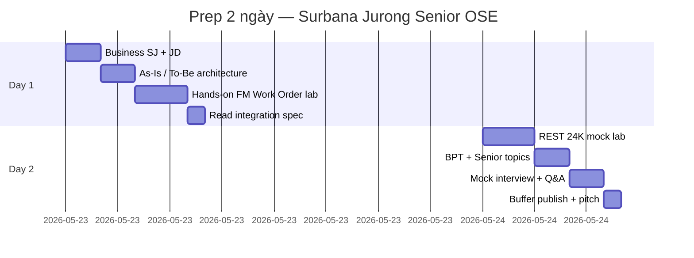

# OutSystems Senior — Sách 2 ngày (Surbana Jurong)

**Giả định:** ~7–8 giờ/ngày. Bạn có **≥3 năm IT** và **OutSystems thực chiến hoặc full-stack mạnh** — cần **nói được SJ business + demo FM app** trước phỏng vấn gấp.

> **7 ngày đầy đủ?** Xem [`OUTSYSTEMS-SENIOR-Prep-7-Ngay.md`](OUTSYSTEMS-SENIOR-Prep-7-Ngay.md) khi có thêm thời gian.

---

## Tổng quan

| Ngày | Sáng (3–4h) | Chiều (3–4h) | Tối (1h) |
|------|-------------|--------------|----------|
| **1** | Business + Architecture | Lab FM portal | Spec REST 24K |
| **2** | REST + Alert → WO | BPT + senior cheat sheet | Mock + pitch EN |

---

## Day 0 (30 phút — trước khi ngủ)

**ODC (bạn đã login portal):**

- [x] ODC portal — Apps page
- [ ] [`resources/odc-studio-quickstart.md`](resources/odc-studio-quickstart.md) — đọc 10 phút
- [ ] **Download ODC Studio** → cài → Sign in
- [ ] **Create → App → Web** → `FMWorkOrderHub` → Publish lần đầu
- [ ] `node resources/mock-server.js` — test local: `http://localhost:3000/sites/SIN-CAMPUS-01/alerts?status=OPEN`
- [ ] (Day 2) Cài **ngrok** — REST từ ODC cloud cần URL public
- [ ] Bookmark [Surbana Technologies — OutSystems Partner](https://www.outsystems.com/partners/surbana-technologies-pte-ltd/)

**O11 (optional):** Service Studio + PE — [`resources/free-hands-on.md`](resources/free-hands-on.md)

---

## Day 1 — Business, architecture & FM lab

### 08:00–09:00 | Business SJ (rút gọn)

| Việc | File | Chỉ đọc |
|------|------|---------|
| Business model + revenue | `docs/01-business-context.md` | §1–4 |
| Pain points + KPI | same | §4, §7 |
| JD map nhanh | `interview/03-jd-mapping.md` | One-page cheat sheet cuối file |

**Ghi 3 câu (notebook):**

1. SJ kiếm tiền chủ yếu từ gì? → **Consulting/PMC ~75–85%**, digital ~3–8% đang tăng  
2. 24K / OMNI làm gì? → **Data/IoT/twin** — OutSystems **không thay**  
3. Vì sao hire Senior OSE? → **Experience layer phân mảnh**, bench nhỏ, cần governance  

**Output:** Trả lời "Why Surbana Jurong?" trong 60 giây.

---

### 09:00–11:00 | Architecture (As-Is → To-Be)

| Việc | File |
|------|------|
| As-Is silos + 24K | `docs/02-as-is-architecture.md` — §1–4 |
| To-Be OutSystems layer | `docs/03-to-be-architecture.md` — §1–4 |
| Bảng so sánh 1 trang | `docs/04-as-is-to-be-summary.md` — full |

**Drill (30 phút):** Vẽ **không nhìn notes**:

1. Users → OutSystems apps → Integration Services → APIM → 24K  
2. 4-layer: Presentation / Business / Domain / Integration  
3. Alert flow: IoT → 24K → REST → Work Order → BPT  

**Output:** Whiteboard 5 phút — nói tiếng Anh.

---

### 11:00–12:00 | IDE warm-up

| Việc | Where |
|------|-------|
| ODC Studio — mở `FMWorkOrderHub`, tour Data / Logic / Interface | ODC Studio |
| Portal — click **INTEGRATE → Connections** (sẽ dùng Day 2) | ODC portal |
| Learn — Integration path (skim) | learn.outsystems.com |

---

### 13:00–16:00 | Hands-on Lab Day 1

Follow: [`03-day1-hands-on-lab.md`](03-day1-hands-on-lab.md)

| Milestone | Done? |
|-----------|-------|
| App `FMWorkOrderHub` published | ☐ |
| Entities Site/Building/Asset/WorkOrder + static Status/Priority | ☐ |
| WorkOrderList + CreateWorkOrder server action | ☐ |
| Role `FM_Supervisor` vs `FieldTech` (basic) | ☐ |

Spec: `samples/entity-model-facility-asset.spec.md` + `samples/work-order-fm-portal.spec.md`

---

### 19:00–20:00 | Spec đọc trước Day 2

- `samples/rest-integration-24k-iot.spec.md` — structures + error mapping  
- Viết 5 bullet: "Senior Dev tôi sẽ làm gì khác Associate?" (code review, integration standards, …)

---

## Day 2 — Integration, senior depth & mock interview

### 08:00–11:00 | Hands-on Lab Day 2

Follow: [`03-day1-hands-on-lab.md`](03-day1-hands-on-lab.md) §Part B + [`04-day2-interview-prep.md`](04-day2-interview-prep.md)

**Terminal:** `node resources/mock-server.js` (giữ chạy)

| Milestone | Done? |
|-----------|-------|
| REST API + structures AlertList / Alert | ☐ |
| Server action `GetOpenAlerts` | ☐ |
| Screen AlertConsole → CreateWorkOrderFromAlert | ☐ |
| Idempotency: không tạo 2 WO cùng SourceAlertId | ☐ |

---

### 11:00–12:00 | BPT + senior (theory — không bắt buộc build hết)

| Việc | File | Thời gian |
|------|------|-----------|
| Đọc BPT escalation diagram | `samples/iot-alert-escalation-bpt.spec.md` | 25 min |
| Performance + security §5 | `docs/03-to-be-architecture.md` | 20 min |
| Code review scenario | `interview/01-senior-round-prep.md` §3 | 15 min |

**Nếu còn 30 phút:** Start BPT `AlertEscalationProcess` — timer 30 phút (optional).

---

### 13:00–14:00 | Senior cheat sheet (tự viết 1 trang)

Phải thuộc 10 điểm:

1. OutSystems **on top of** 24K — không replace  
2. Integration Services module pattern  
3. SiteId row-level security  
4. Aggregate pagination — không fetch 100k rows  
5. Secrets in module config  
6. Idempotency SourceAlertId  
7. Lifetime DEV→PRD concept  
8. Azure AD + APIM (preferred JD)  
9. Audit WorkOrderEvent  
10. Agile DoD: spec + review + UAT script  

Tham khảo: `interview/02-practice-questions.md` §F

---

### 14:00–16:00 | Mock interview 90 phút

Follow: [`04-day2-interview-prep.md`](04-day2-interview-prep.md)

| Block | min |
|-------|-----|
| Pitch EN 90s | 3 |
| Whiteboard FM campus + 24K | 15 |
| Technical — REST errors, aggregate perf | 15 |
| Code review pseudo-action | 10 |
| STAR × 2 | 10 |
| Practice Q&A — pick 15 câu | 25 |
| Your questions for SJ | 5 |
| Debrief — weak spots | 7 |

---

### 19:00–20:00 | Buffer

- [ ] Wake Personal Environment (nếu sleep)  
- [ ] Publish lại app — screenshot Service Center  
- [ ] Thuộc pitch `README.md` (EN + VI)  
- [ ] Đọc NTU Omnibus case 1 lần — [OutSystems case study](https://www.outsystems.com/case-studies/ntu-singapore-mobile-campus-experience/)  

---

## Knowledge checklist (cuối ngày 2)

| Chủ đề | Tự tin 1–5 |
|--------|------------|
| SJ business + 24K/OMNI division | |
| As-Is → To-Be whiteboard | |
| Entity / Static Entity / Aggregate | |
| Server action + audit pattern | |
| REST consume + error mapping | |
| SiteId multi-tenant security | |
| BPT escalation concept | |
| Performance pagination + index | |
| Code review findings (5 bugs) | |
| Pitch EN 90s | |

---

## Đọc nhanh nếu chỉ còn 90 phút

| Phút | File |
|------|------|
| 0–20 | `docs/01-business-context.md` §1–4 |
| 20–45 | `docs/04-as-is-to-be-summary.md` |
| 45–60 | `README.md` pitch + `interview/03-jd-mapping.md` cheat sheet |
| 60–75 | `samples/rest-integration-24k-iot.spec.md` |
| 75–90 | `interview/01-senior-round-prep.md` whiteboard §2 |

---

## Nếu JD nhấn mạnh…

| JD keyword | Ưu tiên thêm (trong 2 ngày) |
|------------|----------------------------|
| **Senior / lead** | Code review §, mentoring STAR, Architecture Canvas |
| **Azure** | `docs/03` §7 — APIM, AD, IoT Hub — nói được |
| **Mobile** | `samples/project-inspection-mobile.spec.md` — 30 min đọc |
| **Documentation** | Chỉ vào `samples/` format làm chuẩn |
| **SQL** | `samples/reference/sql_asset_maintenance_queries.sql` — 2 queries explain |

---

## Pitch closing (English, 20s)

> "In two days I've aligned Surbana Jurong's built-environment platforms with a concrete OutSystems delivery model — FM work orders on a governed integration layer into 24K — and I can whiteboard, demo, and lead that pattern from week one."

---

## Pitch closing (Tiếng Việt, 20s)

> "Trong hai ngày tôi đã nắm business SJ, kiến trúc As-Is/To-Be, và dựng lab FM tích hợp mock 24K — sẵn sàng vào vai Senior: thiết kế app, chuẩn hóa REST, và nâng chất lượng code review cho team."
