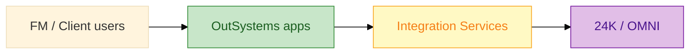

# Senior OutSystems Prep Book

**A 2-day technical book** for **Senior OutSystems Developer** interviews — two practice tracks on **ODC / O11**, shared resources, specs, and interview prep.

[](LICENSE)

---

## Two tracks — pick one interview

| Track | Context | Hands-on app | Start here |
|-------|---------|--------------|------------|
| **FM / built environment** | Surbana Jurong — **24K**, **OMNI** | `FMWorkOrderHub` | [BOOK.md](BOOK.md) → [OUTSYSTEMS-SENIOR-Sach-2-Ngay.md](OUTSYSTEMS-SENIOR-Sach-2-Ngay.md) |
| **Banking** | Client bid, core banking + ERP integration | `OnlineBankingApp` / `BranchQueue` | [banking/README.md](banking/README.md) → [banking/OUTSYSTEMS-DEV-Sach-2-Ngay.md](banking/OUTSYSTEMS-DEV-Sach-2-Ngay.md) |

Shared ODC setup: [resources/odc-studio-quickstart.md](resources/odc-studio-quickstart.md) · [resources/odc-web-developer-path.md](resources/odc-web-developer-path.md)

---

## What this is

| | |
|--|--|
| **Format** | Markdown “book” — business → architecture → labs → specs → interview |
| **Timeline** | **2 days** (main) · [7 days](OUTSYSTEMS-SENIOR-Prep-7-Ngay.md) (extended, FM track) |
| **Not included** | `.oml` files, proprietary client code — you implement from specs |

**FM track start:** [BOOK.md](BOOK.md) → [OUTSYSTEMS-SENIOR-Sach-2-Ngay.md](OUTSYSTEMS-SENIOR-Sach-2-Ngay.md)  
**Banking track start:** [banking/README.md](banking/README.md)

---

## Quick start

```bash
git clone https://github.com/willtran112358/senior-outsystems-prep-book.git
cd senior-outsystems-prep-book
```

1. Open [resources/odc-studio-quickstart.md](resources/odc-studio-quickstart.md) — you’re on ODC portal  
2. Enroll Learn **Becoming a web developer** — [resources/odc-web-developer-path.md](resources/odc-web-developer-path.md) maps lessons ↔ labs  
3. **Visual map:** [resources/dev-environment-and-practice-diagrams.md](resources/dev-environment-and-practice-diagrams.md) — ODC topology, 7-day practice, senior pillars  
4. **Create → App → Web** → `FMWorkOrderHub` → Publish  
5. Mock API: `node resources/mock-server.js` (+ [ngrok](resources/free-hands-on.md) for ODC REST)  
6. Follow [03-day1-hands-on-lab.md](03-day1-hands-on-lab.md)

---

## Book structure

```
senior-outsystems-prep-book/
├── BOOK.md                          ← FM track TOC
├── OUTSYSTEMS-SENIOR-Sach-2-Ngay.md ← FM 2-day storyline
├── banking/                         ← Banking track (Savannah GA / core banking)
│   ├── README.md
│   ├── OUTSYSTEMS-DEV-Sach-2-Ngay.md
│   ├── 03-day1-hands-on-lab.md
│   └── samples/
├── docs/                            ← FM business & architecture
├── samples/                         ← FM engineering specs
├── resources/                       ← Shared ODC guides, mock API, diagrams
└── interview/                       ← Senior round Q&A
```

---

## Who it’s for

- **Senior OutSystems Developer** candidates (3+ years OSE or strong full-stack + low-code)
- **FM track:** infrastructure / digital twin consultancies (e.g. Surbana Jurong — 24K, OMNI)
- **Banking track:** client-delivery roles — core banking, ERP, integration layer, mentoring juniors
- Developers using **ODC** or **O11 Personal Environment** for free practice

---

## Business snapshot (SJ context)

| Metric | ~Value (public, FY2024) |
|--------|-------------------------|
| Group revenue | ~S$2.3B |
| Headcount | ~16,000 |
| Digital platforms | **24K** (IoT/twin), **OMNI** (FM/BIM) |
| Your pitch angle | OutSystems = **governed experience layer** on top of 24K — not a replacement |

Details: [docs/01-business-context.md](docs/01-business-context.md)

---

## Architecture at a glance



- **Dev environment & practice (color diagrams):** [resources/dev-environment-and-practice-diagrams.md](resources/dev-environment-and-practice-diagrams.md)  
- As-Is vs To-Be: [docs/04-as-is-to-be-summary.md](docs/04-as-is-to-be-summary.md)

---

## Pitch (90s — English)

> "Surbana Jurong already owns strong operational platforms — 24K for digital twin and IoT, OMNI for facility lifecycle — but client-facing and field workflows still fragment across bespoke apps. As a Senior OutSystems developer, I'd standardize the experience layer: governed Reactive and mobile apps, reusable integration services into 24K and Azure IoT, and Agile delivery with code review and documentation so the team scales beyond a handful of certifications."

---

## Related

- [Surbana Technologies — OutSystems Partner](https://www.outsystems.com/partners/surbana-technologies-pte-ltd/)
- [OutSystems Learn](https://learn.outsystems.com/)
- [NTU Omnibus case study](https://www.outsystems.com/case-studies/ntu-singapore-mobile-campus-experience/) (campus FM analogy)

---

## License

MIT — see [LICENSE](LICENSE). Content is educational; verify employer-specific facts in your own interviews.
