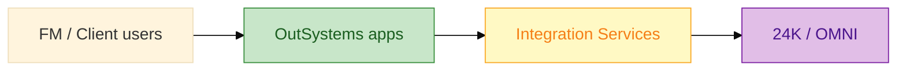

# Senior OutSystems Prep Book

**A 2-day technical book** to prepare for **Senior OutSystems Developer** interviews — written around **built environment / smart infrastructure** (Surbana Jurong context: **24K**, **OMNI**, **ODC**).

[](LICENSE)

---

## What this is

| | |
|--|--|
| **Format** | Markdown “book” — business → architecture → labs → specs → interview |
| **Timeline** | **2 days** (main) · [7 days](OUTSYSTEMS-SENIOR-Prep-7-Ngay.md) (extended) |
| **Hands-on** | Build `FMWorkOrderHub` on **OutSystems Developer Cloud (ODC)** + mock 24K REST API |
| **Not included** | `.oml` files, proprietary SJ code — you implement from specs |

**Start reading:** [BOOK.md](BOOK.md) (table of contents) → [OUTSYSTEMS-SENIOR-Sach-2-Ngay.md](OUTSYSTEMS-SENIOR-Sach-2-Ngay.md) (day-by-day schedule).

---

## Quick start

```bash
git clone https://github.com/willtran112358/senior-outsystems-prep-book.git
cd senior-outsystems-prep-book
```

1. Open [resources/odc-studio-quickstart.md](resources/odc-studio-quickstart.md) — you’re on ODC portal  
2. **Visual map:** [resources/dev-environment-and-practice-diagrams.md](resources/dev-environment-and-practice-diagrams.md) — ODC topology, 7-day practice, senior pillars  
3. **Create → App → Web** → `FMWorkOrderHub` → Publish  
4. Mock API: `node resources/mock-server.js` (+ [ngrok](resources/free-hands-on.md) for ODC REST)  
5. Follow [03-day1-hands-on-lab.md](03-day1-hands-on-lab.md)

---

## Book structure

```
senior-outsystems-prep-book/
├── BOOK.md                          ← Table of contents (start here)
├── OUTSYSTEMS-SENIOR-Sach-2-Ngay.md ← 2-day storyline
├── OUTSYSTEMS-SENIOR-Prep-7-Ngay.md ← Extended edition
├── 03-day1-hands-on-lab.md          ← Labs
├── 04-day2-interview-prep.md
├── docs/                            ← Part I–II: Business & architecture
├── samples/                         ← Part IV: Engineering specs
├── resources/                       ← ODC guide, mock API, **visual diagrams**
└── interview/                       ← Part V: Q&A & senior round
```

---

## Who it’s for

- **Senior OutSystems Developer** candidates (3+ years OSE or strong full-stack + low-code)
- Roles at **infrastructure / FM / digital twin** consultancies (e.g. Surbana Technologies — OutSystems partner since 2018)
- Developers using **ODC** or **O11 Personal Environment** for free practice

---

## Business snapshot (SJ context)

| Metric | ~Value (public, FY2024) |
|--------|-------------------------|
| Group revenue | ~S$2.3B |
| Headcount | ~16,000 |
| Digital platforms | **24K** (IoT/twin), **OMNI** (FM/BIM) |
| Your pitch angle | OutSystems = **governed experience layer** on top of 24K — not a replacement |

Details: [docs/01-business-context.md](docs/01-business-context.md)

---

## Architecture at a glance



- **Dev environment & practice (color diagrams):** [resources/dev-environment-and-practice-diagrams.md](resources/dev-environment-and-practice-diagrams.md)  
- As-Is vs To-Be: [docs/04-as-is-to-be-summary.md](docs/04-as-is-to-be-summary.md)

---

## Pitch (90s — English)

> "Surbana Jurong already owns strong operational platforms — 24K for digital twin and IoT, OMNI for facility lifecycle — but client-facing and field workflows still fragment across bespoke apps. As a Senior OutSystems developer, I'd standardize the experience layer: governed Reactive and mobile apps, reusable integration services into 24K and Azure IoT, and Agile delivery with code review and documentation so the team scales beyond a handful of certifications."

---

## Related

- [Surbana Technologies — OutSystems Partner](https://www.outsystems.com/partners/surbana-technologies-pte-ltd/)
- [OutSystems Learn](https://learn.outsystems.com/)
- [NTU Omnibus case study](https://www.outsystems.com/case-studies/ntu-singapore-mobile-campus-experience/) (campus FM analogy)

---

## License

MIT — see [LICENSE](LICENSE). Content is educational; verify employer-specific facts in your own interviews.
