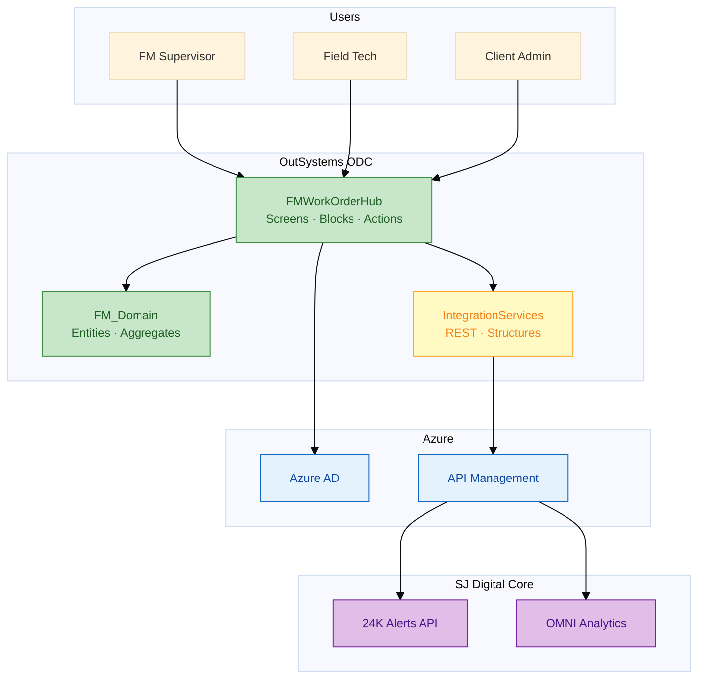

# FM Work Order Hub — OutSystems Solution Delivery

**Client programme:** Surbana Jurong (SJ) — FM client experience  
**Solution:** Governed OutSystems experience layer on **24K** / **OMNI**  
**Platform:** OutSystems Developer Cloud (ODC) · Reactive Web  
**Deliverable type:** Architecture, specifications, patterns, implementation guide

[](LICENSE)

---

## What this repository is

A **senior OutSystems engineer's solution delivery package** for the **FM Work Order Hub** programme — not interview prep. It documents the full stack from ODC platform layer through UI, data model, logic, REST integration, security, database, CI/CD, and hands-on build guidance.

| Deliverable | Location |
|-------------|----------|
| **Solution index** | [SOLUTION.md](SOLUTION.md) |
| **Architecture (12 chapters)** | [delivery/](delivery/) |
| **Engineering specifications** | [samples/](samples/) |
| **ODC setup & mock 24K API** | [resources/](resources/) |
| **Reference patterns (banking)** | [reference/banking/](reference/banking/) |

```bash
git clone https://github.com/willtran112358/fm-work-order-hub-outsystems.git
cd fm-work-order-hub-outsystems
```

---

## Solution at a glance



**Principle:** OutSystems = governed **experience layer** on top of 24K / OMNI — not a replacement.

---

## Quick start (implement the solution)

1. Read [delivery/01-solution-overview.md](delivery/01-solution-overview.md)  
2. ODC setup: [resources/odc-studio-quickstart.md](resources/odc-studio-quickstart.md)  
3. Visual atlas: [delivery/12-diagrams-atlas.md](delivery/12-diagrams-atlas.md)  
4. Build guide: [delivery/11-fm-work-order-hub-guide.md](delivery/11-fm-work-order-hub-guide.md)  
5. Mock API: `node resources/mock-server.js` (+ ngrok for ODC)

---

## Architecture coverage

| Topic | Chapter |
|-------|---------|
| ODC platform layer, publish, environments | [delivery/02-odc-platform-layer.md](delivery/02-odc-platform-layer.md) |
| Screens, blocks, containers, layouts | [delivery/03-ui-screens-blocks.md](delivery/03-ui-screens-blocks.md) |
| Entities, aggregates, fetch on demand | [delivery/04-data-model-entities.md](delivery/04-data-model-entities.md) |
| Client actions, server actions, BPT flows | [delivery/05-logic-actions-flows.md](delivery/05-logic-actions-flows.md) |
| Reactive events, screen lifecycle | [delivery/06-reactive-events.md](delivery/06-reactive-events.md) |
| REST integration, 24K / OMNI | [delivery/07-integration-rest.md](delivery/07-integration-rest.md) |
| Security, authentication, RBAC | [delivery/08-security-authentication.md](delivery/08-security-authentication.md) |
| Database, persistence, indexes | [delivery/09-database-persistence.md](delivery/09-database-persistence.md) |
| CI/CD, testing, monitoring | [delivery/10-cicd-testing.md](delivery/10-cicd-testing.md) |

---

## Repository structure

```
fm-work-order-hub-outsystems/
├── SOLUTION.md                 ← Master index
├── README.md                   ← This file
├── delivery/                   ← Solution architecture (12 chapters)
├── docs/                       ← SJ business & enterprise architecture
├── samples/                    ← Delivered engineering specifications
├── resources/                  ← ODC guides, mock 24K API, diagrams
├── reference/banking/          ← Reusable patterns (merged banking track)
└── archive/interview-prep/     ← Legacy prep material (archived)
```

---

## Applications delivered

| Application | Type | Priority |
|-------------|------|----------|
| `FM_Domain` | Foundation — entities | P0 |
| `IntegrationServices` | Foundation — REST | P0 |
| `FMWorkOrderHub` | Reactive Web | P0 |
| `FieldInspection` | Mobile / Reactive | P1 |
| `AlertEscalationProcess` | BPT workflow | P1 |

Specs: [samples/work-order-fm-portal.spec.md](samples/work-order-fm-portal.spec.md) · [samples/rest-integration-24k-iot.spec.md](samples/rest-integration-24k-iot.spec.md)

---

## Business context (SJ)

| Metric | ~Value (public, FY2024) |
|--------|-------------------------|
| Group revenue | ~S$2.3B |
| Headcount | ~16,000 |
| Digital platforms | **24K** (IoT/twin), **OMNI** (FM/BIM) |

Details: [docs/01-business-context.md](docs/01-business-context.md)

### Interview prep

| Guide | Use when |
|-------|----------|
| **[docs/interview-prep-head-of-tech-ivan-sj.md](docs/interview-prep-head-of-tech-ivan-sj.md)** | **THE ONE FILE** — Ivan Head of Tech technical call (27+ Mermaid charts) |
| [docs/sj-team-profiles-cert-and-pm-prep.md](docs/sj-team-profiles-cert-and-pm-prep.md) | Optional — team profiles, PM/RACI, OutSystems certs |

---

## Related

- [Surbana Technologies — OutSystems Partner](https://www.outsystems.com/partners/surbana-technologies-pte-ltd/)
- [OutSystems Learn](https://learn.outsystems.com/)
- [NTU Omnibus case study](https://www.outsystems.com/case-studies/ntu-singapore-mobile-campus-experience/)

---

## License

MIT — see [LICENSE](LICENSE). Educational delivery documentation; verify client-specific facts in production engagements.
