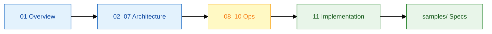

# FM Work Order Hub — Solution Delivery Index

**Client:** Surbana Jurong (SJ) — FM digital engagement  
**Deliverable:** Governed OutSystems experience layer on **24K** / **OMNI**  
**Platform:** OutSystems Developer Cloud (ODC) · Reactive Web + Mobile  
**Author role:** Senior OutSystems Engineer — architecture, integration, standards

---

## How to read this repo

This repository is a **solution delivery package** — not interview prep. It documents what a senior engineer delivers: architecture, platform patterns, specifications, integration contracts, security, CI/CD, and implementation guides for the **FM Work Order Hub** programme.

---

## Part I — Solution context

| # | Document | Contents |
|---|----------|----------|
| 1 | [delivery/01-solution-overview.md](delivery/01-solution-overview.md) | Scope, stakeholders, apps, success criteria |
| 2 | [docs/01-business-context.md](docs/01-business-context.md) | SJ business context, 24K / OMNI positioning |
| 3 | [docs/04-as-is-to-be-summary.md](docs/04-as-is-to-be-summary.md) | As-Is → To-Be one-page |

---

## Part II — Platform & application architecture

| # | Document | Contents |
|---|----------|----------|
| 4 | [delivery/02-odc-platform-layer.md](delivery/02-odc-platform-layer.md) | ODC runtime, portal, publish, environments |
| 5 | [delivery/03-ui-screens-blocks.md](delivery/03-ui-screens-blocks.md) | Screens, blocks, containers, layouts, Reactive UI |
| 6 | [delivery/04-data-model-entities.md](delivery/04-data-model-entities.md) | Entities, static entities, aggregates, fetch on demand |
| 7 | [delivery/05-logic-actions-flows.md](delivery/05-logic-actions-flows.md) | Client actions, server actions, flows, BPT |
| 8 | [delivery/06-reactive-events.md](delivery/06-reactive-events.md) | Screen events, data actions, client variables |
| 9 | [delivery/07-integration-rest.md](delivery/07-integration-rest.md) | REST consumers, structures, 24K / OMNI via APIM |
| 10 | [docs/03-to-be-architecture.md](docs/03-to-be-architecture.md) | Enterprise landscape diagram |

---

## Part III — Security, data, DevOps

| # | Document | Contents |
|---|----------|----------|
| 11 | [delivery/08-security-authentication.md](delivery/08-security-authentication.md) | Roles, Azure AD, entity permissions, audit |
| 12 | [delivery/09-database-persistence.md](delivery/09-database-persistence.md) | Platform DB, indexes, advanced query policy |
| 13 | [delivery/10-cicd-testing.md](delivery/10-cicd-testing.md) | Lifetime pipelines, test strategy, monitoring |

---

## Part IV — Implementation & specifications

| # | Document | Contents |
|---|----------|----------|
| 14 | [delivery/11-fm-work-order-hub-guide.md](delivery/11-fm-work-order-hub-guide.md) | Build guide — module by module |
| 15 | [delivery/12-diagrams-atlas.md](delivery/12-diagrams-atlas.md) | All Mermaid diagrams in one place |
| 16 | [samples/entity-model-facility-asset.spec.md](samples/entity-model-facility-asset.spec.md) | Delivered entity model |
| 17 | [samples/work-order-fm-portal.spec.md](samples/work-order-fm-portal.spec.md) | Screen & action spec |
| 18 | [samples/rest-integration-24k-iot.spec.md](samples/rest-integration-24k-iot.spec.md) | REST contract |
| 19 | [samples/iot-alert-escalation-bpt.spec.md](samples/iot-alert-escalation-bpt.spec.md) | BPT escalation process |

---

## Part V — Reference patterns (merged banking track)

Reusable OutSystems patterns from a parallel banking programme — same platform primitives, different domain.

| Document | Use for FM programme |
|----------|---------------------|
| [reference/banking/01-platform-patterns.md](reference/banking/01-platform-patterns.md) | Layered architecture, module governance |
| [reference/banking/02-integration-patterns.md](reference/banking/02-integration-patterns.md) | Idempotency, error mapping, audit |
| [reference/banking/samples/](reference/banking/samples/) | BPT, REST, entity examples |

---

## Supporting assets

| Asset | Path |
|-------|------|
| ODC quickstart | [resources/odc-studio-quickstart.md](resources/odc-studio-quickstart.md) |
| Dev environment diagrams | [resources/dev-environment-and-practice-diagrams.md](resources/dev-environment-and-practice-diagrams.md) |
| Mock 24K API | [resources/mock-server.js](resources/mock-server.js) · [resources/mock-24k-alerts.json](resources/mock-24k-alerts.json) |

---

## Legacy interview material

Archived under [`archive/interview-prep/`](archive/interview-prep/) for historical reference — not part of the solution delivery scope.
