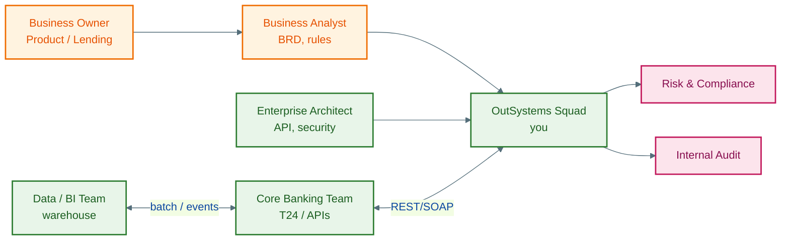

# Business context: Banking × OutSystems low-code

**Disclaimer:** Khung nghiệp vụ **điển hình** cho OutSystems Developer tại SI/bank VN & APAC — không gắn một JD cụ thể. Dùng để **phỏng vấn & whiteboard**, không phải tư vấn pháp lý.

---

## 1. Vì sao ngân hàng thuê OutSystems Developer?

| Pain (bank) | Low-code / OutSystems response | KPI business |
|-------------|--------------------------------|--------------|
| Backlog digital channel 12–24 tháng | App web/mobile **tuần–tháng** thay vì quý | Time-to-market, conversion |
| Core (T24, Flexcube, …) khó sửa UI | **Integration layer** + experience app | NPS digital, cost per transaction |
| Nhiều team .NET/Java chồng chéo | **Một platform**, reuse UI + logic | TCO, vendor consolidation |
| Compliance & audit | Platform **logging, roles, versioning** | Audit findings ↓ |
| M&A / sản phẩm mới (lending, BNPL) | Pilot app trước khi commit core change | Revenue new product |

**Bạn (DE banking) nói gì:** Đã từng đảm bảo **dữ liệu đúng & đúng hạn** cho risk/marketing; giờ đảm bảo **luồng nghiệp vụ & tích hợp** ra app mà user thấy — cùng mindset SLA, lineage, idempotency.

---

## 2. Domain ưu tiên (ôn trước phỏng vấn)

| Domain | Luồng điển hình | OutSystems thường làm |
|--------|-----------------|------------------------|
| **Retail onboarding** | eKYC → tạo CIF → mở tài khoản | Wizard UI, REST core, document upload |
| **Loan origination** | Apply → scoring → approve → disburse | Forms, rules, BPT approval |
| **Payment / transfer** | Initiate → OTP → post | Integration payment hub, limits |
| **Branch ops** | Queue, appointment, cross-sell | Tablet app, offline-tolerant (hạn chế) |
| **Compliance** | STR, KYC refresh, document expiry | Timers, escalations, audit trail |
| **Internal** | HR leave, IT ticket, procurement | Nhanh, ít budget core |

---

## 3. Stakeholder map

---

## 4. Revenue & delivery model (SI / in-house)

| Mô hình | Ai trả tiền | Developer làm gì |
|---------|-------------|------------------|
| **SI fixed price** | Bank theo milestone | Spec → build → UAT → hypercare |
| **T&M staff aug** | Day rate × headcount | Ticket sprint, BA onsite |
| **Center of Excellence** | Bank license platform | Standard components, governance |
| **Maintenance** | % license / retainer | Bug, OS upgrade, performance |

**Câu hỏi hay gặp:** "Low-code có thay DE không?" → **Không.** DE vẫn warehouse/ML; OutSystems **orchestration & channel**. Bạn = cầu nối hiểu **cả hai**.

---

## 5. Compliance talking points (không cần luật sư)

| Chủ đề | Cách nói trong interview |
|--------|--------------------------|
| **PDPA / GDPR** | Minimize fields; consent screen; retention job |
| **NHNN (VN)** | Log giao dịch; không lưu PIN full; mã hóa transport |
| **Audit trail** | Who changed what — platform + custom audit entity |
| **Segregation of duties** | Maker-checker trong BPT; role không overlap |
| **DR / BCP** | Enterprise: multi-env Lifetime; bạn biết **promote** không phải backup tape |

---

## 6. Competitive landscape (1 phút)

| | OutSystems | Power Apps | Mendix | Custom Java |
|--|------------|------------|--------|-------------|
| **Bank APAC** | Mạnh enterprise | Microsoft shop | EU | Mọi nơi |
| **Integration** | Mạnh REST/SOAP | Azure-native | Tốt | Tùy team |
| **Governance** | Lifetime, Architecture Canvas | Power Platform admin | Similar | Tự xây |
| **Học curve** | Trung bình | Thấp nếu đã O365 | Trung bình | Cao |

---

## 7. Case nói nhanh (STAR skeleton — banking)

**Situation:** Bank cần **loan approval mobile** trong 8 tuần; core chỉ có SOAP batch.  
**Task:** OutSystems dev — UI + integration + maker-checker.  
**Action:** Entity mirror application; REST wrapper; BPT 2-level approval; audit entity.  
**Result:** Go-live pilot 3 chi nhánh; giảm thời gian duyệt từ X ngày → Y giờ *(điền số thật nếu có)*.

Chi tiết kỹ thuật: `samples/loan-approval-action-flow.spec.md`, `02-bridge-de-to-outsystems.md`.

---

## 8. Câu hỏi hỏi lại interviewer

1. O11 hay ODC? Reactive web hay mobile native share?  
2. Ai sở hữu **Lifetime** và môi trường DEV/TST/PRD?  
3. Integration pattern chuẩn — REST API Management hay point-to-point?  
4. Có **Center of Excellence** (UI kit, foundation module) không?  
5. On-call / hypercare sau go-live?
