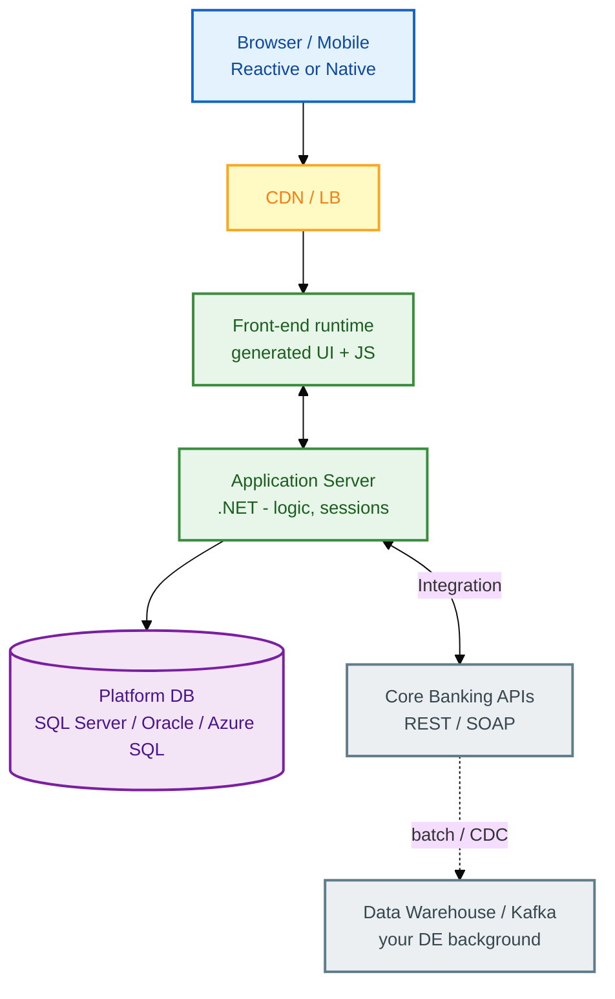
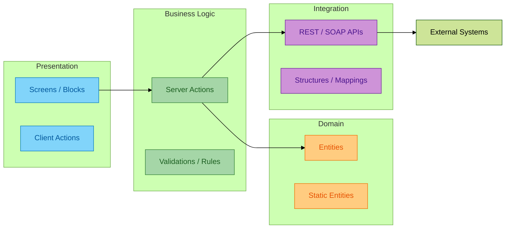
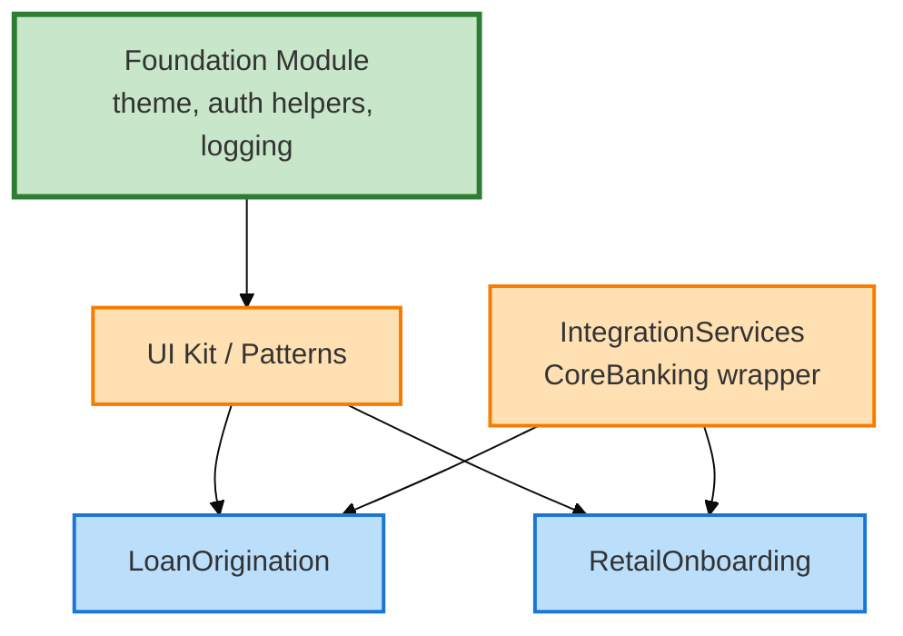
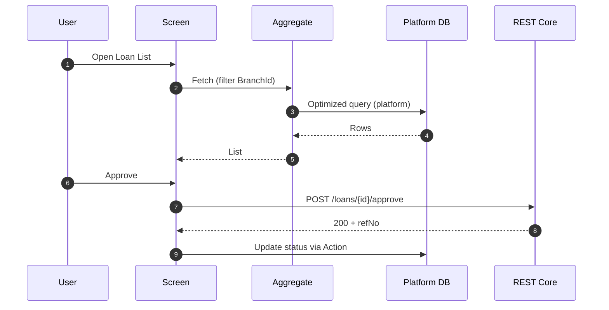
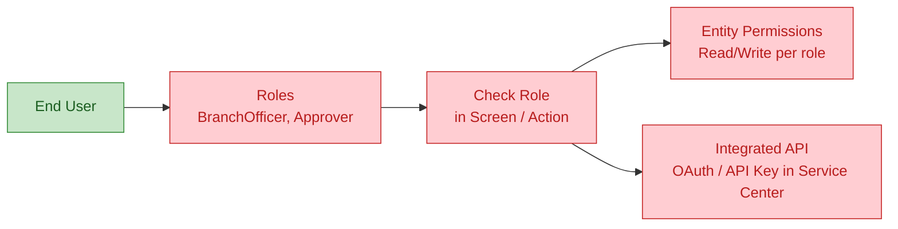
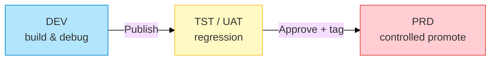

# Architecture: OutSystems platform (O11 focus + ODC note)

**Mục tiêu:** Vẽ được 3 diagram trong phỏng vấn — **runtime**, **app layers**, **integration**.

---

## 1. Platform stack (runtime)

**Nhớ:** Developer **không** viết HTML/CSS thủ công hàng ngày — Service Studio sinh UI; bạn thiết kế **screens, aggregates, logic**.

---

## 2. Application architecture (4-layer)

| Layer | DE banking tương đương | OutSystems artifact |
|-------|----------------------|---------------------|
| Presentation | Dashboard / report UI | Screen, Block, List |
| Business | ETL transform rules | Server Action, Expression |
| Domain | Curated tables / dims | Entity, Aggregate |
| Integration | Source connectors | Extension, API method |

---

## 3. Module & dependency (governance)

**Interview line:** "Tách **integration** khỏi feature module để đổi contract core mà không redeploy toàn bộ UI."

---

## 4. Data flow: Aggregate vs SQL (DE bridge)

| Khái niệm | Giải thích ngắn |
|-----------|-----------------|
| **Entity** | Bảng trong app DB (application data) |
| **Aggregate** | Query có filter/sort/join — **không** viết SQL tay trừ Advanced Query |
| **Advanced Query** | SQL thủ công — dùng ít, cần justify performance |
| **Structure** | DTO cho API — giống schema staging |

DE habit: "Tôi chỉ dùng Advanced Query khi aggregate không đủ — và document execution plan."

---

## 5. Security architecture

---

## 6. Deployment: Lifetime (enterprise mental model)

**Personal Environment:** Chỉ 1 env — vẫn nói được quy trình **DEV→TST→PRD** từ kinh nghiệm project.

---

## 7. O11 vs ODC (30 giây)

| | **O11** (mature) | **ODC** (cloud-native) |
|--|------------------|-------------------------|
| IDE | Service Studio desktop | **ODC Studio** |
| Hosting | Customer cloud / on-prem / PE | OutSystems cloud |
| Learn path | Become a Reactive Web Developer | **Becoming a web developer** (~11h) |
| REST dev mock | `localhost` thường OK (PE) | **ngrok** + Connections |
| Prep pack | Path B nếu chưa có ODC portal | **Path A** — `resources/odc-web-developer-path.md` |
| AI-assisted build | Có (IDE mới) | Path ODC nhấn **review output** — entity, aggregate, logic |

**Bank VN:** Nhiều khách hàng enterprise vẫn O11 + Lifetime; pattern entity / aggregate / RBAC **giống** ODC.

---

## 8. Anti-patterns (senior signal)

| Anti-pattern | Hậu quả | Fix |
|--------------|---------|-----|
| God Screen 2000 dòng logic | Maintain hell | Tách Server Actions, Blocks |
| Duplicate integration | Contract drift | Foundation `IntegrationServices` |
| Mọi thứ Advanced Query | Lock-in DB, slow | Aggregates + indexes |
| Không audit custom | Audit fail | `AuditLog` entity + BPT history |
| Sync long call core | Timeout UX | Async + polling / message |

---

## 9. Whiteboard prompt (luyện 10 phút)

**Đề:** "Branch officer duyệt khoản vay < 50M trên tablet; > 50M escalate regional manager."

Vẽ: Screen → Action validate amount → BPT fork → REST notify core → Audit entity.

Spec chi tiết: `samples/loan-approval-action-flow.spec.md`, `samples/bpt-kyc-escalation.spec.md`.
