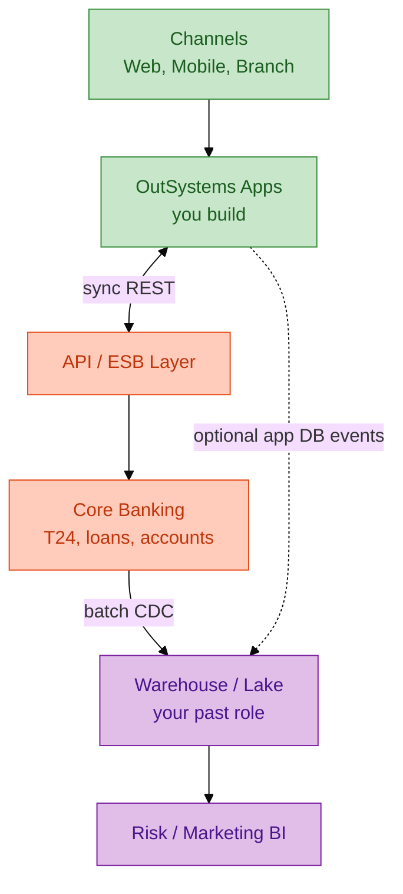
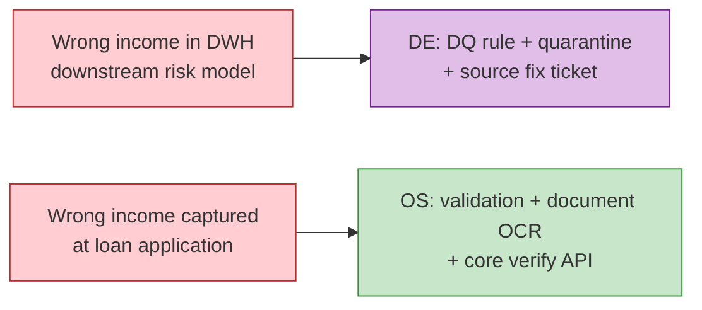

# Bridge: Data Engineering (banking) → OutSystems Developer

Answer phỏng vấn **English** nếu JD yêu cầu; bảng dưới song ngữ để ôn.

---

## 1. 90-second intro (memorize)

```text
I'm Will — about six years in data engineering, mostly banking in Vietnam and APAC.

I've built batch and streaming pipelines from core banking and channels into cloud warehouses, with strong focus on data quality, SLAs, and integration contracts.

Since ~2023 I've been on OutSystems — reactive web, mobile UI, and the integration layer — so I own the path from core/ERP APIs to user-facing banking flows, not only downstream analytics.

On client bids I focus on architecture quality and mentoring juniors: entity models, REST contracts, maker-checker, audit — the same rigor as idempotent loads and DQ gates in DE. Hands-on: `OnlineBankingApp` on Personal Environment.
```

---

## 2. Skill mapping

| DE / Banking skill | OutSystems expression | Câu nói phỏng vấn |
|--------------------|----------------------|-------------------|
| **Staging / curated layers** | Entity groups + Foundation module | "Integration structures are my staging; entities are curated app state." |
| **SCD2 / historization** | Entity with `ValidFrom`/`ValidTo` or history table | "I version KYC status explicitly, not overwrite silently." |
| **Idempotent loads** | Server Action check `ExternalRef` before POST | "Duplicate submit → same core ref, no double disburse." |
| **DQ rules / Great Expectations** | Validations in Action + Before Insert trigger pattern | "Fail fast at UI with message; log to AuditLog." |
| **Lineage** | Architecture Canvas + dependency modules | "I trace Screen → Action → API method like column lineage." |
| **Kafka / events** | (Often still core) — app polls or webhook if exposed | "Real-time is platform-limited; I design async handoff honestly." |
| **SQL tuning** | Aggregates first; Advanced Query last | "Same as choosing mart vs raw scan." |
| **IAM / PII** | Roles + field-level sensitivity | "Mask account number in list; full in detail with role." |
| **Incident triage** | Service Center logs + debugger | "Like checking Airflow task log + row count." |
| **Agile / sprint** | User stories → modules/screens | "Same ceremonies; artifact is OML not dbt model." |

---

## 3. Diagram: where you sit in bank IT



**Message:** Bạn **không bỏ** DE — bạn **mở rộng upstream** tới channel app.

---

## 4. STAR story A — DE project → credibility

| STAR | Content |
|------|---------|
| **S** | Techcombank / MSB — high-volume payments or marketing data to cloud |
| **T** | Stable daily loads, DQ on customer/income fields |
| **A** | Glue/Kafka, idempotent keys, reconciliation reports |
| **R** | SLA met; fewer audit findings *(your metrics)* |
| **Bridge** | "Same reconciliation mindset when core returns ambiguous HTTP 200 with business error code — I map and surface to user." |

---

## 5. STAR story B — OutSystems prep (honest "learning sprint")

| STAR | Content |
|------|---------|
| **S** | Targeting OutSystems role; no production OML yet |
| **T** | Prove platform fluency in days |
| **A** | Personal Environment; BranchQueue app; REST to mock core; spec maker-checker |
| **R** | Published app; documented entity model in repo `samples/` |
| **Bridge** | "I document like DE — specs before code — which fits regulated clients." |

---

## 6. Whiteboard: "DE fixes data; OS fixes process"



---

## 7. Gaps to acknowledge (honesty wins)

| Gap | Mitigation bạn nói |
|-----|-------------------|
| Chưa production OutSystems | Personal Environment + specs; pair với senior week 1 |
| Forge ecosystem | Đã browse + install 1 component |
| Lifetime hands-on | Hiểu flow; đã đọc doc promote |
| Mobile store deploy | Reactive responsive first; native pipeline học on job |

---

## 8. Salary / level framing (nếu hỏi)

- DE senior ≠ auto OutSystems senior — position as **"integration-aware full-stack low-code"** với premium vì banking domain.  
- Nếu junior OS title: nhấn **ramp speed** + **fewer integration mistakes**.

---

## 9. Questions showing DE depth

1. How do app events feed the warehouse — batch export or API?  
2. Is core integration idempotent at the API gateway?  
3. Where is **golden source** for customer — core vs app DB?  
4. Data retention on uploaded KYC images — platform blob vs bank DMS?
