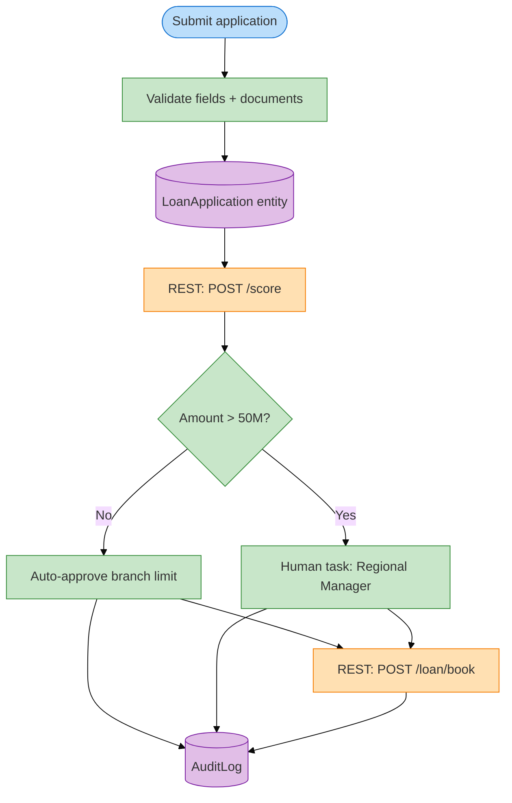

# Day 2 — Interview prep & mock scenarios

**Context (Jun 2026):** Senior Assistant Developer for **client bid** (Savannah GA) — architecture quality + mentor juniors; OutSystems Reactive/Mobile + core/ERP integration. Diagram: [`resources/odc-dev-environment-diagrams.md`](resources/odc-dev-environment-diagrams.md).

---

## 60-minute interview agenda (typical)

| Block | ~min | What they test |
|-------|------|----------------|
| Intro + role fit | 5–8 | DE → low-code motivation |
| Platform fundamentals | 10–15 | Entity, Action, Aggregate, Reactive |
| Integration scenario | 10–15 | REST, errors, idempotency |
| Process / banking case | 10–15 | BPT, maker-checker |
| Live exercise or take-home discussion | 10 | Screen sketch, pseudo-logic |
| Your questions | 5 | Culture, stack, env |

---

## Whiteboard case 1 — Loan approval (primary)

**Prompt:** Retail loan application on web; integrate scoring API; two-level approval; audit for compliance.

### Expected flow (draw this)



**Say out loud:**

1. **Separation:** UI module vs `IntegrationServices` module.  
2. **Idempotency:** `ClientRequestId` on POST book — retry safe.  
3. **Failure:** Scoring down → status `PendingScore`, batch retry job (honest if no BPT timer yet).  
4. **DE link:** "AuditLog like operational data store for compliance queries."

Spec: `samples/loan-approval-action-flow.spec.md`

---

## Whiteboard case 2 — KYC refresh

**Prompt:** Annual KYC refresh; notify customer; escalate if not completed in 30 days.

Draw timer + email + BPT — spec `samples/bpt-kyc-escalation.spec.md`.

---

## Behavioral (STAR)

### Q: "Tight deadline, BA changes scope mid-sprint"

```text
S: UAT in 2 weeks for onboarding app; BA added mandatory OTP step.
T: Deliver without slipping go-live.
A: Impact analysis — OTP as separate Server Action + REST; descoped nice-to-have report; daily 15min sync with BA.
R: UAT on time; OTP in hypercare list not blocking sign-off.
```

### Q: "Production incident — payments stuck"

```text
S: Users see success UI but core shows no booking.
T: Restore trust + stop duplicate money movement.
A: Check Service Center logs; compare ExternalRef; disable submit button; hotfix idempotency check; reconciliation CSV with core ops.
R: DE-style recon — same playbook I used on pipeline row-count mismatch.
```

---

## Technical rapid-fire (answers 30–60s)

| Question | Answer skeleton |
|----------|-----------------|
| Aggregate vs Advanced Query? | Aggregate first — platform optimized; SQL when proven bottleneck |
| Client vs Server Action? | Client: UI-only; Server: DB, secrets, REST |
| Reactive vs Traditional Web? | Reactive = SPA modern default; Traditional legacy O11 |
| Where secrets for API? | Service Center / module settings — not hardcode |
| Module dependency rule? | Foundation ← Feature; no circular |
| Forge component risk? | Review support, version, security bulletin |

Full list: `05-practice-questions.md`

---

## Demo backup (if they ask "show something")

1. Personal Environment URL — BranchQueue list  
2. Walk through Entity diagram in Service Studio  
3. Show one REST method test  
4. **Do not** live demo if env asleep — có screenshot

---

## Red flags to avoid

- Claim expert without production — say **"strong ramp, DE production"**  
- Badmouth low-code — say **"governance + speed tradeoff managed"**  
- Ignore compliance — always mention audit / roles  

---

## Questions to ask (pick 3)

1. Foundation module và UI kit có sẵn không?  
2. Integration team riêng hay dev tự consume API?  
3. O11 upgrade cycle — ai lead regression?  
4. Pairing / certification budget first 90 days?  
5. On-call after go-live?

---

## Mock script (45 min solo)

| Min | Activity |
|-----|----------|
| 0–2 | Record intro video — review clarity |
| 2–12 | Whiteboard loan case — timer |
| 12–22 | Answer 5 questions from `05-practice-questions.md` aloud |
| 22–32 | Explain REST spec without slides |
| 32–40 | STAR behavioral x2 |
| 40–45 | Write 3 questions for interviewer |
