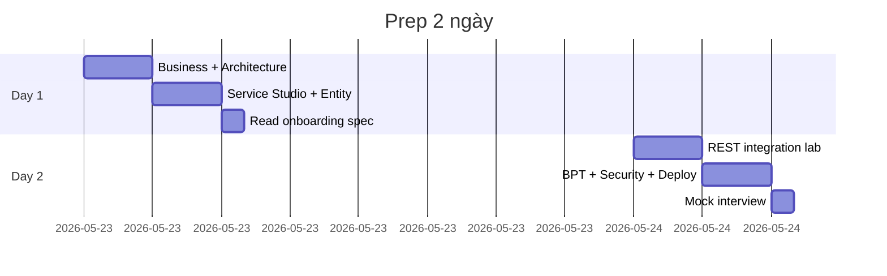

# OutSystems Developer — Sách 2 ngày (DE banking → low-code)

**Giả định:** ~6–8 giờ/ngày. Bạn đã quen SQL, REST, agile banking project — **chưa** từng ship OutSystems production.

---

## Tổng quan

---

## Day 0 (30 phút — trước khi ngủ)

- [ ] **ODC:** Portal login + Download ODC Studio → `resources/odc-studio-quickstart.md`  
      **O11:** Personal Environment + Service Studio → `resources/free-hands-on-local.md`
- [ ] Learn: enroll **Becoming a web developer** (ODC) hoặc **Reactive Web Developer** (O11)
- [ ] Làm xong Learn: *ODC overview* + *Capabilities Quiz* (~15 min)
- [ ] Đọc map lesson ↔ lab: `resources/odc-web-developer-path.md` §4

---

## Day 1 — Nền tảng & data model

### 08:00–09:00 | Business mindset

| Việc | File |
|------|------|
| Đọc stakeholder + domain | `00-business-banking-lowcode.md` §1–5 |
| Ghi 3 câu: pain bank / vai trò OS / KPI | Notebook |

**Output:** Trả lời được "Why bank hire OutSystems?"

---

### 09:00–11:00 | Architecture

| Việc | File |
|------|------|
| Vẽ lại **3 diagram** không nhìn tài liệu | `01-architecture-outsystems.md` |
| So sánh Entity vs Fact table DE | `02-bridge-de-to-outsystems.md` §2 |

**Output:** Whiteboard 4-layer app trong 5 phút.

---

### 11:00–12:00 | Learn + IDE setup

| Việc | Where |
|------|-------|
| Learn §6–9: Intro + **Modeling data** (relationships, integrity) | Becoming a web developer |
| ODC Studio / Service Studio → app `BranchQueue` → publish lần 1 | `odc-studio-quickstart.md` |
| (Optional) AI: mô tả "branch queue ticket list" → **review** entity + aggregate filter | `odc-web-developer-path.md` §3 |

---

### 13:00–16:00 | Hands-on Lab 1

Follow: `03-day1-hands-on-lab.md`

| Milestone | Done? |
|-----------|-------|
| App `BranchQueue` published | ☐ |
| 2 entities + 1 static entity | ☐ |
| List + Detail screen | ☐ |
| Server Action create + validate | ☐ |

---

### 19:00–20:00 | Spec reading

- `samples/entity-model-retail-onboarding.spec.md` — map từng field sang entity bạn vừa tạo
- Viết 5 bullet: "DE tôi đã làm tương tự ở MSB/Techcombank"

---

## Day 2 — Integration, process, interview

### 08:00–11:00 | Hands-on Lab 2

Follow: `03-day1-hands-on-lab.md` §Day 2 + `04-day2-interview-prep.md`

| Milestone | Done? |
|-----------|-------|
| REST consume mock customer API | ☐ |
| Structure + mapping error codes | ☐ |
| Role `BranchOfficer` + screen check | ☐ |
| (Optional) Simple BPT approval | ☐ |

Spec: `samples/rest-integration-core-banking.spec.md`

---

### 11:00–12:00 | BPT & loan flow (theory + spec)

| Việc | File |
|------|------|
| Đọc BPT diagram | `samples/bpt-kyc-escalation.spec.md` |
| Đọc loan actions | `samples/loan-approval-action-flow.spec.md` |
| Learn module "Processes" (video skim) | learn.outsystems.com |

---

### 13:00–15:00 | Interview prep

| Việc | File |
|------|------|
| 90s intro — học thuộc | `02-bridge-de-to-outsystems.md` |
| 2 STAR stories | `04-day2-interview-prep.md` |
| 20 câu practice | `05-practice-questions.md` |

---

### 15:00–16:00 | Mock 45 phút (tự hoặc bạn bè)

1. **Intro** 2 min  
2. **Whiteboard** loan approval 10 min  
3. **Technical** aggregates vs SQL 5 min  
4. **Integration** idempotency POST payment 5 min  
5. **Behavioral** deadline + BA conflict 5 min  
6. **Your questions** 3 min  

---

### 19:00–20:00 | Buffer

- Publish lại app — chụp screenshot Service Center (backup demo)
- Wake Personal Environment nếu sleep
- Đọc lại pitch README

---

## Knowledge checklist (cuối ngày 2)

| Chủ đề | Tự tin 1–5 |
|--------|------------|
| Entity / Static Entity / Aggregate | |
| Server vs Client Action | |
| REST consume + Structures | |
| Roles & check in logic | |
| BPT vs simple If on amount | |
| Lifetime DEV→PRD | |
| Bridge DE → app integration | |
| Banking compliance one-liners | |

---

## Nếu JD nhấn mạnh…

| JD keyword | Ưu tiên thêm |
|------------|--------------|
| Mobile | Reactive + device layouts; OutSystems Now preview |
| ODC | **Becoming a web developer** path + `odc-web-developer-path.md` |
| AI / copilot | §3 `odc-web-developer-path.md` — review model, không tin blind |
| Senior / lead | Architecture Canvas, module boundaries, code review checklist |
| Azure | Integration với Azure API Management — nói được, không cần lab |

---

## Pitch closing (English, 20s)

> "In two days I've rebuilt the mental model: banking domains I already know, expressed as OutSystems entities, integrations, and governed processes — ready to pair with your foundation team on day one."
