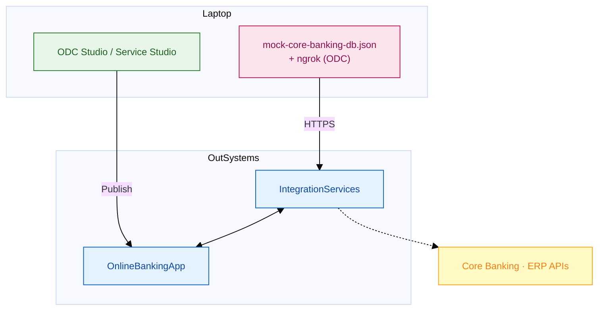
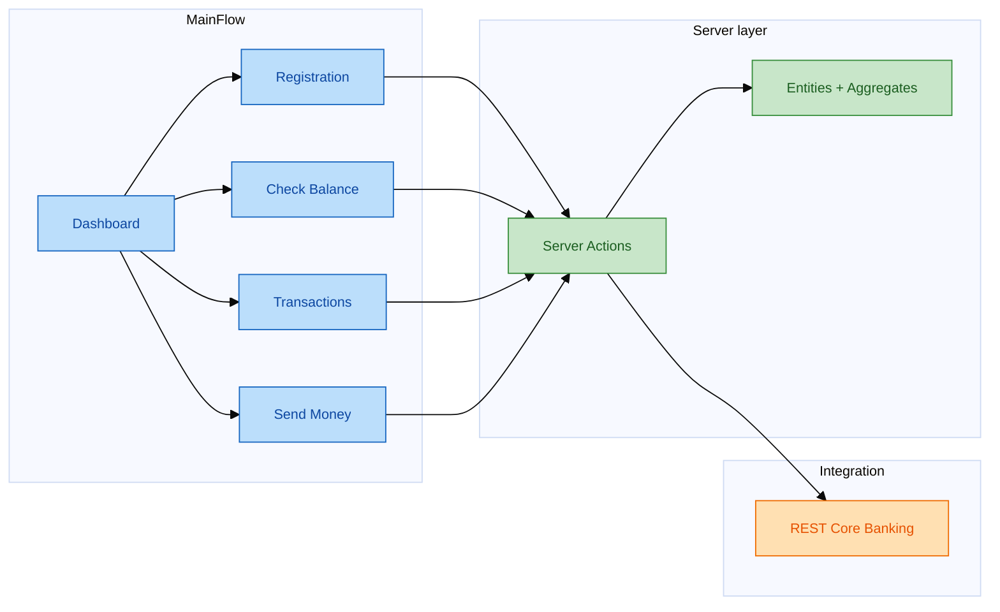

# Banking track — OutSystems interview prep (2 days)

**Audience:** Developers with **Data Engineering / banking** background moving into **OutSystems low-code**.  
**Hands-on:** `OnlineBankingApp` or lab `BranchQueue` on **ODC** or **O11 Personal Environment**.

> Shared ODC setup lives in the parent repo: [`../resources/odc-studio-quickstart.md`](../resources/odc-studio-quickstart.md) · [`../resources/odc-web-developer-path.md`](../resources/odc-web-developer-path.md)

---

## Interview context (Jun 2026 — Savannah GA)

| | |
|--|--|
| **Role** | Senior Assistant Developer — **architecture quality** + **mentor juniors** |
| **Delivery** | **Client bid** (external app), not in-house |
| **Stack** | OutSystems **Reactive Web + Mobile**, **integration layer** (REST, ERP, core banking) |
| **Fit** | ~6yr backend, banking consulting, ERP/DB, OutSystems since **~2023** |
| **Current build** | `OnlineBankingApp` on **O11 PE** (`personal-*.outsystemscloud.com`) |

**Pitch:** *"I bring banking integration and data architecture rigor into OutSystems — governed entity models, REST contracts, maker-checker flows — and I help juniors ship with the same quality bar on client delivery."*

Diagrams: [`resources/odc-dev-environment-diagrams.md`](resources/odc-dev-environment-diagrams.md)

---

## ODC dev environment

---

## OnlineBankingApp — screen map

---

## Track contents

| File | Purpose |
|------|---------|
| [`00-business-banking-lowcode.md`](00-business-banking-lowcode.md) | Why banks use low-code, domain, KPI, compliance |
| [`01-architecture-outsystems.md`](01-architecture-outsystems.md) | O11/ODC architecture, layers, integration |
| [`OUTSYSTEMS-DEV-Sach-2-Ngay.md`](OUTSYSTEMS-DEV-Sach-2-Ngay.md) | 2-day hour-by-hour schedule |
| [`02-bridge-de-to-outsystems.md`](02-bridge-de-to-outsystems.md) | DE banking → OutSystems skill map |
| [`03-day1-hands-on-lab.md`](03-day1-hands-on-lab.md) | Day 1 lab (`BranchQueue`) |
| [`04-day2-interview-prep.md`](04-day2-interview-prep.md) | Day 2 + mock interview |
| [`05-practice-questions.md`](05-practice-questions.md) | Technical + banking scenarios |
| [`samples/`](samples/) | Entity, REST, BPT specs (no `.oml`) |

**90-min cram:** `00` → `01` + diagrams → `02` → `samples/rest-integration-core-banking.spec.md` → `04`.
