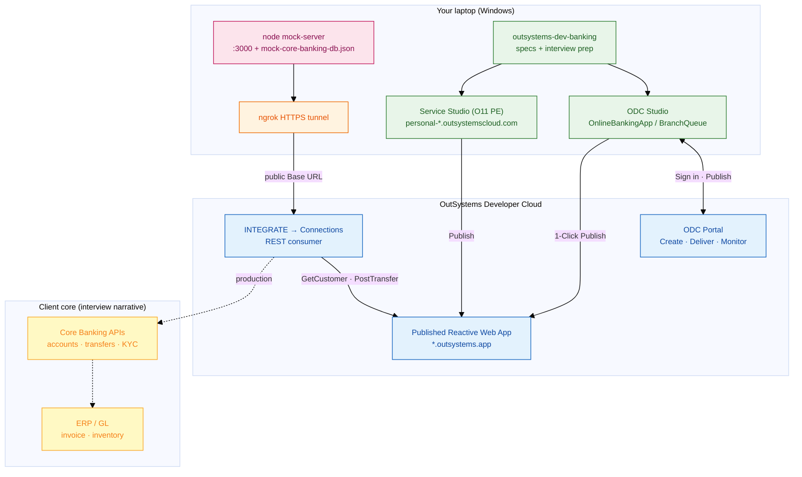
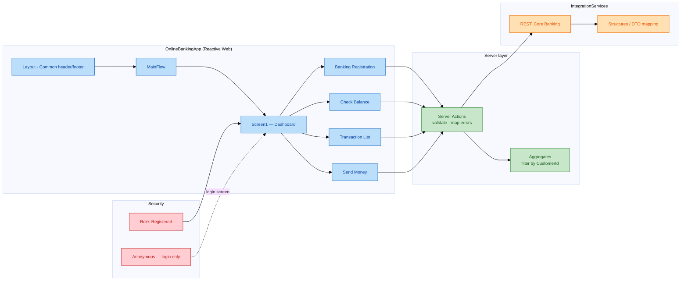
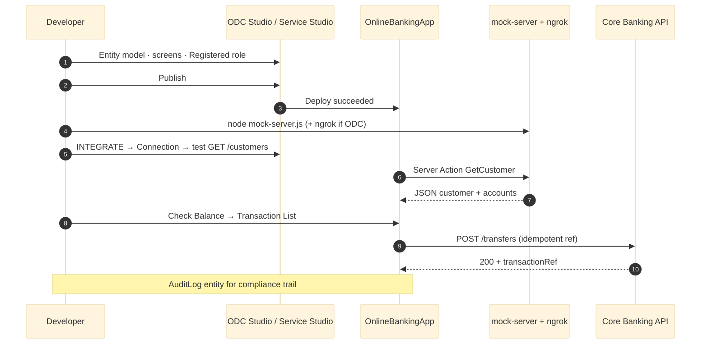
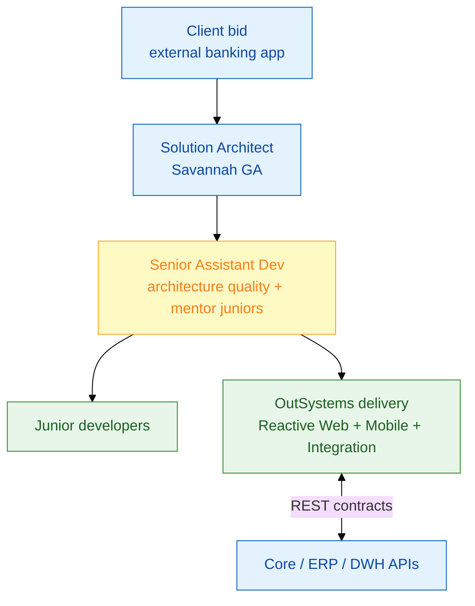

# ODC dev environment & banking app — visual guide

**Mục tiêu:** Nhìn một lần hiểu **laptop + ODC cloud + mock core banking** và **luồng build OnlineBankingApp** (hoặc lab `BranchQueue`).

> Render trên GitHub, VS Code/Cursor, Obsidian. Theme `base` + `classDef` — màu nhẹ, dễ in.

**Liên quan:** [`odc-studio-quickstart.md`](odc-studio-quickstart.md) · [`odc-web-developer-path.md`](odc-web-developer-path.md) · [`free-hands-on-local.md`](free-hands-on-local.md)

---

## 1. ODC dev environment — toàn cảnh

**Ghi nhớ (30s):** *ODC app chạy cloud — REST tới `localhost` không được; dev dùng **ngrok** hoặc Postman Mock. O11 Personal Environment thì `localhost` thường OK.*

---

## 2. OnlineBankingApp — module & screen map (FM banking flows)

**Interview line:** *Tách **IntegrationServices** khỏi UI — đổi contract core mà không redeploy toàn bộ MainFlow.*

---

## 3. Publish & integration flow (Day 0 → demo)

---

## 4. Senior assistant dev — delivery context (interview)

---

## 5. ODC Portal sidebar (quick map)

| Sidebar | Banking prep | Ghi chú |
|---------|--------------|---------|
| **CREATE → Apps** | `OnlineBankingApp` / `BranchQueue` | Lab Day 1 |
| **DELIVER → Deployments** | Publish sau mỗi milestone | ≈ O11 Publish |
| **MONITOR → Logs** | Debug REST / action errors | Giống Service Center logs |
| **INTEGRATE → Connections** | Core banking mock | ODC: **ngrok** bắt buộc |
| **FORGE** | OutSystemsUI · Charts | Header, lists, forms |
