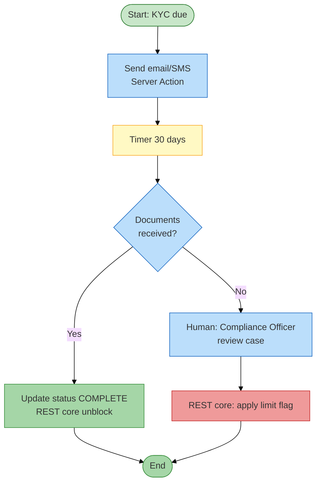

# Engineering spec (no code): BPT — KYC refresh escalation

**Process name:** `KycRefreshProcess`  
**Module:** `ComplianceOps`  
**Trigger:** Scheduled job daily OR manual bulk start

---

## 1. Business story

Retail customers must refresh KYC every **12 months**. If no response within **30 days** of notification, escalate to **Compliance Officer** and restrict channel limits via core API.

---

## 2. Process diagram



---

## 3. Process data (entity `KycRefreshCase`)

| Field | Type |
|-------|------|
| Id | Long |
| CIF | Text |
| DueDate | Date |
| ProcessId | Text (BPT id) |
| Status | Text |
| LastNotificationOn | DateTime |
| DocumentsReceivedOn | DateTime? |

---

## 4. Roles

| Role | Activity |
|------|----------|
| System | Notify, timers |
| Customer | (external) upload via portal — out of scope lab |
| ComplianceOfficer | Escalation human task |

---

## 5. BPT activities (spec)

| Step | Type | Implementation note |
|------|------|---------------------|
| Start | Automatic | Create case; link ProcessId |
| NotifyCustomer | Automatic | Server Action → notification API |
| WaitForResponse | Timer | 30 days |
| CheckDocuments | Automatic | Query DMS or entity flag |
| CompleteKyc | Automatic | REST core `/customers/{cif}/kyc/complete` |
| ComplianceReview | Human | Assign pool ComplianceOfficer |
| ApplyRestriction | Automatic | REST core `/customers/{cif}/limits/restrict` |

---

## 6. Decision gateway `CheckDocuments`

```
IF KycRefreshCase.DocumentsReceivedOn IS NOT NULL
  -> CompleteKyc
ELSE
  -> ComplianceReview
```

---

## 7. Human task UI

**Screen:** `ComplianceCaseDetail`

- Show CIF, customer name (REST lookup)  
- History notifications  
- Buttons: **Mark received**, **Escalate restrict**, **Extend 7 days** (optional exception)

Only **ComplianceOfficer** role opens screen.

---

## 8. Timers & SLA (interview)

| Question | Answer |
|----------|--------|
| Why BPT not batch job? | Human steps, reassignment, audit per instance |
| Timer precision | Platform timer — acceptable for 30-day SLA not millisecond |
| What if core REST fails on restrict? | Leave activity open; retry; do not complete process |

---

## 9. Audit

BPT history + custom `AuditLog` on each automatic REST call (request id, response code).

---

## 10. Comparison: loan approval BPT

| | Loan approval | KYC refresh |
|--|---------------|-------------|
| Trigger | User submit | Schedule |
| Human | Regional manager | Compliance |
| Timer | Optional SLA | Core 30-day wait |
| Core calls | Score + book | Complete / restrict |

Cross-ref: `loan-approval-action-flow.spec.md`

---

## 11. Prep without building BPT

Draw diagram above + explain activities aloud — sufficient for many mid-level rounds.

If time in lab: single human activity after timer on mock entity.
