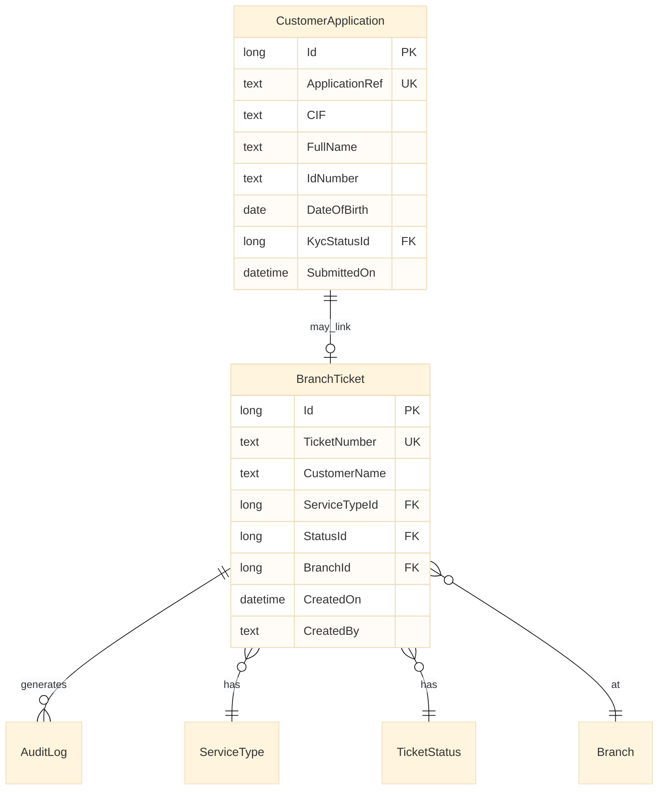

# Engineering spec (no code): Retail onboarding — entity model

**App module:** `RetailOnboarding`  
**Type:** Reactive Web  
**Purpose:** Branch queue + simplified onboarding capture (prep lab: subset → `BranchQueue`)

---

## 1. Context diagram



---

## 2. Entities

### 2.1 `BranchTicket` (transaction)

| Field | Type | Rules |
|-------|------|-------|
| Id | Long, auto | PK |
| TicketNumber | Text(20) | Unique per branch per day; format `B{BranchCode}-{YYYYMMDD}-{Seq4}` |
| CustomerName | Text(200) | Required; trim; min 2 chars |
| ServiceTypeId | ServiceType Id | Required |
| StatusId | TicketStatus Id | Default `Queued` |
| BranchId | Branch Id | From session `GetBranchId()` |
| CreatedOn | DateTime | Server `CurrDateTime()` on insert |
| CreatedBy | Text | `GetUserId()` |

**Indexes (conceptual):** `(BranchId, StatusId, CreatedOn)` for list screen.

---

### 2.2 Static entities

**ServiceType**

| Id | Label |
|----|-------|
| 1 | OpenAccount |
| 2 | LoanInquiry |
| 3 | KycRefresh |

**TicketStatus**

| Id | Label | IsTerminal |
|----|-------|------------|
| 1 | Queued | false |
| 2 | InProgress | false |
| 3 | Done | true |
| 4 | Cancelled | true |

**KycStatus** (for full onboarding)

| Id | Label |
|----|-------|
| 1 | Pending |
| 2 | Verified |
| 3 | Rejected |

---

### 2.3 `AuditLog` (compliance)

| Field | Type | Notes |
|-------|------|-------|
| Id | Long | PK |
| EntityName | Text | e.g. BranchTicket |
| EntityId | Long | |
| Action | Text | Create, StatusChange |
| OldValue | Text | JSON snippet optional |
| NewValue | Text | |
| UserId | Text | |
| Timestamp | DateTime | |

---

## 3. Aggregates

| Name | Source | Filter | Sort | Used on |
|------|--------|--------|------|---------|
| `GetBranchTickets` | BranchTicket | BranchId = Session | CreatedOn DESC | TicketList |
| `GetTicketById` | BranchTicket | Id = Input | — | TicketDetail |
| `GetOpenTicketsCount` | BranchTicket | Status != Done/Cancelled | — | Dashboard badge |

---

## 4. Server Actions (pseudo-flow)

### `CreateTicket`

```
INPUT: CustomerName, ServiceTypeId
VALIDATE: CustomerName not empty; ServiceTypeId exists
ASSIGN: TicketNumber = GenerateTicketNumber(BranchId)
INSERT: BranchTicket
CALL: WriteAuditLog("BranchTicket", Id, "Create", ...)
OUTPUT: TicketId
```

### `UpdateTicketStatus`

```
INPUT: TicketId, NewStatusId
FETCH: current StatusId
VALIDATE: transition allowed (see matrix)
UPDATE: BranchTicket.StatusId
CALL: WriteAuditLog(...)
```

**Status transition matrix**

| From \ To | InProgress | Done | Cancelled |
|-----------|------------|------|-----------|
| Queued | ✓ | — | ✓ |
| InProgress | — | ✓ | ✓ |
| "Done / Cancelled | — | — | — |

---

## 5. Screens (wireframe text)

**TicketList**

- Header: Branch name + open count  
- List: TicketNumber, CustomerName, ServiceType.Label, Status.Label, CreatedOn  
- FAB: Navigate NewTicket  

**NewTicket**

- Input CustomerName  
- Dropdown ServiceType  
- Submit → `CreateTicket` → navigate Detail  

---

## 6. DE mapping notes

| Banking DWH | This spec |
|-------------|-----------|
| Fact branch visits | BranchTicket rows |
| Dim service type | ServiceType static |
| Ops audit table | AuditLog |
| Daily seq | TicketNumber generator (like batch surrogate key) |

---

## 7. Out of scope (prep)

- Core CIF create REST  
- Document upload  
- OTP

See `rest-integration-core-banking.spec.md` for API half.
