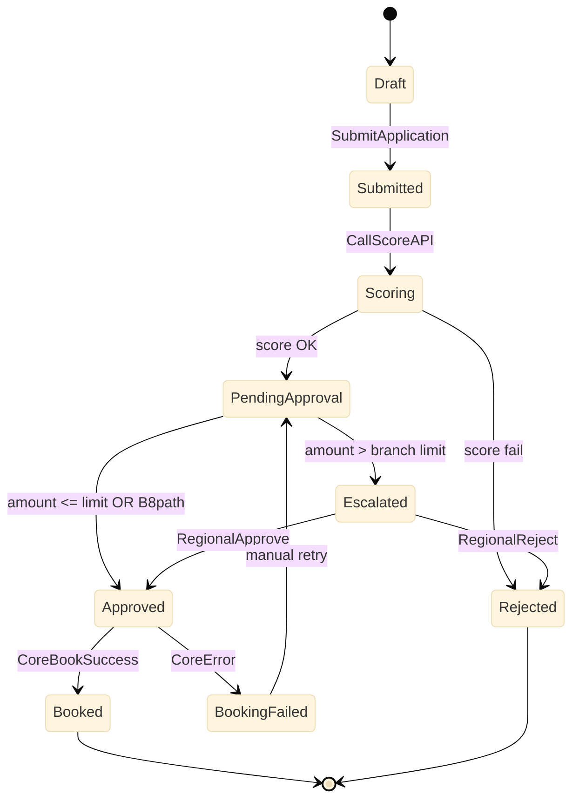

# Engineering spec (no code): Loan approval — actions & integration

**Module:** `LoanOrigination`  
**Depends on:** `IntegrationServices` (REST core + scoring)

---

## 1. Process overview



---

## 2. Entity `LoanApplication`

| Field | Type | Notes |
|-------|------|-------|
| Id | Long | PK |
| ApplicationRef | Text | UK; client-facing |
| CustomerCIF | Text | From search |
| ProductCode | Text | e.g. UNSECURED_RETAIL |
| RequestedAmount | Decimal(18,2) | VND |
| TenorMonths | Integer | |
| StatusId | LoanStatus (static) | |
| ScoreResult | Text | PASS/FAIL/REVIEW |
| ScoreBand | Text | optional |
| CoreBookingRef | Text | after success |
| ClientRequestId | Text | UUID idempotency |
| SubmittedBy | Text | user id |
| SubmittedOn | DateTime | |

**Static `LoanStatus`:** Draft, Submitted, Scoring, PendingApproval, Escalated, Approved, Rejected, Booked, BookingFailed

---

## 3. Business rules

| Rule ID | Condition | Action |
|---------|-----------|--------|
| BR-01 | RequestedAmount <= 0 | Block submit |
| BR-02 | TenorMonths not in product catalog | Block submit |
| BR-03 | Customer KYC != VERIFIED | Block submit |
| BR-04 | RequestedAmount <= BranchAutoLimit (50M) | Auto-approve after score PASS |
| BR-05 | RequestedAmount > BranchAutoLimit | Create BPT human task RegionalManager |
| BR-06 | Core book returns duplicate ClientRequestId | Treat as success (idempotent) |

---

## 4. Server Actions (pseudo)

### `SubmitApplication`

```
VALIDATE: BR-01, BR-02, BR-03
ASSIGN: ClientRequestId = NewGuid() if empty
UPDATE: Status = Submitted
CALL: InvokeScoring
```

### `InvokeScoring`

```
REST POST /v1/loans/score
BODY: { cif, amount, tenor, productCode }
ON 200 PASS -> Status PendingApproval -> EvaluateApprovalPath
ON 200 FAIL -> Status Rejected
ON 5xx -> Status Scoring + log (retry job)
```

### `EvaluateApprovalPath`

```
IF amount <= GetBranchAutoLimit(SessionBranchId) AND ScoreResult = PASS
  CALL ApproveApplication(Auto)
ELSE
  START BPT LoanApprovalProcess
```

### `BookLoanToCore`

```
REST POST /v1/loans/book
HEADERS: Idempotency-Key = ClientRequestId
BODY: { applicationRef, cif, amount, tenor, productCode }
ON 200 -> Status Booked, save CoreBookingRef
ON 409 duplicate -> Status Booked (idempotent)
ON 4xx business -> Status BookingFailed, surface code
```

---

## 5. Integration contracts (summary)

### POST `/v1/loans/score:ore`

Request structure `ScoreRequest` — fields mirror entity subset.  
Response `ScoreResponse`: `{ result, band, reasonCode? }`

### POST `/v1/loans/book`

Request `BookRequest` — includes `ClientRequestId`.  
Response `BookResponse`: `{ bookingRef, valueDate }`

Full mock: `rest-integration-core-banking.spec.md`

---

## 6. UI screens

| Screen | Role | Key elements |
|--------|------|--------------|
| LoanApply | BranchOfficer | CIF search, amount, tenor, docs checklist |
| LoanDetail | BranchOfficer, Approver | Timeline status, score, approve/reject |
| LoanList | BranchOfficer | Filter branch, status |

---

## 7. Audit & compliance

Every status change → `AuditLog` row.  
Approve/Reject → capture `UserId`, `Role`, `Timestamp`, `Comment` (required on reject).

---

## 8. Interview talking points

- **Why Server Action for approve?** Secrets, role check, core call — never Client Action only.  
- **Why BPT for escalation?** Reassignment, SLA timer, audit trail of human steps.  
- **DE parallel:** `ClientRequestId` = natural key dedup in staging load.
