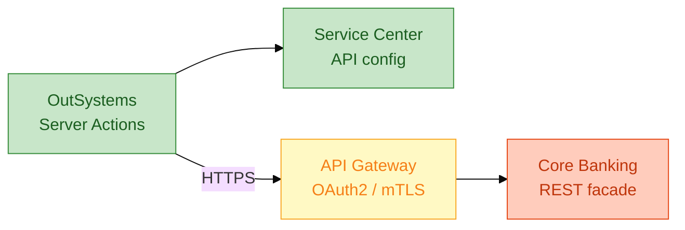

# Engineering spec (no code): Core banking REST integration

**Module:** `IntegrationServices` (foundation — no UI)  
**Consumer apps:** `LoanOrigination`, `RetailOnboarding`, `CustomerLookup` lab

---

## 1. Integration landscape



---

## 2. Environment endpoints (config — not hardcoded)

| Env | Base URL | Auth |
|-----|----------|------|
| DEV | `https://api-dev.bank.internal/core/v1` | Client credentials |
| TST | `https://api-tst.bank.internal/core/v1` | Client credentials |
| PRD | `https://api.bank.internal/core/v1` | Client credentials + mTLS |

**Personal Environment prep:** Mock `http://localhost:3000` or Mockoon.

---

## 3. Structures (DTOs)

### `CustomerResponse`

| Field | Type | Example |
|-------|------|---------|
| cif | Text | CIF001 |
| fullName | Text | Nguyen Van A |
| kycStatus | Text | VERIFIED / PENDING |
| segment | Text | RETAIL |
| mobile | Text | masked in list screens |

### `ScoreRequest` / `ScoreResponse`

See `loan-approval-action-flow.spec.md` §5.

### `BookRequest`

| Field | Type |
|-------|------|
| clientRequestId | Text (UUID) |
| applicationRef | Text |
| cif | Text |
| amount | Decimal |
| tenorMonths | Integer |
| productCode | Text |

### `BookResponse`

| Field | Type |
|-------|------|
| bookingRef | Text |
| valueDate | Date |
| status | Text |

### `ErrorBody` (generic)

| Field | Type |
|-------|------|
| code | Text |
| message | Text |
| correlationId | Text |

---

## 4. API catalog

### GET `/customers`

| | |
|--|--|
| **Query** | `cif` (required) |
| **200** | CustomerResponse |
| **404** | ErrorBody code `CIF_NOT_FOUND` |

### POST `/loans/score`

| | |
|--|--|
| **Body** | ScoreRequest |
| **200** | ScoreResponse |
| **422** | ErrorBody validation |

### POST `/loans/book`

| | |
|--|--|
| **Headers** | `Idempotency-Key: {clientRequestId}` |
| **Body** | BookRequest |
| **200** | BookResponse |
| **409** | Duplicate idempotency — return original bookingRef |
| **422** | Business reject e.g. `INSUFFICIENT_COLLATERAL` |

---

## 5. Server Action pattern `CallCoreWithMapping`

Pseudo-template (all integrations reuse):

```
INPUT: endpointKey, requestStructure, timeoutMs
LOAD: baseUrl, token from ServiceCenter
TRY
  response = REST.Invoke(...)
  IF HTTP 200 AND business status OK
    MAP to output structure
  ELSE IF HTTP 200 AND business status FAILED
    MAP ErrorBody -> user-friendly message via Static Entity ErrorCodeCatalog
  ELSE IF HTTP 404/422
    same mapping
  ELSE IF HTTP 503 OR timeout
    LOG correlationId; OUTPUT retryable=true
CATCH
  LOG exception; OUTPUT retryable=true
```

---

## 6. Error catalog (Static Entity `ErrorCodeCatalog`)

| Code | User message (EN) | Retry? |
|------|-------------------|--------|
| CIF_NOT_FOUND | Customer not found. Check CIF. | No |
| INSUFFICIENT_COLLATERAL | Application does not meet collateral rules. | No |
| CORE_UNAVAILABLE | Banking service temporarily unavailable. | Yes |
| DUPLICATE_REQUEST | Request already processed. | No (show existing ref) |

---

## 7. Mock OpenAPI snippet (for Mockoon / JSON Server)

```yaml
openapi: 3.0.0
info:
  title: Mock Core Banking
  version: 1.0.0
paths:
  /customers:
    get:
      parameters:
        - name: cif
          in: query
          required: true
          schema:
            type: string
      responses:
        '200':
          description: OK
        '404':
          description: Not found
  /loans/book:
    post:
      responses:
        '200':
          description: Booked
        '409':
          description: Duplicate idempotency key
```

---

## 8. Non-functional requirements

| NFR | Target |
|-----|--------|
| Timeout | 15s read; 30s book |
| Retry | Max 2 on 503 with exponential backoff (Timer or sync loop — justify) |
| Logging | Log correlationId, never log full PAN/password |
| PII | Mask mobile/account in debug logs |

---

## 9. DE bridge script (30s)

> "This module is my **integration staging layer**: structures are contracts, ErrorCodeCatalog is reference data, Server Actions are idempotent orchestration — same patterns as API ingestion before warehouse load."

---

## 10. Lab checklist (`CustomerLookup`)

- [ ] Structure `CustomerResponse` created  
- [ ] REST consume GET configured  
- [ ] Action maps 404 → catalog message  
- [ ] Screen shows VERIFIED badge green / PENDING amber  
