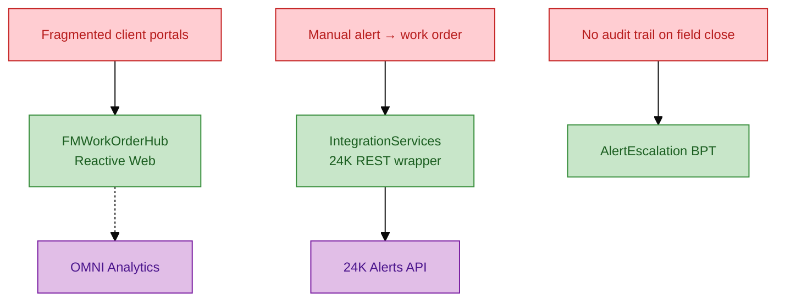
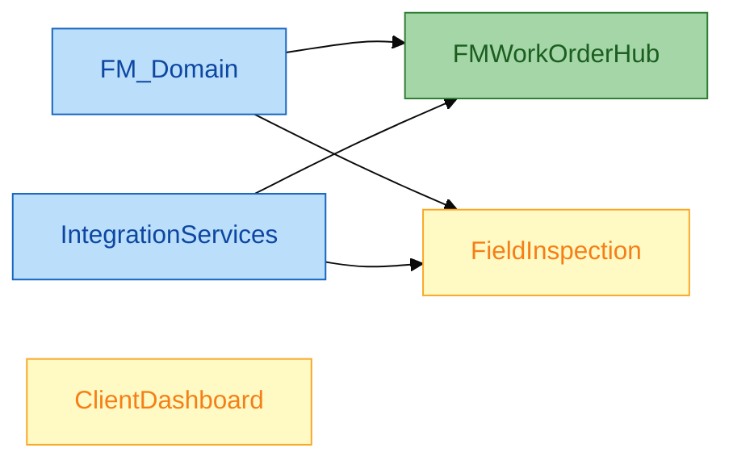
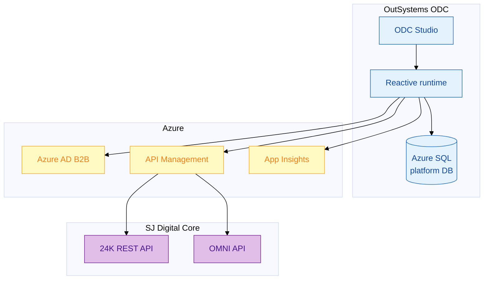

# Solution overview — FM Work Order Hub

**Programme:** SJ FM Client Experience Modernisation  
**Solution name:** `FMWorkOrderHub` (+ foundation modules)  
**Platform:** OutSystems Developer Cloud (ODC)  
**Status:** Solution design & delivery specification

---

## 1. Problem statement

SJ operates world-class FM platforms — **24K** (IoT / digital twin) and **OMNI** (BIM / Smart FM analytics). Client-facing work execution (assign technician, track SLA, sign-off, audit) still fragments across spreadsheets and bespoke apps.

**OutSystems delivers:** a governed **experience layer** — not a replacement for 24K or OMNI.

---

## 2. Solution scope

| In scope | Out of scope |
|----------|--------------|
| Reactive web app `FMWorkOrderHub` | Replacing 24K digital twin |
| Foundation `FM_Domain` entities | OMNI BIM authoring |
| `IntegrationServices` REST to 24K | Custom IoT ingestion |
| `AlertConsole` + BPT escalation | ERP / finance integration |
| RBAC: Supervisor, FieldTech, ClientReadOnly | Native hardware SDKs |
| Audit entity `WorkOrderEvent` | Data warehouse ETL (separate workstream) |

---

## 3. Application portfolio

| Application | Type | Priority | Users |
|-------------|------|----------|-------|
| `FM_Domain` | Foundation (entities) | P0 | — |
| `IntegrationServices` | Foundation (REST) | P0 | — |
| `FMWorkOrderHub` | Reactive Web | P0 | FM supervisor, helpdesk |
| `FieldInspection` | Mobile / Reactive | P1 | Field technicians |
| `ClientDashboard` | Reactive Web | P1 | Client admin |

---

## 4. Deliverables (senior engineer)

| Deliverable | Location in repo |
|-------------|------------------|
| Solution architecture | `delivery/02`–`07`, `docs/03` |
| Entity & screen specifications | `samples/` |
| REST integration contract | `samples/rest-integration-24k-iot.spec.md` |
| Security & RBAC model | `delivery/08-security-authentication.md` |
| CI/CD & test strategy | `delivery/10-cicd-testing.md` |
| Implementation build guide | `delivery/11-fm-work-order-hub-guide.md` |
| Mock API for DEV/TST | `resources/mock-server.js` |

---

## 5. Success criteria

| KPI | Target |
|-----|--------|
| Alert → work order creation | < 2 min operator time |
| REST error visibility | 100% mapped to user message + log |
| Role-based site isolation | Zero cross-site data leak in UAT |
| Publish to TST | < 15 min via Lifetime pipeline |
| Audit completeness | Every status change → `WorkOrderEvent` |

---

## 6. Technology stack

