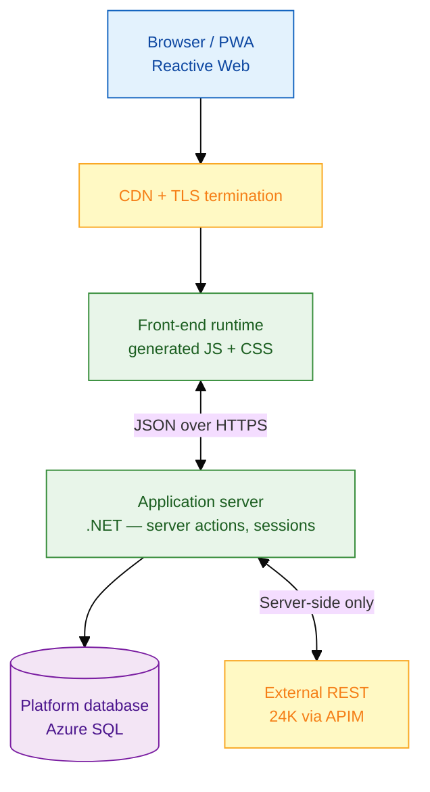
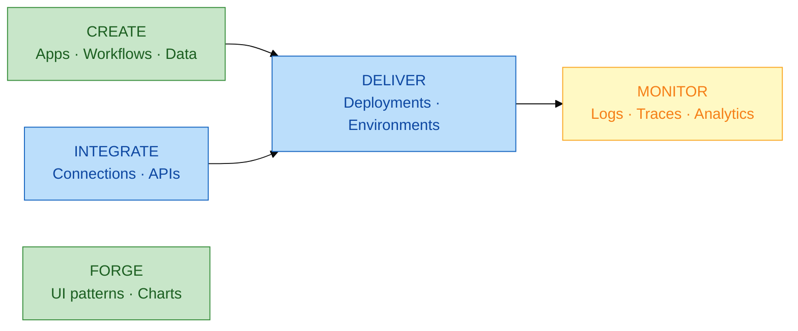
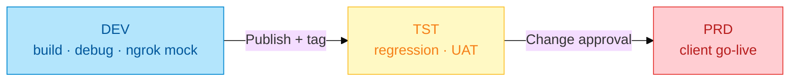
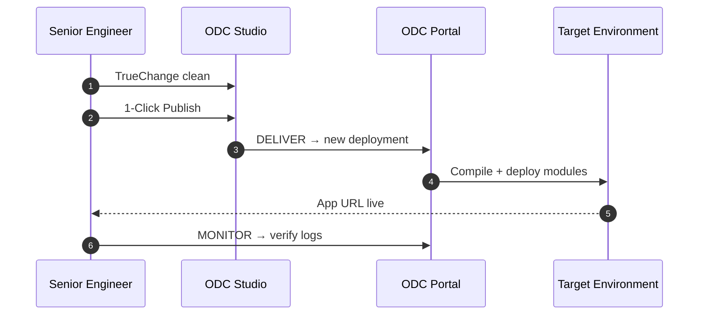
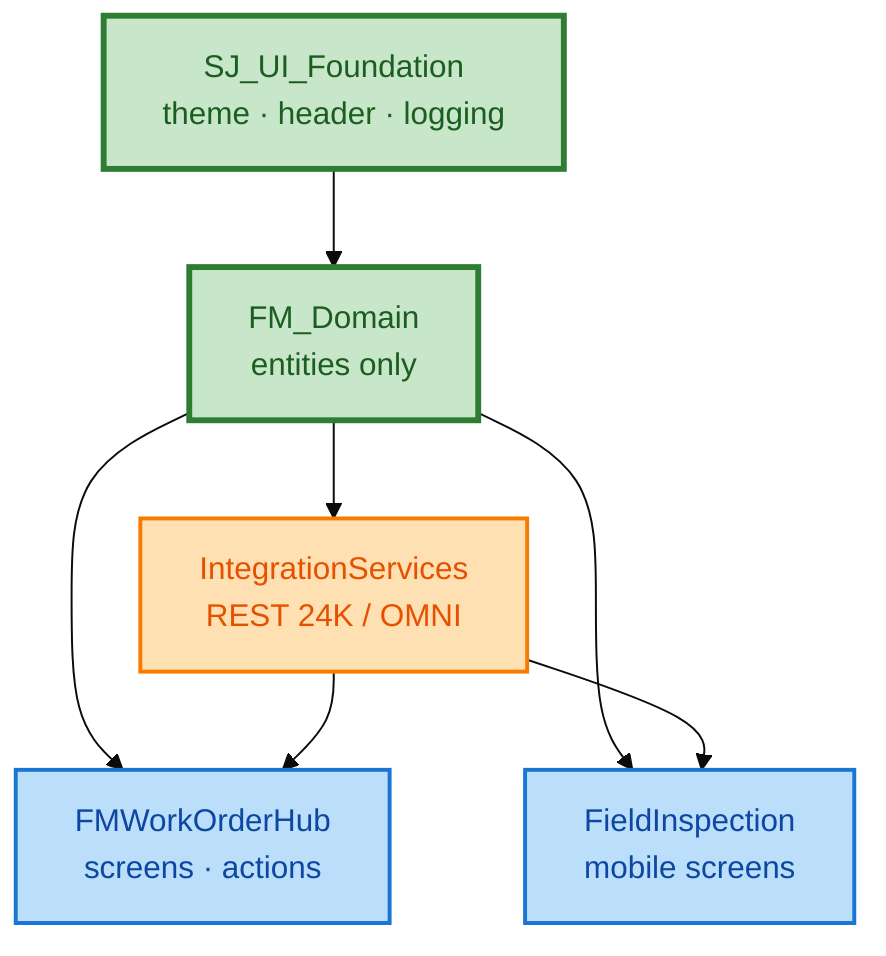

# ODC platform layer

**Platform:** OutSystems Developer Cloud (ODC)  
**Runtime:** Managed cloud — no customer-managed application servers

---

## 1. ODC runtime stack

| Layer | Responsibility | Developer artifact |
|-------|----------------|-------------------|
| Front-end runtime | Render UI, run client actions | Screens, blocks, widgets |
| Application server | Business logic, integration, auth | Server actions, aggregates |
| Platform DB | Application state | Entities, indexes |
| ODC Portal | Deploy, monitor, integrate | Connections, deployments |

---

## 2. ODC Portal map (delivery operations)

| Portal area | FM programme usage |
|-------------|-------------------|
| **CREATE → Apps** | `FMWorkOrderHub`, `IntegrationServices` |
| **CREATE → Workflows** | `AlertEscalationProcess` BPT |
| **DELIVER → Deployments** | DEV → TST → PRD promotion |
| **INTEGRATE → Connections** | 24K REST base URL + OAuth |
| **MONITOR → Logs** | REST failure triage, action errors |

---

## 3. Environment topology

| Environment | 24K endpoint | Auth |
|-------------|--------------|------|
| DEV | ngrok → `mock-server.js` or APIM-dev | OAuth2 client credentials |
| TST | `apim-tst.sj.internal/24k/v1` | OAuth2 + test subscription |
| PRD | `apim.sj.internal/24k/v1` | OAuth2 + IP allowlist |

---

## 4. Publish flow (no-code platform operation)

**Delivery checklist per publish:**

- [ ] Module dependency order: `FM_Domain` → `IntegrationServices` → `FMWorkOrderHub`
- [ ] Connection credentials scoped to target environment
- [ ] Smoke test: `WorkOrderList` loads, `GetOpenAlerts` returns data
- [ ] Deployment notes in change ticket

---

## 5. Module dependency (governance)

**Rule:** Integration modules have **no UI** — prevents circular dependencies and enables independent contract versioning.
