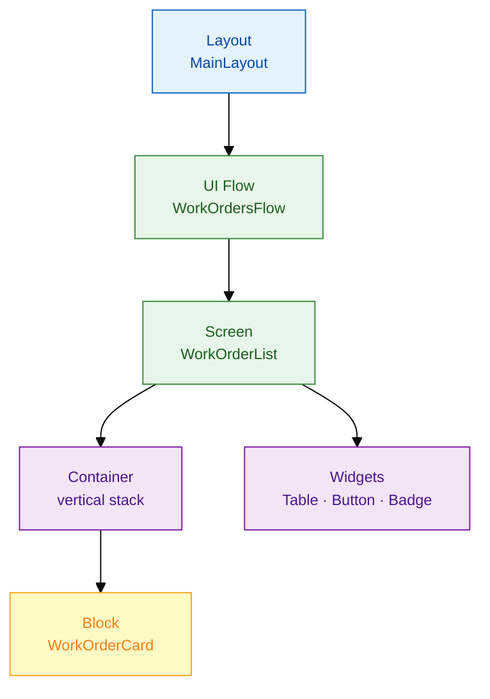
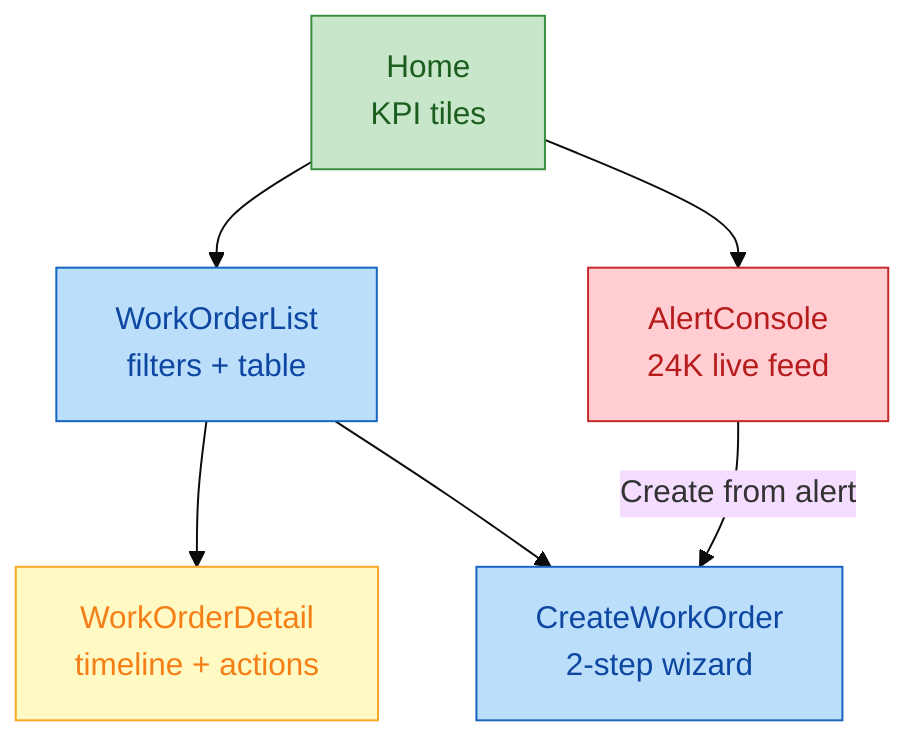
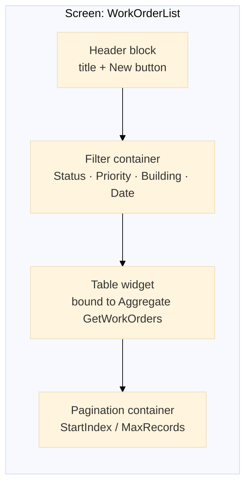
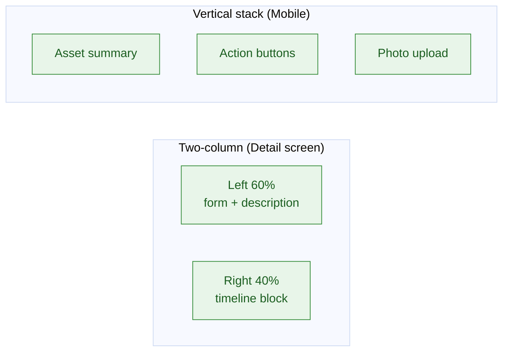

# UI layer — Screens, blocks, containers

**Application:** `FMWorkOrderHub` (Reactive Web)  
**Pattern:** Layout + UI Flow + reusable blocks

---

## 1. UI composition model



| Artifact | Purpose | FM example |
|----------|---------|------------|
| **Layout** | Shell: header, menu, footer | `SJ_MainLayout` — logo, user menu |
| **UI Flow** | Group related screens | `WorkOrdersFlow` |
| **Screen** | One route / view | `WorkOrderList`, `AlertConsole` |
| **Block** | Reusable UI fragment | `PriorityBadge`, `WorkOrderTimeline` |
| **Container** | Layout structure | Vertical / horizontal / columns |
| **Widget** | Atomic control | Table, Form, Button, Expression |

---

## 2. Screen map — FMWorkOrderHub



---

## 3. Screen anatomy (WorkOrderList)



### Delivered UI specification

| Zone | Widget / block | Data binding |
|------|----------------|--------------|
| Header | Title + Button `NewWorkOrder` | — |
| Filters | Dropdowns + DatePicker | Local variables `FilterStatus`, `FilterPriority` |
| Table | Table (columns from aggregate) | `GetWorkOrders` aggregate |
| Pagination | Previous / Next | `StartIndex`, `MaxRecords = 20` |
| Row click | Navigate | `WorkOrderDetail` with `WorkOrderId` input |

---

## 4. Block pattern — WorkOrderTimeline

Reusable across `WorkOrderDetail` and `ClientDashboard`.

```text
Block: WorkOrderTimeline
Input: WorkOrderId (Work Order Identifier)

Internal:
  Aggregate GetWorkOrderEvents
    Source: WorkOrderEvent
    Filter: WorkOrderId = Input.WorkOrderId
    Sort: CreatedOn ascending

UI:
  List → ForEach event
    Expression: EventType + CreatedBy + CreatedOn
    Icon by EventType (CREATED, ASSIGNED, STATUS_CHANGE, CLOSED)
```

---

## 5. Container layout patterns



| Pattern | Use when |
|---------|----------|
| Columns 60/40 | Detail + sidebar timeline |
| Vertical stack | Mobile field inspection |
| Tabs | Settings vs history (avoid > 3 tabs) |
| Modal popup | Quick assign — not full navigation |

---

## 6. Responsive & accessibility (delivery standard)

| Rule | Implementation |
|------|----------------|
| Touch targets | Buttons ≥ 44px on field screens |
| Priority colours | Badge block — not colour-only (add icon + text) |
| Loading state | `IsDataFetched` on aggregates — show spinner container |
| Empty state | Expression + illustration when zero work orders |
| Error banner | Block `ErrorBanner` — bound to `LastErrorMessage` local var |

Full screen spec: [`samples/work-order-fm-portal.spec.md`](../samples/work-order-fm-portal.spec.md)
