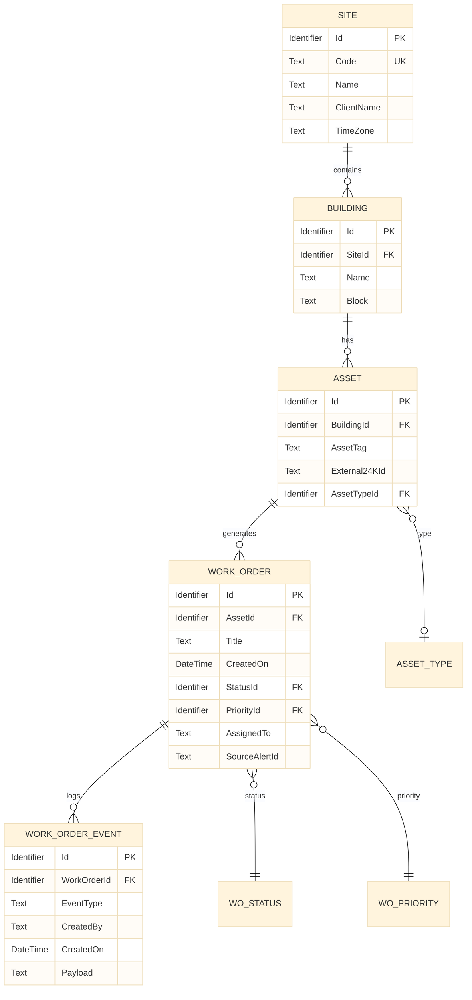
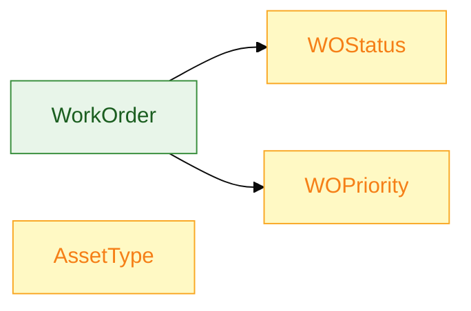
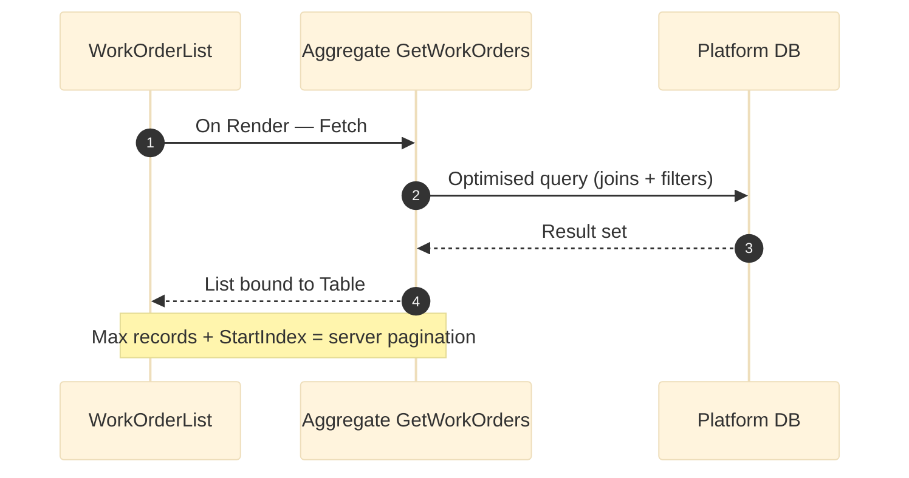
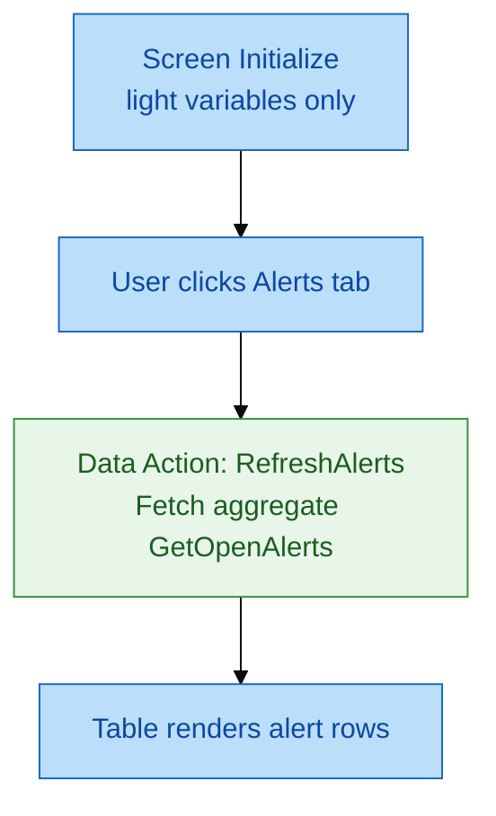
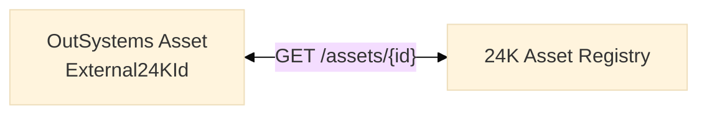

# Data model — Entities, aggregates, fetch on demand

**Foundation module:** `FM_Domain`  
**Spec:** [`samples/entity-model-facility-asset.spec.md`](../samples/entity-model-facility-asset.spec.md)

---

## 1. Entity relationship (delivered model)



---

## 2. Static entities (reference data)

| Static entity | Records | Purpose |
|---------------|---------|---------|
| `WOStatus` | Open, InProgress, OnHold, Closed, Cancelled | Work order lifecycle |
| `WOPriority` | Critical, High, Medium, Low | SLA sorting |
| `AssetType` | AHU, Lift, Chiller, Pump, … | Icon + filter grouping |
| `EventType` | CREATED, ASSIGNED, STATUS_CHANGE, NOTE, CLOSED | Audit taxonomy |



---

## 3. Aggregate — data retrieve pattern

OutSystems **Aggregates** replace hand-written SQL for 95% of reads.



### Delivered aggregate: `GetWorkOrders`

```text
Aggregate: GetWorkOrders
  Source: WorkOrder
  Joins:
    Asset (WorkOrder.AssetId = Asset.Id)
    Building (Asset.BuildingId = Building.Id)
    Site (Building.SiteId = Site.Id)
    WOStatus, WOPriority
  Filters:
    Site.Id = GetSiteIdForUser()          -- row-level security
    WOStatus.Id = FilterStatus            -- optional, when FilterStatus <> Null
    WOPriority.Id = FilterPriority        -- optional
  Sort: WOPriority.Order asc, WorkOrder.CreatedOn desc
  Max records: MaxRecords (default 20)
  Start index: StartIndex
```

---

## 4. Fetch on demand

**Fetch on demand** defers data load until the user or event triggers it — improves first paint on heavy screens.



| Scenario | Strategy |
|----------|----------|
| `WorkOrderList` | Fetch on render — primary view |
| `AlertConsole` | **Fetch on demand** — tab click or Refresh button |
| `WorkOrderDetail` | Fetch on render — single record + events aggregate |
| `CreateWorkOrder` wizard step 2 | Fetch asset list only when step 2 opens |

### Data action (no-code pattern)

```text
Data Action: RefreshAlerts
  Aggregate: GetOpenAlertsFrom24K   -- server call wrapper
  On After Fetch:
    Assign AlertCount = GetOpenAlertsFrom24K.List.Length
```

---

## 5. Advanced Query policy

| Allowed | Requires approval |
|---------|-------------------|
| Aggregate with joins ≤ 5 tables | Advanced Query for reporting export |
| Index on `WorkOrder(StatusId, CreatedOn)` | Dynamic SQL |
| Calculated attributes in aggregate | Cross-database queries |

**Delivered index recommendations:**

```sql
-- Platform DBA script (reference/samples/reference/sql_asset_maintenance_queries.sql)
CREATE INDEX IX_WorkOrder_Status_CreatedOn ON OSUSR_xxx_WorkOrder (StatusId, CreatedOn DESC);
CREATE INDEX IX_Asset_External24KId ON OSUSR_xxx_Asset (External24KId);
```

---

## 6. External key — 24K bridge

| Entity field | Maps to | Rule |
|--------------|---------|------|
| `Asset.External24KId` | 24K asset registry | Immutable after create |
| `WorkOrder.SourceAlertId` | 24K alert ID | Set when created from AlertConsole |
| `Site.Code` | 24K `siteCode` param | e.g. `SIN-CAMPUS-01` |


