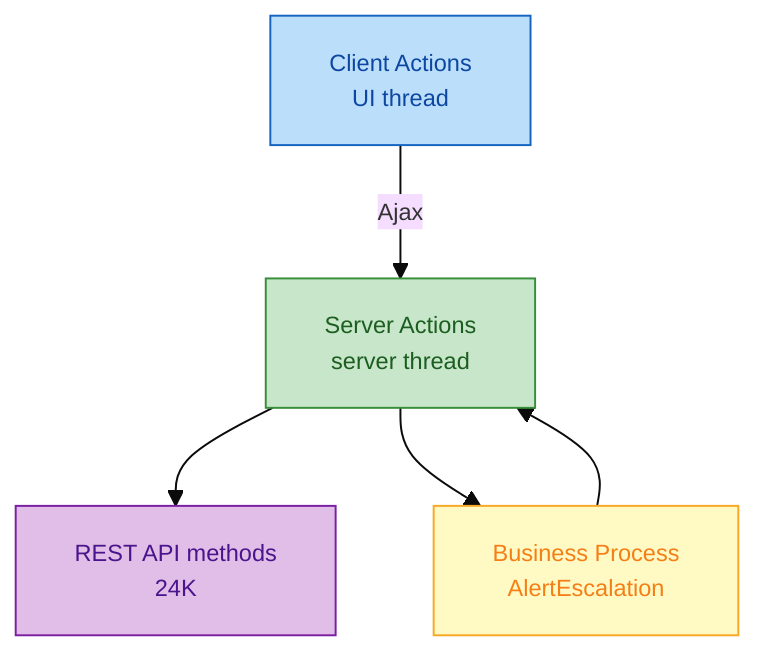
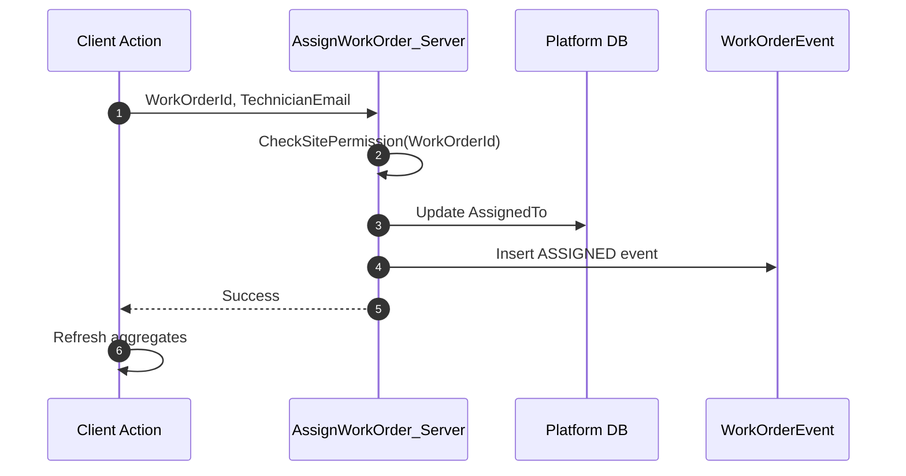
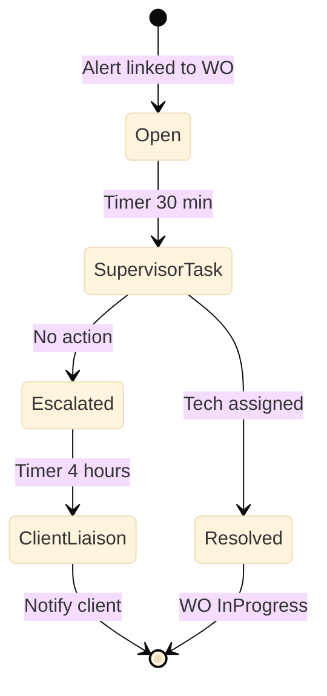

# Logic — Client actions, server actions, flows

**Modules:** `FMWorkOrderHub`, `IntegrationServices`

---

## 1. Logic layer map



| Type | Runs on | Use for |
|------|---------|---------|
| **Client Action** | Browser | Navigation, validation UX, call server action |
| **Server Action** | App server | DB writes, REST calls, security checks |
| **Flow** | Orchestration | Multi-step, timers, human tasks (BPT) |
| **Expression** | Either | Calculated values, conditions |

---

## 2. Client action — AssignWorkOrder (delivered pattern)

```text
Client Action: AssignWorkOrder
  Input: WorkOrderId, TechnicianEmail

  // 1. Optimistic UI guard
  If TechnicianEmail = "" Then
    Message: "Select a technician"
    Exit
  End If

  // 2. Call server
  AssignWorkOrder_Server(WorkOrderId, TechnicianEmail)

  // 3. Refresh data
  Refresh GetWorkOrders
  Refresh GetWorkOrderEvents   -- on detail screen

  // 4. Feedback
  Message: "Assigned to " + TechnicianEmail
```



---

## 3. Server action — CreateWorkOrderFromAlert

```text
Server Action: CreateWorkOrderFromAlert
  Input: AlertId, AssetExternalId, Title, PriorityId
  Output: WorkOrderId

  // 1. Resolve asset
  Asset = GetAssetByExternal24KId(AssetExternalId)
  If Asset.Id = NullIdentifier Then
    Raise Error: ASSET_NOT_FOUND
  End If

  // 2. Permission
  CheckSitePermission(Asset.Building.SiteId)

  // 3. Create work order
  NewWorkOrder.AssetId = Asset.Id
  NewWorkOrder.Title = Title
  NewWorkOrder.PriorityId = PriorityId
  NewWorkOrder.StatusId = OpenStatusId
  NewWorkOrder.SourceAlertId = AlertId
  CreateWorkOrder entity

  // 4. Audit
  LogWorkOrderEvent(WorkOrderId, "CREATED", GetUserName())

  // 5. Acknowledge in 24K (idempotent)
  AcknowledgeAlert24K(AlertId, WorkOrderId)

  Output.WorkOrderId = WorkOrderId
```

---

## 4. Server action — AcknowledgeAlert24K (integration)

Lives in `IntegrationServices` — no UI dependency.

```text
Server Action: AcknowledgeAlert24K
  Input: AlertId, WorkOrderRef

  Request = New AckRequest
  Request.acknowledgedBy = GetUserName()
  Request.workOrderRef = "WO-" + WorkOrderRef

  Response = REST_24K_Alerts.Acknowledge(AlertId, Request)

  If Response.StatusCode = 409 Then
    // Already acknowledged — treat as success (idempotent)
    LogIntegration("ACK_DUPLICATE", AlertId)
    Return
  End If

  If Response.StatusCode >= 400 Then
    Raise Error: Map24KError(Response)
  End If
```

---

## 5. Business Process — AlertEscalation



Spec: [`samples/iot-alert-escalation-bpt.spec.md`](../samples/iot-alert-escalation-bpt.spec.md)

---

## 6. Error handling standard

| Error source | Map to | Log |
|--------------|--------|-----|
| Validation | User message on screen | Debug only |
| REST 4xx | `LastErrorMessage` + retry button | MONITOR warning |
| REST 5xx | Generic + incident ref | MONITOR error + App Insights |
| Permission | "Access denied" | Security audit |

---

## 7. Anti-patterns (delivery review)

| Anti-pattern | Fix |
|--------------|-----|
| REST call in client action | Move to server action |
| 200-line client action | Extract server actions + blocks |
| Duplicate integration logic | Centralise in `IntegrationServices` |
| Silent catch-all | Map errors explicitly |
