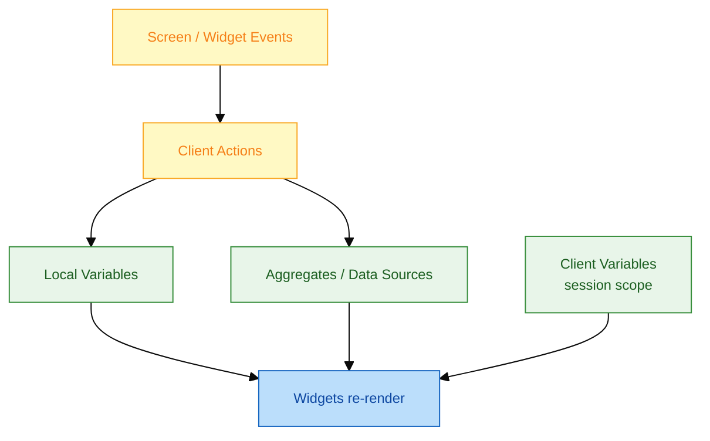
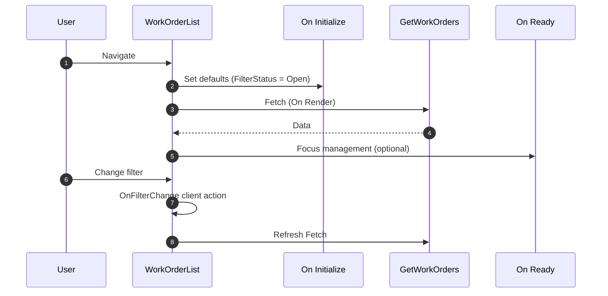
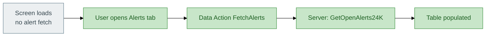
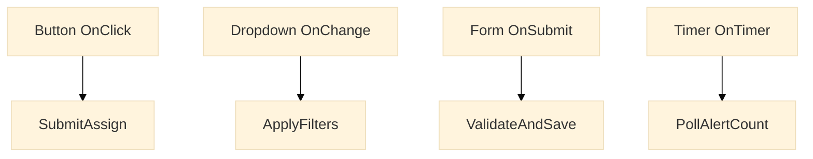

# Reactive Web — Events, screen lifecycle, data actions

**App type:** Reactive Web (`FMWorkOrderHub`)

---

## 1. Reactive runtime model



| Concept | Scope | FM example |
|---------|-------|------------|
| **Input parameter** | Screen | `WorkOrderId` on Detail |
| **Local variable** | Screen / action | `FilterStatus`, `IsLoading` |
| **Client variable** | Session | `SelectedSiteId`, `UserDisplayName` |
| **Aggregate** | Data source | `GetWorkOrders` |

---

## 2. Screen events lifecycle



### Delivered event bindings — WorkOrderList

| Event | Handler | Behaviour |
|-------|---------|-----------|
| **On Initialize** | `InitWorkOrderList` | Set `StartIndex=0`, default filters |
| **On Render** | — | `GetWorkOrders` auto-fetch |
| **Filter dropdown OnChange** | `ApplyFilters` | Reset `StartIndex`, refresh aggregate |
| **Table row OnClick** | `OpenDetail` | Navigate `WorkOrderDetail(WorkOrderId)` |
| **New button OnClick** | `GoToCreate` | Navigate `CreateWorkOrder` |

---

## 3. Fetch on demand — AlertConsole



```text
Client Action: OnAlertsTabSelected
  // Fetch on demand — not on screen initialize
  Refresh GetOpenAlerts

Aggregate: GetOpenAlerts
  Source: Server action result via Data Action
  Fetch: On Demand — property enabled
```

---

## 4. Widget events



| Widget | Event | FM usage |
|--------|-------|----------|
| Button | OnClick | Assign, Close, Refresh |
| Dropdown | OnChange | Filter change |
| Input | OnBlur | Inline validation |
| Timer | OnTimer | Poll critical alert count (60s) — use sparingly |
| Popup | OnClose | Reset wizard step |

---

## 5. Client variables (session state)

```text
Client Variable: SelectedSiteId (Site Identifier)
  Set on: Login callback / Home screen initialize
  Read on: All aggregates via GetSiteIdForUser() server helper

Client Variable: LastErrorMessage (Text)
  Set on: Server action error handler
  Clear on: Next successful action or dismiss banner
```

---

## 6. Reactive vs Traditional Web

| Aspect | Reactive (delivered) | Traditional Web |
|--------|---------------------|-----------------|
| Page model | SPA — partial refresh | Full page submit |
| Data fetch | Aggregates + AJAX | Preparation + submit |
| Mobile | Responsive by default | Separate mobile app |
| FM choice | **Reactive** for supervisor portal | Legacy only if mandated |

---

## 7. Performance checklist

- [ ] Aggregates use **Max records** — never unbounded lists
- [ ] Heavy REST calls behind **fetch on demand**
- [ ] Client actions stay < 30 logic nodes
- [ ] `IsDataFetched` gates table render — no flash of empty state
- [ ] Images in field app — lazy load block
