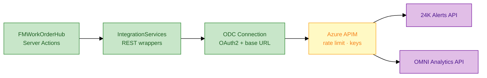
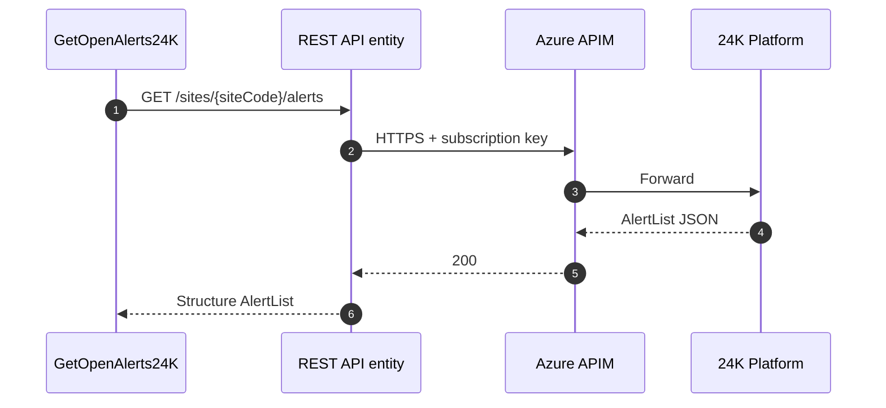
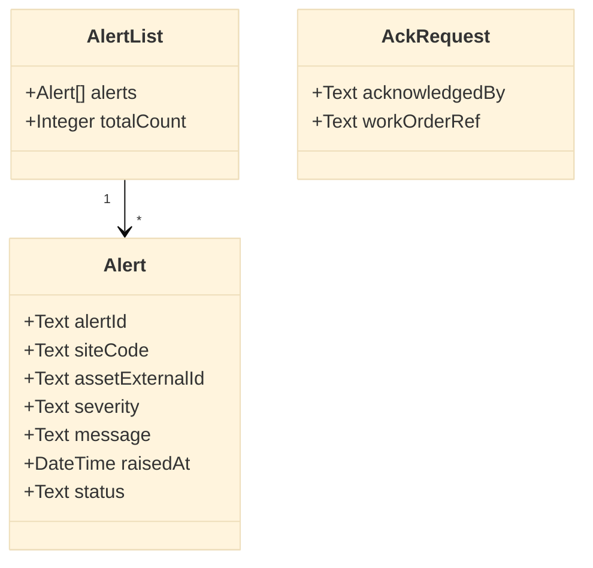
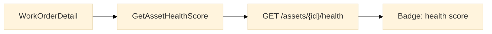

# Integration layer — REST API

**Module:** `IntegrationServices` (foundation, no UI)  
**Spec:** [`samples/rest-integration-24k-iot.spec.md`](../samples/rest-integration-24k-iot.spec.md)

---

## 1. Integration landscape



---

## 2. REST consumer setup (ODC — no-code)

| Step | Portal path | Value |
|------|-------------|-------|
| 1 | INTEGRATE → Connections | New REST connection `SJ_24K_DEV` |
| 2 | Base URL | `https://xxxx.ngrok-free.app` (DEV) |
| 3 | Auth | None (mock) / OAuth2 (TST/PRD) |
| 4 | Studio | Add REST API → import swagger or manual methods |
| 5 | Module | `IntegrationServices` — expose server actions only |



---

## 3. Structures (DTO mapping)



| Structure | Direction | Purpose |
|-----------|-----------|---------|
| `AlertList` | Response | List endpoint wrapper |
| `Alert` | Response | Single alert row |
| `AckRequest` | Request | POST acknowledge body |
| `Asset24K` | Response | Asset lookup enrichment |

---

## 4. Delivered REST methods

| Method | HTTP | Server action wrapper |
|--------|------|----------------------|
| `GetSiteAlerts` | GET `/sites/{siteCode}/alerts` | `GetOpenAlerts24K` |
| `AcknowledgeAlert` | POST `/alerts/{id}/acknowledge` | `AcknowledgeAlert24K` |
| `GetAsset` | GET `/assets/{externalId}` | `GetAssetFrom24K` |

### GetOpenAlerts24K (pseudo-logic)

```text
Server Action: GetOpenAlerts24K
  Input: SiteCode, SeverityFilter (optional)
  Output: AlertList

  Response = REST_SJ24K.GetSiteAlerts(
    SiteCode,
    Query: status=OPEN, severity=SeverityFilter
  )

  If Response.StatusCode = 200 Then
    Output = Response.Body
  Else
    Output.alerts = Empty list
    LogIntegrationError(Response)
    Raise Error: Map24KError(Response)
  End If
```

---

## 5. Error mapping

| HTTP | 24K code | User message | Retry |
|------|----------|--------------|-------|
| 400 | INVALID_SITE | "Site not found in 24K" | No |
| 401 | — | "Integration auth failed — contact admin" | No |
| 404 | ALERT_GONE | "Alert already cleared" | No |
| 409 | ALREADY_ACK | Silent success (idempotent) | — |
| 429 | RATE_LIMIT | "Too many requests — wait 30s" | Yes |
| 500+ | — | "24K unavailable — ref {correlationId}" | Yes |

---

## 6. DEV mock API

```bash
cd resources
node mock-server.js
# ODC: ngrok http 3000 → use HTTPS URL in Connection
```

| Endpoint | Mock file |
|----------|-----------|
| `GET /sites/SIN-CAMPUS-01/alerts` | `mock-24k-alerts.json` |
| `POST /alerts/{id}/acknowledge` | In-memory state |

---

## 7. OMNI read integration (P1)



Read-only — OMNI remains analytics system of record.
