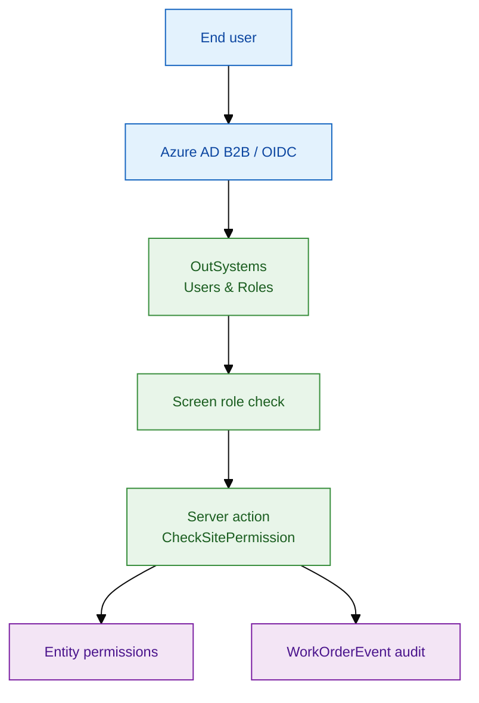
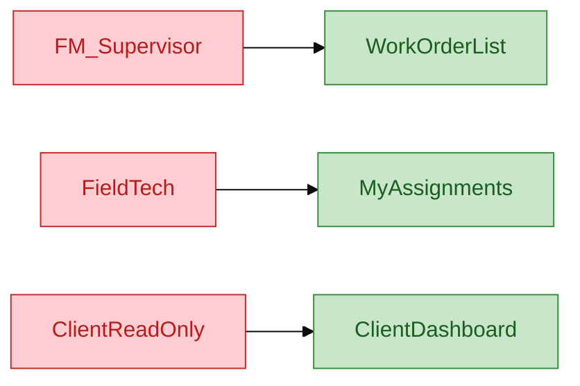
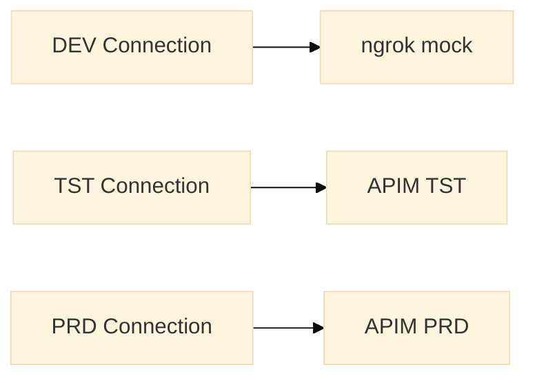

# Security & authentication

**Identity:** Azure AD B2B (client users) + SJ corporate AD (internal)  
**Authorisation:** OutSystems Roles + server-side site checks

---

## 1. Security architecture



---

## 2. Roles (delivered)

| Role | Screens | Server actions | Entity |
|------|---------|----------------|--------|
| `FM_Supervisor` | All work order screens | CRUD, assign, close | Read/Write WO |
| `FieldTech` | Assigned list, detail | Update status, add note | Read WO, Write events |
| `ClientReadOnly` | Client dashboard | Read only | Read WO filtered by site |
| `Admin` | Site config | User-site mapping | Full domain |
| `Registered` | Authenticated shell | — | — |
| `Anonymous` | Login only | — | — |



---

## 3. Screen-level security (no-code)

```text
Screen: WorkOrderList
  Roles: FM_Supervisor, Admin
  Anonymous: unchecked
  Registered: checked (base auth)

Screen: ClientDashboard
  Roles: ClientReadOnly
```

---

## 4. Server-side row security

**Never rely on UI filters alone.**

```text
Server Action: GetSiteIdForUser
  Output: SiteId

  Mapping = UserSiteMapping
    Filter: UserId = GetUserId()
  If Mapping empty Then Raise NOT_AUTHORISED
  Output = Mapping.SiteId

Server Action: CheckSitePermission
  Input: WorkOrderId

  WO = GetWorkOrderById(WorkOrderId)
  SiteId = WO.Asset.Building.SiteId
  If SiteId <> GetSiteIdForUser() And not IsAdmin() Then
    Raise NOT_AUTHORISED
  End If
```

---

## 5. Integration credentials

| Secret | Storage | Rotation |
|--------|---------|----------|
| OAuth client secret | ODC Connection (per env) | 90 days |
| APIM subscription key | Connection extra header | On compromise |
| ngrok token | Developer vault only | DEV only |



---

## 6. Audit & compliance

| Event | Stored in | Retention |
|-------|-----------|-----------|
| WO status change | `WorkOrderEvent` | 7 years |
| 24K acknowledge | `WorkOrderEvent` + integration log | 7 years |
| Login failure | MONITOR / SIEM | 1 year |
| REST 5xx | App Insights | 90 days |

```text
Server Action: LogWorkOrderEvent
  Input: WorkOrderId, EventType, Payload

  NewEvent.WorkOrderId = WorkOrderId
  NewEvent.EventType = EventType
  NewEvent.CreatedBy = GetUserName()
  NewEvent.CreatedOn = CurrDateTime()
  NewEvent.Payload = Payload
  Create WorkOrderEvent
```

---

## 7. Security test cases (UAT)

| # | Test | Expected |
|---|------|----------|
| S1 | ClientReadOnly opens other site WO URL | Access denied |
| S2 | FieldTech closes unassigned WO | Blocked |
| S3 | Direct REST call without token | 401 |
| S4 | SQL injection in filter text | Escaped — no error |
