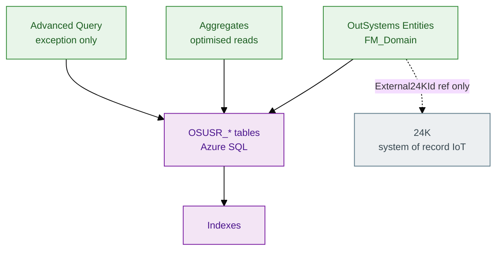
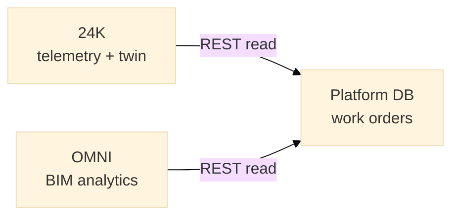
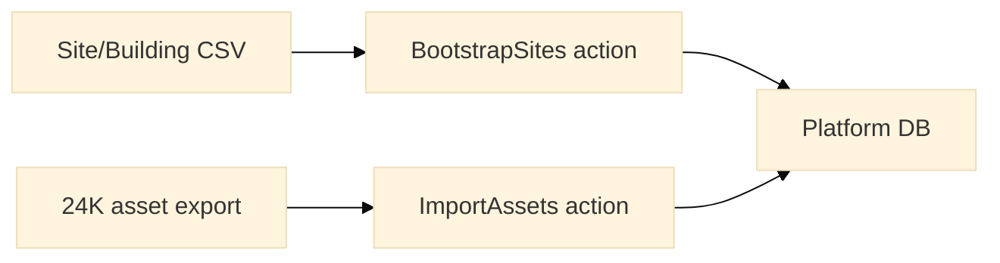

# Database & persistence

**Database:** Azure SQL (ODC-managed platform database)  
**Module:** `FM_Domain` entities

---

## 1. Persistence model



---

## 2. What lives in platform DB vs 24K

| Data | System of record | OutSystems holds |
|------|------------------|------------------|
| Sensor telemetry | 24K | — |
| Digital twin graph | 24K | — |
| BIM model | OMNI | — |
| Work orders | **OutSystems** | Full lifecycle |
| Assignment / SLA | **OutSystems** | Yes |
| Audit events | **OutSystems** | `WorkOrderEvent` |
| Asset registry (ops) | 24K (master) | Cache subset + `External24KId` |



---

## 3. Entity physical design

| Entity | Est. rows (year 1) | Growth | Index |
|--------|-------------------|--------|-------|
| `Site` | 50 | Low | PK |
| `Building` | 500 | Low | SiteId |
| `Asset` | 50,000 | Medium | External24KId, BuildingId |
| `WorkOrder` | 200,000 | High | StatusId+CreatedOn, AssetId |
| `WorkOrderEvent` | 1M+ | High | WorkOrderId+CreatedOn |

---

## 4. Transaction patterns

```text
Server Action: CloseWorkOrder
  Start Transaction

  Update WorkOrder.StatusId = Closed
  LogWorkOrderEvent(CLOSED)
  // Optional: Notify24K — async preferred

  Commit Transaction

  On Error
    Rollback Transaction
    Raise
```

| Pattern | Use |
|---------|-----|
| Single transaction | WO update + audit event |
| No transaction | Read-only aggregates |
| Async handoff | Email / webhook after commit |

---

## 5. Advanced Query policy

Delivered rule: **Aggregates first.**

| Scenario | Tool |
|----------|------|
| List with 4 joins | Aggregate |
| CSV export 10k rows | Advanced Query + timer action |
| Cross-module report | Separate reporting module |
| Full-text search | Extension or external search |

Reference SQL: [`samples/reference/sql_asset_maintenance_queries.sql`](../samples/reference/sql_asset_maintenance_queries.sql)

---

## 6. Backup & DR (ODC managed)

| Concern | ODC responsibility | Team responsibility |
|---------|-------------------|---------------------|
| DB backup | Platform SLA | Verify restore in TST yearly |
| Point-in-time | ODC portal | Document RPO/RTO |
| Entity export | Manual OML | Version in git specs |
| Secrets | Not in DB | Connections per env |

---

## 7. Data migration (bootstrap)



One-time server actions — disabled in PRD after cutover.
