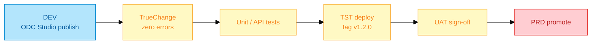
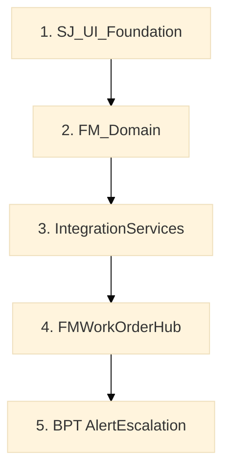
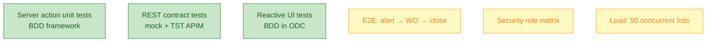
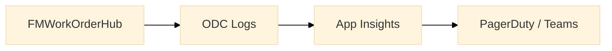

# CI/CD, testing & monitoring

**Pipeline:** OutSystems Lifetime (or ODC DELIVER for cloud-only)  
**Monitoring:** ODC MONITOR + Azure App Insights

---

## 1. CI/CD pipeline



| Stage | Gate | Owner |
|-------|------|-------|
| DEV | TrueChange clean | Developer |
| TST | Automated smoke + peer review | Senior engineer |
| UAT | Client FM supervisor sign-off | BA + client |
| PRD | Change advisory board | Release manager |

---

## 2. Module publish order



Breaking change in `IntegrationServices` → regression all consumers before PRD.

---

## 3. Test strategy



### Delivered test cases

| ID | Scenario | Type |
|----|----------|------|
| T01 | CreateWorkOrder happy path | Unit |
| T02 | CreateWorkOrderFromAlert + 409 ack | Unit |
| T03 | GetOpenAlerts24K maps 500 error | Integration |
| T04 | ClientReadOnly cross-site blocked | Security |
| T05 | WorkOrderList pagination 20 rows | UI |
| T06 | BPT escalates after 30 min | Process |

### Server action unit test (pattern)

```text
Test: CreateWorkOrder_ValidAsset_ReturnsId
  Setup: Seed Asset, Site, User with FM_Supervisor
  Execute: CreateWorkOrder(AssetId, ...)
  Assert: WorkOrderId <> NullIdentifier
  Assert: WorkOrderEvent count = 1, type CREATED
```

---

## 4. ODC MONITOR operations

| Signal | Where | Action |
|--------|-------|--------|
| REST 5xx spike | MONITOR → Logs | Page on-call |
| Slow aggregate | Analytics | Add index / reduce joins |
| Failed publish | DELIVER | Rollback deployment |
| Auth errors | Logs filter `401` | Check AD app registration |



---

## 5. Versioning & release notes

| Artifact | Format |
|----------|--------|
| Git tag | `fm-hub-v1.2.0` |
| Lifetime tag | Same as git |
| Release notes | Module diff + REST contract changes |
| Rollback | Redeploy previous Lifetime tag |

---

## 6. Definition of Done (senior sign-off)

- [ ] TrueChange zero errors/warnings (justified exceptions documented)
- [ ] Server actions have unit tests for happy + error paths
- [ ] REST errors mapped per `07-integration-rest.md`
- [ ] RBAC verified per role matrix
- [ ] Publish to TST with deployment notes
- [ ] MONITOR clean for 24h smoke period
