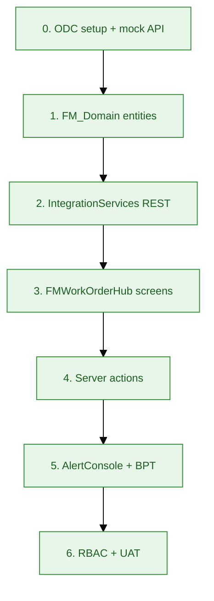
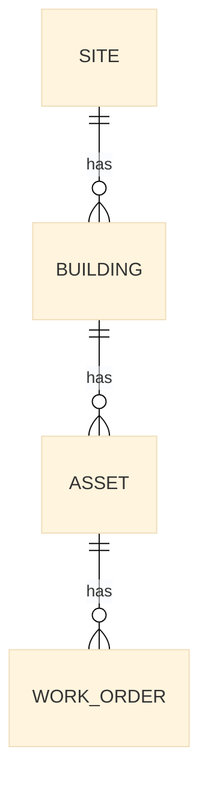
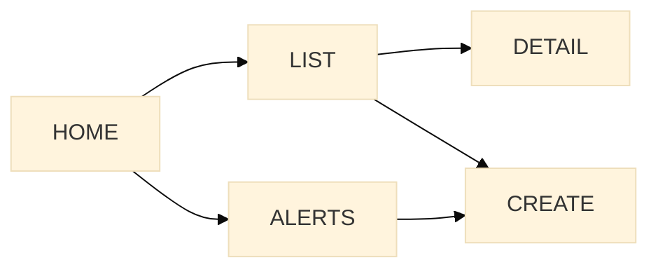
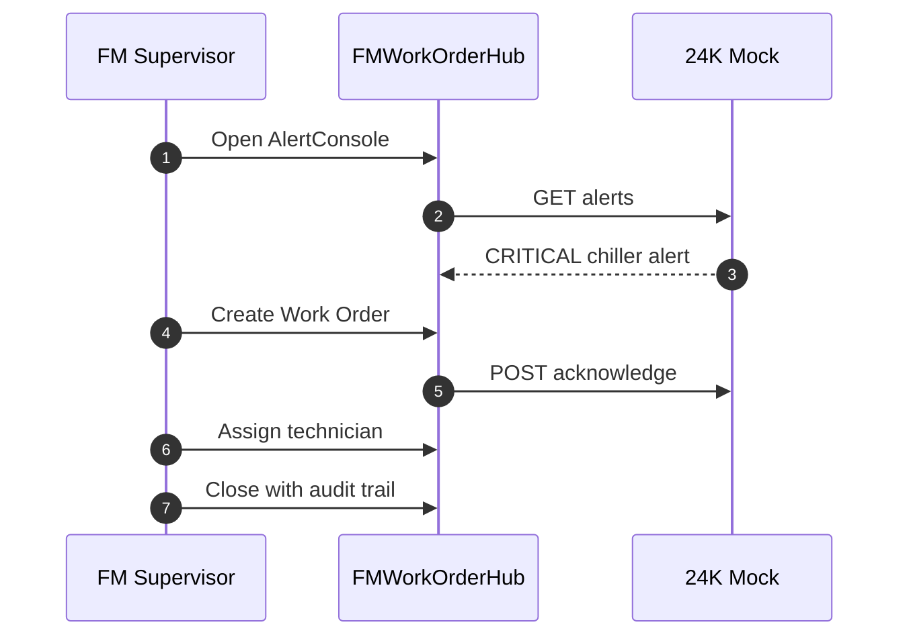

# Implementation guide — FMWorkOrderHub

**Audience:** OutSystems developers implementing the delivered solution  
**Prerequisites:** ODC Studio, access to DEV environment

---

## 1. Build sequence

---

## Phase 0 — Environment (30 min)

1. ODC Portal → Create → Web app → `FMWorkOrderHub`  
2. `node resources/mock-server.js` + ngrok (ODC)  
3. INTEGRATE → Connection → base URL  
4. Publish empty app — verify URL loads  

Guide: [`resources/odc-studio-quickstart.md`](../resources/odc-studio-quickstart.md)

---

## Phase 1 — FM_Domain (2h)

Create foundation module `FM_Domain` — **entities only, no screens**.

| Entity | Key fields |
|--------|------------|
| `Site` | Code, Name, ClientName, TimeZone |
| `Building` | SiteId, Name, Block |
| `Asset` | BuildingId, AssetTag, **External24KId**, AssetTypeId |
| `WorkOrder` | AssetId, Title, StatusId, PriorityId, AssignedTo, SourceAlertId |
| `WorkOrderEvent` | WorkOrderId, EventType, CreatedBy, CreatedOn, Payload |
| `WOStatus`, `WOPriority`, `AssetType` | Static entities |

Spec: [`samples/entity-model-facility-asset.spec.md`](../samples/entity-model-facility-asset.spec.md)

**Done when:** Seed data — 1 site, 2 buildings, 5 assets with `External24KId`.

---

## Phase 2 — IntegrationServices (2h)

| Deliverable | Detail |
|-------------|--------|
| REST API | Import from spec or manual 3 methods |
| Structures | `Alert`, `AlertList`, `AckRequest` |
| `GetOpenAlerts24K` | Wrap GET alerts |
| `AcknowledgeAlert24K` | Idempotent POST |
| `GetAssetFrom24K` | Optional enrichment |

Spec: [`samples/rest-integration-24k-iot.spec.md`](../samples/rest-integration-24k-iot.spec.md)

**Test:** Connection test → returns CRITICAL alert from mock.

---

## Phase 3 — Screens (3h)

| Screen | Aggregates / blocks |
|--------|---------------------|
| `Home` | KPI expressions — open count, critical count |
| `WorkOrderList` | `GetWorkOrders` + filters + pagination |
| `WorkOrderDetail` | `GetWorkOrderById`, `WorkOrderTimeline` block |
| `CreateWorkOrder` | 2-step wizard |
| `AlertConsole` | `GetOpenAlerts` — **fetch on demand** |

Spec: [`samples/work-order-fm-portal.spec.md`](../samples/work-order-fm-portal.spec.md)

---

## Phase 4 — Server actions (2h)

| Action | Module |
|--------|--------|
| `CreateWorkOrder` | FMWorkOrderHub |
| `CreateWorkOrderFromAlert` | FMWorkOrderHub |
| `AssignWorkOrder` | FMWorkOrderHub |
| `CloseWorkOrder` | FMWorkOrderHub |
| `GetSiteIdForUser` | FM_Domain |
| `CheckSitePermission` | FM_Domain |
| `LogWorkOrderEvent` | FM_Domain |

Patterns: [`delivery/05-logic-actions-flows.md`](05-logic-actions-flows.md)

---

## Phase 5 — BPT escalation (1h)

1. CREATE → Workflow → `AlertEscalationProcess`  
2. Timer 30 min → Supervisor human activity  
3. Timer 4h → Client liaison notification  

Spec: [`samples/iot-alert-escalation-bpt.spec.md`](../samples/iot-alert-escalation-bpt.spec.md)

---

## Phase 6 — Security & UAT (1h)

| Task | Reference |
|------|-----------|
| Assign roles per user | [`delivery/08-security-authentication.md`](08-security-authentication.md) |
| Screen role checks | All screens except login |
| Run security test matrix | S1–S4 |
| Client UAT script | Alert → WO → assign → close |

---

## 2. Demo script (client showcase)

---

## 3. Related apps (P1 roadmap)

| App | Spec |
|-----|------|
| `FieldInspection` | [`samples/project-inspection-mobile.spec.md`](../samples/project-inspection-mobile.spec.md) |
| `ClientDashboard` | Read-only WO list for `ClientReadOnly` |
