# Diagrams atlas — FM Work Order Hub

All key Mermaid diagrams in one place for reviews, client workshops, and architecture sign-off.

---

## 1. Solution context

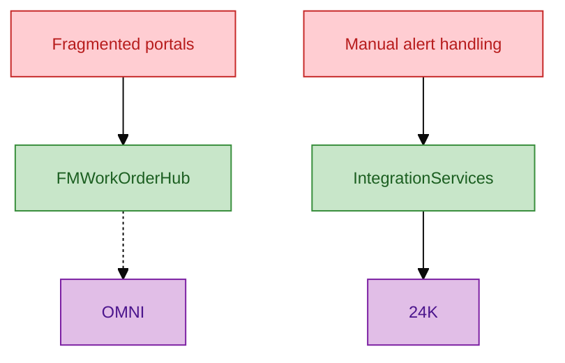

---

## 2. Enterprise landscape

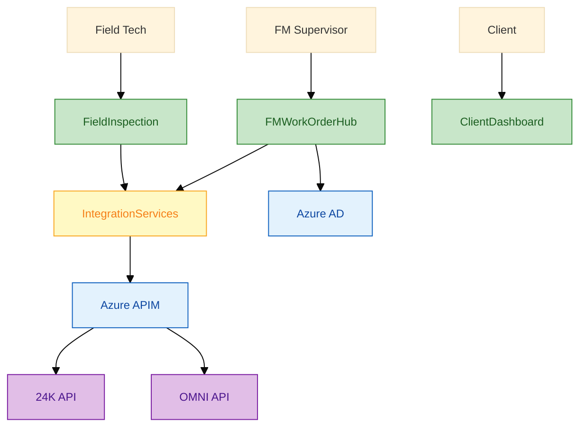

---

## 3. ODC dev environment

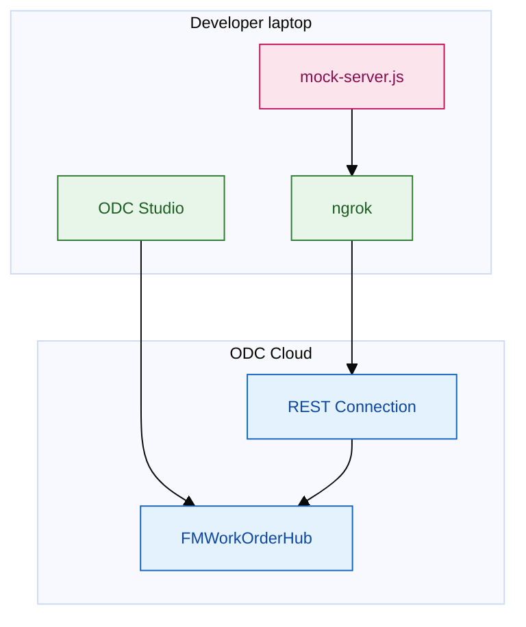

---

## 4. Four application layers

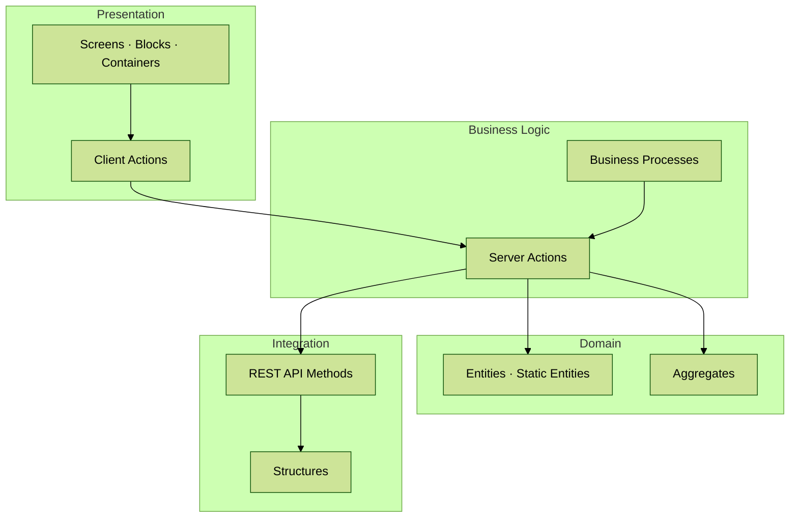

---

## 5. Screen map

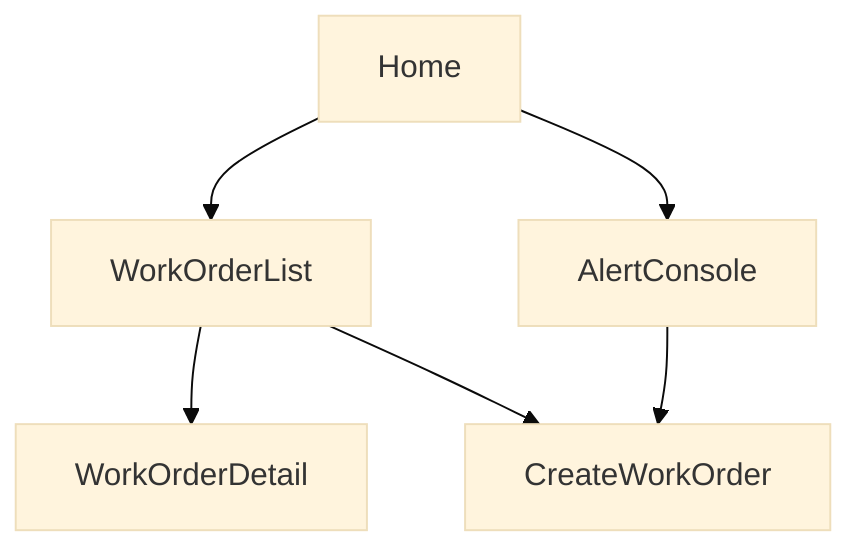

---

## 6. Entity model

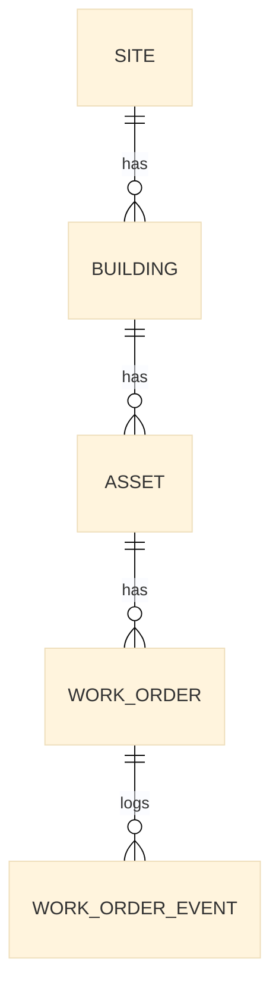

---

## 7. Alert to work order sequence

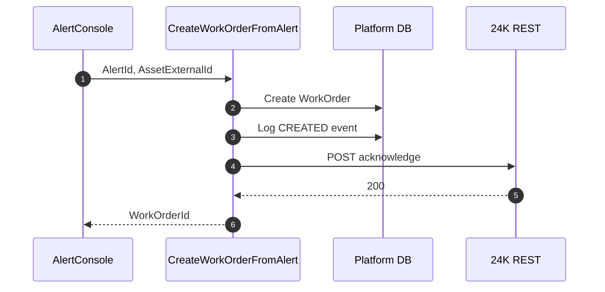

---

## 8. Reactive screen lifecycle

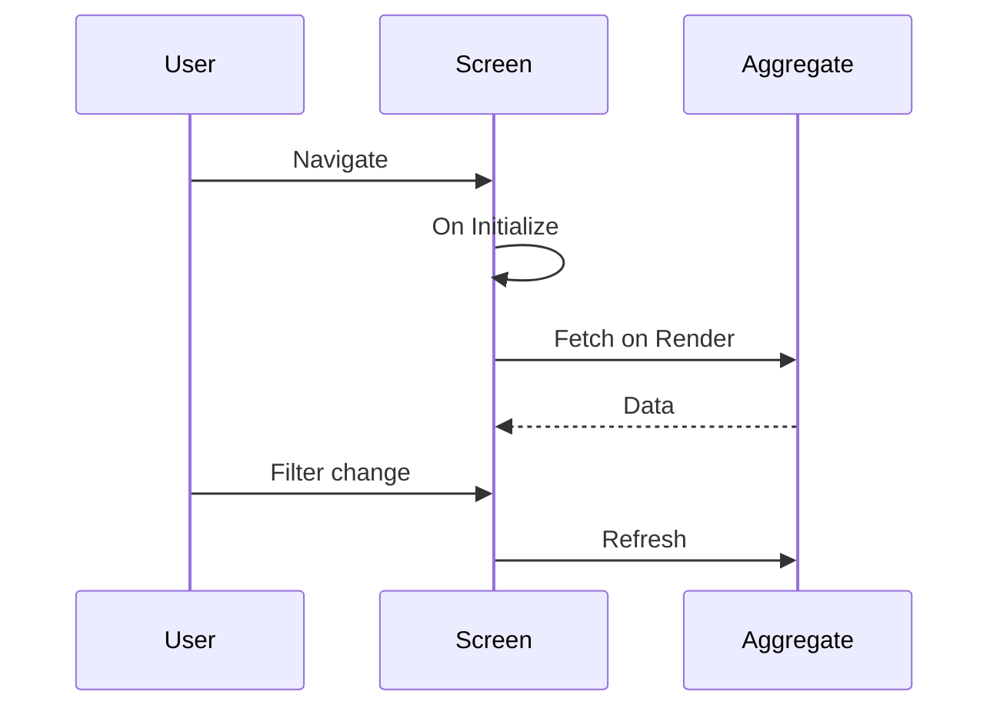

---

## 9. Security model

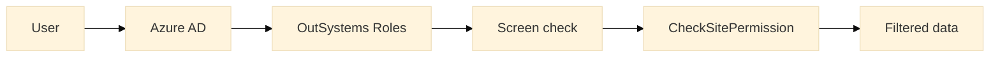

---

## 10. CI/CD pipeline

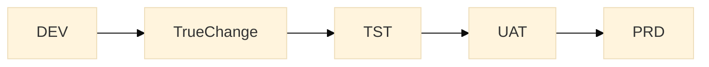

---

## 11. BPT escalation

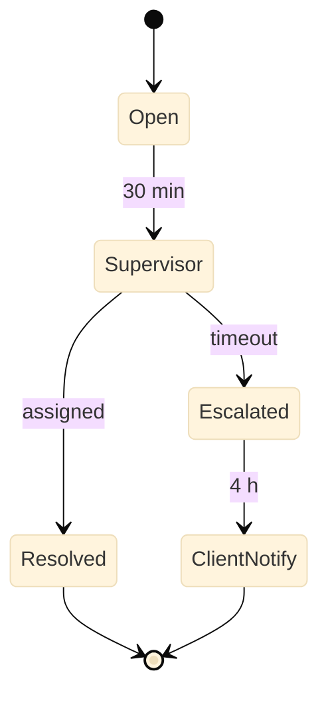

---

## 12. Module dependencies

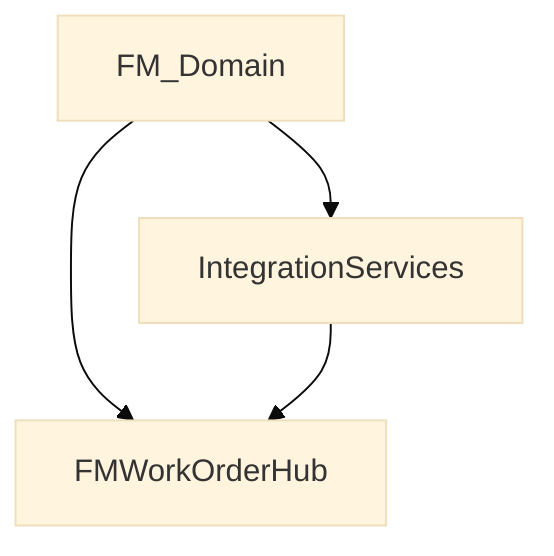

---

> **Source chapters:** [`01-solution-overview.md`](01-solution-overview.md) through [`11-fm-work-order-hub-guide.md`](11-fm-work-order-hub-guide.md) · [`resources/dev-environment-and-practice-diagrams.md`](../resources/dev-environment-and-practice-diagrams.md)
