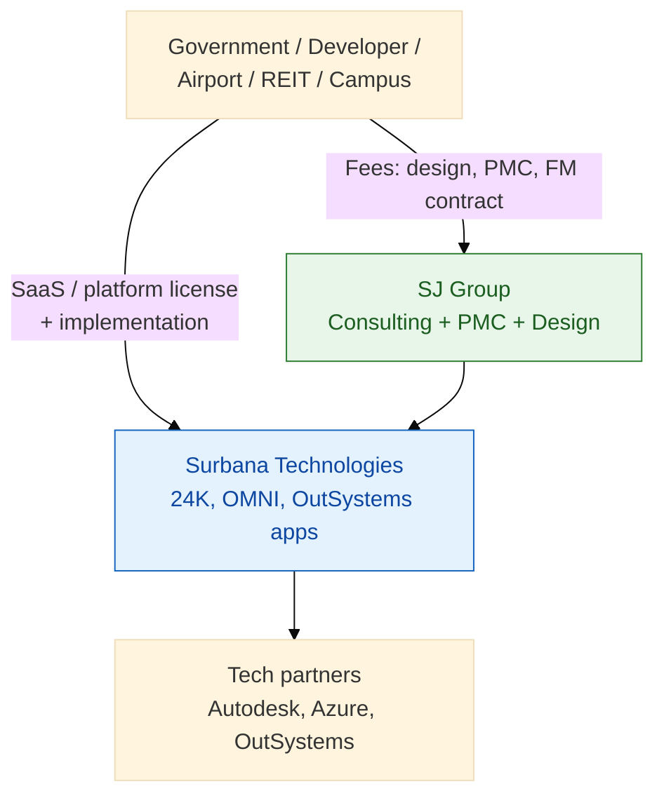
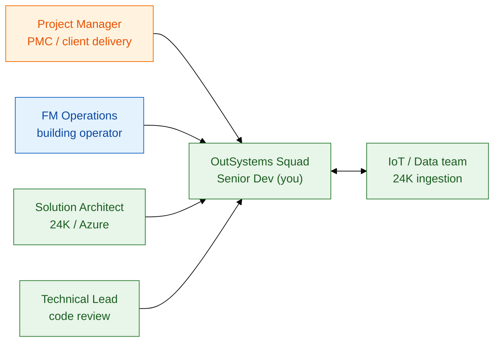

# Business context: Surbana Jurong × OutSystems Senior Developer

**Disclaimer:** Khung nghiệp vụ từ **nguồn công khai** — dùng phỏng vấn & whiteboard, không phải tư vấn đầu tư hay số liệu nội bộ SJ.

---

## 1. Surbana Jurong là ai?

| | |
|--|--|
| **Tên pháp lý (Singapore entity)** | Surbana Jurong Private Limited |
| **Thành lập** | 2015 (merger Surbana + Jurong) |
| **Headquarters** | Singapore — Jurong Innovation District (JID) |
| **Sở hữu** | Temasek Holdings |
| **Định vị** | Global consultancy: **urban development, infrastructure, managed services** |
| **Digital delivery arm** | **Surbana Technologies Pte Ltd** — OutSystems partner since **2018** |

**Member brands (10):** AETOS, Atelier Ten, B+H, CHIL, KTP, Prostruct, Robert Bird Group, SAA, SMEC, Surbana Jurong.

**Sectors:** Aviation, coastal, commercial, defence, energy, healthcare, industrial, oil & gas, tourism, township, transport, water.

---

## 2. Business model

### Revenue streams

| Stream | Mô tả | % ước lượng group revenue |
|--------|--------|---------------------------|
| **Professional services** | Master planning, engineering design, PMC (e.g. KAIA Jeddah ~US$50B programme) | **~75–85%** |
| **Managed services / FM** | Vận hành tòa nhà, bảo trì, security (AETOS) | **~10–15%** |
| **Digital products** | 24K platform (Azure Marketplace), OMNI, smart city modules | **~3–8%** (đang tăng) |
| **Training / academy** | SJ Academy, knowledge transfer (e.g. Saudi aviation talent) | **~1–2%** |

**OutSystems Senior Dev nằm ở đâu:** Delivery **custom-tab** — custom apps + integration bọc quanh 24K/OMNI, và **internal productivity** cho 16k nhân sự đa quốc gia.

---

## 3. Revenue & profit — hiện tại và dự phóng

### Hiện tại (public, FY2024)

| Metric | Value | Source type |
|--------|-------|-------------|
| Revenue (Surbana Jurong Pte Ltd) | **S$2.28B** (Dec 2024) | Company registry / Tracxn |
| Group revenue (narrative) | **~S$2.3B** (2024) | Business Times |
| 1-year revenue CAGR | **~6%** | Tracxn |
| Active projects | **~7,000** worldwide | Business Times |
| Headcount | **~16,000** | SJ / OutSystems partner page |
| EBITDA trend | Pressure (CAGR negative cited on some aggregators) | Macro + project mix |

**Growth trajectory (2015 → 2024):** Revenue từ **~S$400M → ~S$2.3B** — driven by M&A (10 acquisitions) và mega-infrastructure pipeline (Middle East aviation, townships, green transition).

### Ước lượng 3–5 năm (interview framing — không phải forecast chính thức)

| Driver | Impact on revenue | Impact on margin / profit |
|--------|-------------------|---------------------------|
| **Middle East aviation & giga-projects** | +8–12% CAGR segment | High PMC margin; execution risk |
| **Digital twin / 24K attach rate** | Digital stream **15–25% CAGR** nếu cross-sell vào mỗi FM contract | Recurring SaaS ↑ gross margin |
| **Smart city / campus (APAC)** | Steady 5–7% | Competitive; differentiation qua integrated platform |
| **Green / ESG advisory** | Premium fees | Consulting margin stable |
| **Low-code scale (OutSystems)** | Indirect — **delivery cost ↓ 30–40%** vs pure custom | **Operating margin ↑** on digital engagements |

**Scenario table (illustrative — nói "directional" trong interview):**

| Scenario | Group revenue 2028E | Digital % revenue | Comment |
|----------|---------------------|-------------------|---------|
| **Base** | S$2.7–2.9B | 6–8% | 6% CAGR core; digital linear |
| **Accelerated digital** | S$2.9–3.2B | 10–12% | 24K + OutSystems on every FM deal |
| **Downside** | S$2.4–2.6B | 4–5% | Project delays, FX, China slowdown |

**Profit levers bạn liên kết với role:**

1. **Faster app delivery** → more digital revenue per consultant FTE  
2. **Reuse (Forge, internal blocks)** → margin on fixed-price SI  
3. **Less shadow IT** → security/compliance cost ↓  
4. **Integration standardization** → fewer bespoke .NET/mobile one-offs  

---

## 4. Current pain points (why they hire Senior OutSystems)

| Pain | Evidence / symptom | Business cost |
|------|------------------|---------------|
| **Fragmented experience layer** | 24K/OMNI strong at data; portals & mobile often **per-project custom** | Duplicate build, slow change requests |
| **Small OutSystems bench** | Partner page: **4 public certs** (2 Associate Dev, 2 Associate Traditional Web) | Bottleneck on digital backlog |
| **Integration sprawl** | IoT, BMS, BIM, Azure — many protocols | Integration defects, slow UAT |
| **Global delivery coordination** | 40+ countries, 7k projects | Need **governed** SDLC, docs, code review |
| **Field workforce digitization** | FM technicians, inspectors still paper/excel on some sites | SLA misses, audit gaps |
| **Client portal expectations** | Airport/campus clients want NTU-style mobile experience | Lose deals to faster integrators |
| **Legacy FM tools** | Pre-OMNI portals, spreadsheets | Cannot upsell analytics |

**Smart City in a Box (2016) vision:** "plug and play apps" for city officials — **OutSystems là công cụ hợp lý** để biến vision thành factory thay vì one-off.

---

## 5. Stakeholder map (Senior Dev daily)

---

## 6. Competitive & technology landscape

| Layer | SJ asset | Gap OutSystems fills |
|-------|----------|----------------------|
| **CDE / Digital twin** | 24K (Azure) | Dashboards, alerts, workflows |
| **FM lifecycle** | OMNI (BIM + Smart FM) | Work orders, mobile inspect |
| **Design** | Autodesk BIM | IDD — field apps reporting to BIM |
| **Low-code** | OutSystems (partner) | Rapid client portals |
| **Cloud** | Azure preferred (24K marketplace) | REST, IoT Hub, AD SSO |

**Preferred JD skill — AWS/Azure:** SJ digital stack **Azure-heavy** (24K on Azure Marketplace). Trong phỏng vấn: nhấn **Azure AD, IoT Hub, API Management**; AWS = transferable (Lambda/API Gateway analogy).

---

## 7. KPIs Senior Dev should speak to

| KPI | Target language |
|-----|-----------------|
| **Time-to-market** | "FM portal MVP in 6–8 weeks vs 6 months custom" |
| **Defect escape rate** | Code review + automated tests on critical actions |
| **Integration reliability** | 99.5% REST success; circuit breaker on IoT ingest |
| **Performance** | Screen load <2s; aggregate pagination on 100k assets |
| **Security** | RBAC by site/tenant; no secrets in code |
| **Documentation** | Architecture Canvas + spec per integration |

---

## 8. STAR one-minute (business impact)

**Situation:** Client campus FM team tracked work orders in Excel; 24K had sensor alerts but **no closed loop** to technicians.  
**Task:** Deliver mobile-friendly work order app integrated to 24K alert API in one quarter.  
**Action:** Led OutSystems design — entity model, REST consumer, BPT escalation, Azure AD SSO; code reviews for 2 juniors.  
**Result:** Mean time to acknowledge alert **4h → 45min**; foundation reused on second campus (**~30% less effort**).

---

## 9. Links (public)

- [SJ Digital Technology Services](https://www.sjgroup.com/integrated-solutions/digital/)
- [Surbana Technologies — OutSystems Partner](https://www.outsystems.com/partners/surbana-technologies-pte-ltd/)
- [24K on Azure Marketplace](https://azuremarketplace.microsoft.com/en-us/marketplace/apps/surbanatechnologiespteltd1647934931824.24k_version_1)
- [OMNI launch (Prostruct)](https://prostruct.com.sg/resources/news-press-releases/surbana-jurong-launches-next-generation-digital-facility-and-asset-management-solution/)
