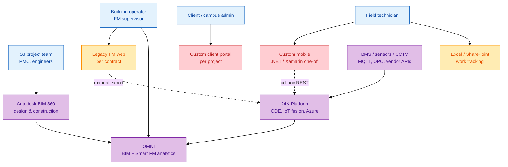
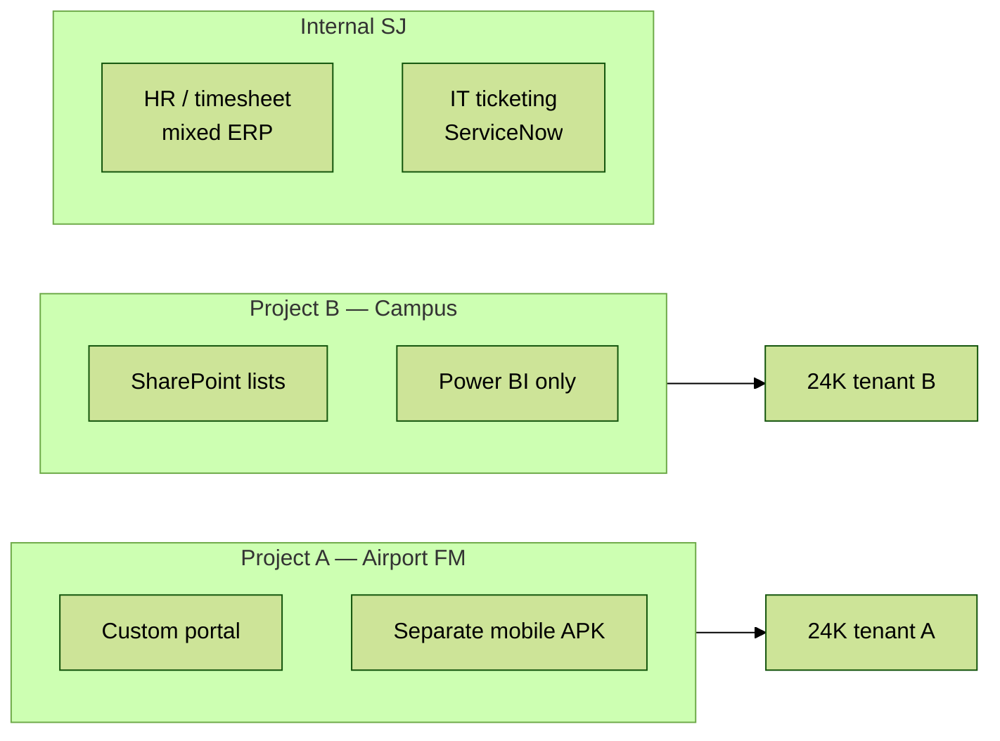
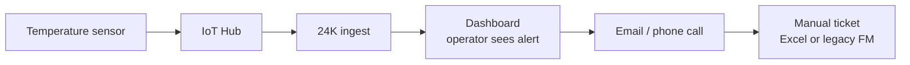

# As-Is architecture — Surbana Jurong digital & applications

**Scope:** Điển hình hệ thống SJ **trước** khi chuẩn hóa OutSystems experience layer — dựa trên public product descriptions (24K, OMNI, Smart City in a Box).

---

## 1. Landscape overview

**Đặc điểm As-Is:**

- **Data plane mạnh** (24K, OMNI) — IoT, BIM, analytics  
- **Experience plane yếu / phân mảnh** — nhiều app custom hoặc thủ công  
- **Integration point-to-point** — mỗi project tự nối 24K  

---

## 2. 24K platform (core — không thay thế)

| Capability | Mô tả |
|------------|--------|
| **Data fusion** | BMS, security, IoT sensors → common platform |
| **Scale** | Single building → entire city |
| **Hosting** | Azure Marketplace SaaS |
| **Analytics** | Real-time dashboards, AI (marketing) |
| **Consumers** | IHL campuses, estates, smart city pilots |

**OutSystems không thay 24K** — làm **human workflow & client UX** trên data 24K expose.

---

## 3. OMNI (FM & asset management)

| Layer | Function |
|-------|----------|
| **Static** | BIM model, asset registry |
| **Dynamic** | IoT sensor streams |
| **Analytics** | Preventive/corrective maintenance optimization |
| **Output** | Dashboards for building operators |

**Gap:** Work **execution** (assign tech, capture photo, sign-off) often outside OMNI UI → spreadsheets or custom apps.

---

## 4. Typical application silos (pain)

| Silo type | Tech stack | Problem |
|-----------|------------|---------|
| Client portal | ASP.NET, React one-off | 6–12 month build; hard to maintain |
| Field mobile | Native / hybrid per project | App store friction; no reuse |
| Internal ops | ERP modules, spreadsheets | Not integrated with project IoT data |
| Reporting | Power BI on 24K | Read-only — no closed-loop workflow |

---

## 5. Integration patterns (As-Is)

| Pattern | Usage | Risk |
|---------|-------|------|
| **REST ad-hoc** | Custom app → 24K API | No version contract; breaks on upgrade |
| **Batch CSV** | Export alerts → email → manual ticket | Latency hours; no audit |
| **Direct DB** (anti-pattern) | Some legacy read replica | Security; coupling |
| **Azure IoT Hub** | Device → 24K | Good at ingestion; UX still separate |
| **SSO** | Mixed AD / local accounts | Role drift across apps |

---

## 6. SDLC & governance (As-Is)

| Area | Typical state |
|------|---------------|
| **Source control** | Git for custom code; OutSystems **limited** or per-dev |
| **Environments** | DEV/TST/PRD inconsistent naming |
| **Documentation** | Word/Confluence per project; outdated API maps |
| **Code review** | Strong in .NET teams; ** ad hoc** in low-code |
| **Testing** | Manual UAT heavy; few automated API tests |
| **Deployment** | Manual publish; no Lifetime pipeline on smaller engagements |

---

## 7. Security & compliance (As-Is concerns)

| Concern | As-Is manifestation |
|---------|---------------------|
| **Multi-tenant** | Campus clients must not see each other's assets |
| **PII** | Technician location, visitor logs |
| **OT security** | IoT credentials in config files (found in audits) |
| **Availability** | FM apps must work when 24K analytics up — graceful degradation |

---

## 8. What Senior Dev inherits (talking points)

1. **Respect 24K/OMNI** — không đề xuất "rewrite platform"  
2. **Map silos** — inventory apps per sector (aviation vs campus)  
3. **Integration debt** — catalog REST endpoints; propose Integration Services module  
4. **Team maturity** — lift code review, Architecture Canvas, Lifetime where licensed  
5. **Quick win** — FM work order portal on OutSystems (see `samples/work-order-fm-portal.spec.md`)

---

## 9. Reference diagram — data flow (IoT alert, As-Is)

**Latency:** Minutes to hours. **Audit:** Partial. **Senior Dev mission:** close the loop in software.
