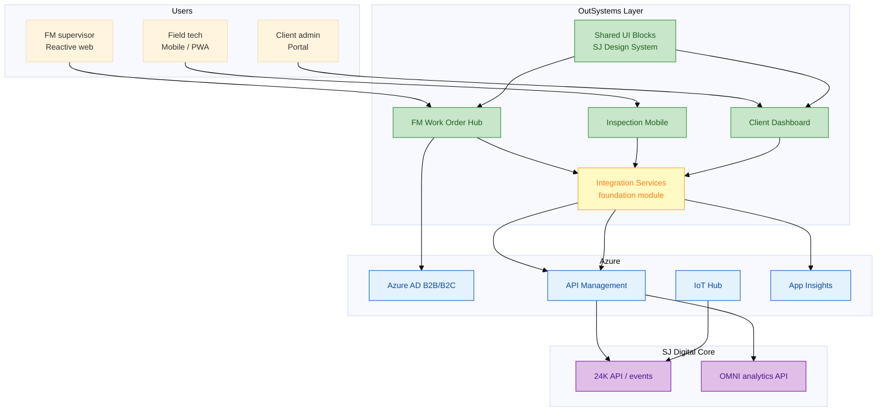
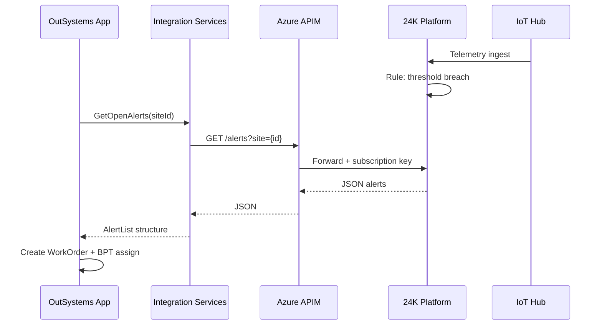
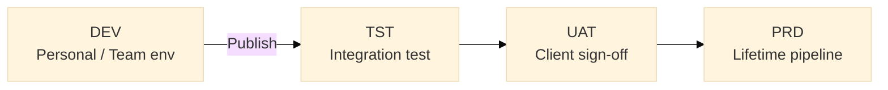

# To-Be architecture — OutSystems experience layer on 24K

**Vision:** **One governed low-code factory** (OutSystems) for client portals, FM workflows, and internal ops — sitting on **24K / OMNI / Azure** without replacing them.

---

## 1. Target landscape



---

## 2. OutSystems application portfolio (proposed)

| Application | Type | Users | Priority |
|-------------|------|-------|----------|
| **FM Work Order Hub** | Reactive Web | FM supervisors, helpdesk | P0 — quick win |
| **Field Inspection** | Mobile / Reactive | Technicians | P0 |
| **IoT Alert Console** | Reactive Web | Control room | P1 |
| **Client Project Portal** | Reactive Web | Airport/campus client | P1 |
| **Internal Project Tracker** | Reactive Web | SJ PMC staff | P2 |
| **Integration Services** | Service module (no UI) | Other apps | P0 foundation |

**Senior Dev ownership:** Integration Services + 1 flagship app + **standards** for squad.

---

## 3. Layered application design (OutSystems)

```mermaid
%%{init: {'theme': 'forest'}}%%
flowchart TB
    subgraph presentation["Presentation — Reactive / Mobile"]
        SCR["Screens & Blocks"]
        CA["Client Actions"]
    end

    subgraph business["Business Logic"]
        SA["Server Actions"]
        BPT["Business Process Technology"]
    end

    subgraph domain["Domain — OutSystems DB"]
        ENT["Entities: WorkOrder, Asset, Site"]
        ST["Static Entities: Status, Priority"]
    end

    subgraph integration["Integration"]
        REST["REST: 24KAlerts, Assets"]
        EXT["Extensions: crypto, geofence JS"]
    end

    SCR --> SA --> ENT
    SA --> BPT
    SA --> REST API
    REST --> K24["24K / OMNI"]
```

| Layer | SJ-specific design rule |
|-------|-------------------------|
| **Presentation** | SJ branding via theme + shared blocks |
| **Business** | No business rule in UI — server actions only |
| **Domain** | Mirror **operational** subset of 24K — not full twin |
| **Integration** | All external calls via **Integration Services** |

---

## 4. Integration architecture (proposed)



### API standards (Senior Dev defines)

| Standard | Rule |
|----------|------|
| **Versioning** | `/v1/` in path; deprecate with 6-month notice |
| **Auth** | OAuth2 client credentials at APIM; no API keys in screens |
| **Idempotency** | `clientRequestId` on create work order |
| **Error mapping** | Map HTTP + 24K codes → user-safe messages |
| **Timeout** | 30s default; circuit breaker after 5 failures |
| **Logging** | CorrelationId in every server action |

Spec chi tiết: [`samples/rest-integration-24k-iot.spec.md`](../samples/rest-integration-24k-iot.spec.md).

---

## 5. Performance, scalability, security (JD bullets)

### Performance

| Technique | Where |
|-----------|-------|
| **Aggregate pagination** | Asset list 100k+ rows |
| **Fetch only required attributes** | Screen variables |
| **Cache site metadata** | Site static + 1h server cache |
| **Async patterns** | Long 24K report → timer + notification |
| **Index SQL** | `WorkOrder.SiteId`, `StatusId`, `CreatedOn` |

### Scalability

| Dimension | Approach |
|-----------|----------|
| **Users** | Horizontal — OutSystems farm / ODC auto-scale |
| **Tenants** | SiteId on every entity; row-level security |
| **Integrations** | APIM rate limit; queue for bulk sync |
| **Mobile** | Lightweight screens; compress images on upload |

### Security

| Control | Implementation |
|---------|----------------|
| **Authentication** | Azure AD SSO (SAML/OIDC) |
| **Authorization** | Roles: `FM_Supervisor`, `FieldTech`, `ClientReadOnly` |
| **Data isolation** | Filter aggregates by `SiteId` from session |
| **Secrets** | Service Center module configs |
| **Audit** | Custom `AuditLog` entity on status changes |
| **Transport** | TLS 1.2+; cert pinning on mobile if required |

---

## 6. SDLC & DevOps (To-Be)



| Practice | To-Be |
|----------|-------|
| **Agile/Scrum** | 2-week sprints; story = spec + acceptance criteria |
| **Code review** | TL reviews Architecture Canvas + critical server actions |
| **Documentation** | Spec per module (like `samples/`); API catalog in Confluence |
| **Version control** | OutSystems built-in + export tags per release |
| **Testing** | Unit on server actions; API mock tests; UAT scripts |
| **Monitoring** | Azure App Insights + Service Center logs |

---

## 7. AWS / Azure (preferred skills)

**Primary: Azure** (align with 24K)

| Service | Role |
|---------|------|
| **Azure AD** | SSO |
| **API Management** | Gateway, throttling, keys |
| **IoT Hub** | Device telemetry (already in 24K path) |
| **Blob Storage** | Inspection photos from OutSystems |
| **Application Insights** | APM |

**AWS analogy (if asked):** API Gateway ≈ APIM; Cognito ≈ Azure AD; IoT Core ≈ IoT Hub — **integration patterns transfer**.

---

## 8. Migration phasing (realistic)

| Phase | Duration | Deliverable |
|-------|----------|-------------|
| **0 — Foundation** | 4–6 weeks | Integration Services, AD SSO, env pipeline |
| **1 — FM MVP** | 8 weeks | Work Order Hub + 24K alert consume |
| **2 — Mobile** | 6 weeks | Field inspection linked to work orders |
| **3 — Client portal** | 8 weeks | Read-only dashboards + service requests |
| **4 — Retire silos** | Ongoing | Decommission per-project custom apps |

**Senior Dev role in Phase 0–1:** Architecture decision record, integration contract with 24K team, mentor associates.

---

## 9. Success metrics (To-Be)

| Metric | As-Is | To-Be target |
|--------|-------|--------------|
| Alert → work order created | Manual, hours | **< 5 min automated** |
| New client portal | 6–12 months | **8–10 weeks** (reuse blocks) |
| Integration defects per release | High variance | **< 3 P1 per release** |
| Apps to maintain (per sector) | N custom | **1 platform + config** |

---

## 10. Whiteboard checklist (5 phút)

1. Vẽ **users → OutSystems apps → Integration Services → APIM → 24K**  
2. Nói ** không replace 24K**  
3. Nêu **1 performance** + **1 security** cụ thể  
4. Nêu **Lifetime / multi-env**  
5. Kết bằng **reuse** và **margin** cho Surbana Technologies  
