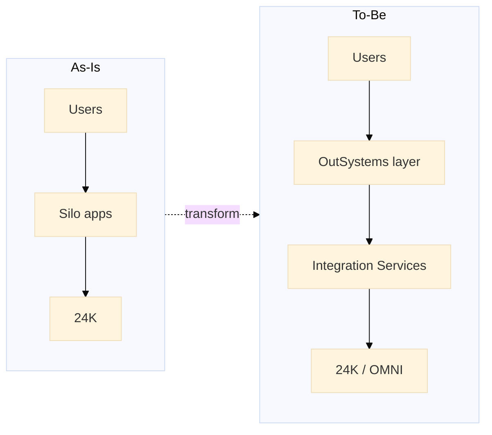

# As-Is → To-Be summary — Surbana Jurong OutSystems

**Mục đích:** Một trang để **whiteboard 5 phút** hoặc slide nói nhanh trong phỏng vấn Senior.

---

## Executive summary

| | As-Is | To-Be |
|--|-------|-------|
| **Strategic focus** | 24K/OMNI = data & analytics strength | + **OutSystems = experience & workflow factory** |
| **Apps** | Siloed custom + spreadsheets | Shared Reactive/Mobile portfolio |
| **Integration** | Point-to-point per project | **Integration Services** + Azure APIM |
| **Delivery speed** | 6–12 months custom portal | 8–10 weeks MVP with reuse |
| **Governance** | Inconsistent | Lifetime, code review, Architecture Canvas |
| **Team** | ~4 public OSE certs | Senior-led squad scaling delivery |

---

## Architecture comparison

---

## Pain → Solution map

| Pain point | As-Is symptom | To-Be solution | Business outcome |
|------------|---------------|----------------|------------------|
| Slow client UX delivery | Custom .NET per airport/campus | Reusable OutSystems blocks | Faster revenue on digital attach |
| Alert → action gap | Email + Excel | BPT + auto work order | SLA ↑, client retention |
| Integration fragility | Ad-hoc REST | Versioned API via APIM | Fewer P1 incidents |
| Field workforce | Paper / offline notes | Mobile inspection app | Audit-ready close-out |
| Small OSE bench | Bottleneck | Senior standards + mentoring | Scale without 2× headcount |
| Multi-tenant security | Role drift | Site-scoped aggregates + AD | Win enterprise FM deals |

---

## Technology stack comparison

| Layer | As-Is | To-Be |
|-------|-------|-------|
| **Digital twin / IoT** | 24K on Azure | Same — **unchanged** |
| **FM analytics** | OMNI | Same — **read via API** |
| **Design** | Autodesk BIM | Same |
| **Experience apps** | Custom / SharePoint | **OutSystems Reactive + Mobile** |
| **Identity** | Mixed | **Azure AD SSO** |
| **API gateway** | Partial | **Azure APIM** |
| **Monitoring** | 24K dashboards | + **App Insights** on OutSystems |
| **CI/CD** | Manual | **Lifetime** (where licensed) |

---

## SDLC comparison

| Practice | As-Is | To-Be |
|----------|-------|-------|
| Requirements | Confluence per project | Spec template (`samples/`) |
| Design | Ad-hoc | Architecture Canvas + integration ADR |
| Build | Mixed teams | OutSystems squad + Integration Services first |
| Test | Manual UAT | Server action tests + API mocks |
| Deploy | Manual publish | DEV → TST → UAT → PRD pipeline |
| Operate | Client-specific runbooks | Shared playbooks + Service Center |
| Documentation | Often stale | Module spec + API catalog |

---

## Phased roadmap (interview slide)

| Phase | Time | Outcome |
|-------|------|---------|
| **0 Foundation** | Weeks 1–6 | Integration Services, SSO, envs |
| **1 FM Hub** | Weeks 7–14 | Work orders + 24K alerts |
| **2 Mobile** | Weeks 15–20 | Field inspection |
| **3 Portal** | Weeks 21–28 | Client-facing dashboard |
| **4 Decommission** | Ongoing | Retire silo apps |

---

## KPI targets

| KPI | As-Is (typical) | To-Be target |
|-----|-----------------|--------------|
| Alert → ticket | 2–4 hours manual | < 5 minutes |
| Portal delivery | 6–12 months | 8–10 weeks |
| P1 integration bugs / release | Unpredictable | < 3 |
| Screen load (asset list) | N/A or slow | < 2 seconds (paginated) |
| Reuse on 2nd campus | ~0% | ~30% effort reduction |

---

## One-liner for interviewer

> "We keep 24K as the system of record for IoT and twin data; OutSystems becomes the governed experience and workflow layer — so Surbana Technologies ships FM and client portals in weeks, not months, with integration standards our associates can repeat."

---

## Deep-dive links

- Business: [`01-business-context.md`](01-business-context.md)
- As-Is detail: [`02-as-is-architecture.md`](02-as-is-architecture.md)
- To-Be detail: [`03-to-be-architecture.md`](03-to-be-architecture.md)
