# Interview Prep — Head of Tech @ Surbana Jurong (OutSystems Senior)

**Candidate:** Tran Manh Tu · `willtran11235@gmail.com` · 0838810018  
**Interviewer:** Ivan Lim (`ivan.limwy@surbanajurong.com`) — Head of Tech  
**When:** Thu **25 Jun 2026**, 15:00–16:00 (GMT+7 / Indochina Time)  
**Where:** [Microsoft Teams](https://teams.live.com/meet/9329469970608?p=iBTJ8NNOxrs4bBkA2j)  
**Job:** [OutSystems Senior Developer — SJ](https://aniday.com/job-view/job-15661.html)  
**Your portfolio:** [fm-work-order-hub-outsystems](https://github.com/willtran112358/fm-work-order-hub-outsystems)

> **Disclaimer:** Public-source research for interview prep only — not affiliated with Surbana Jurong.

---

## 0. One glance before you join

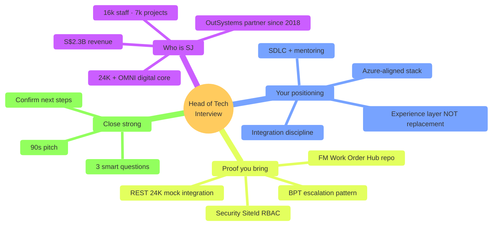

### 30-second pitch (memorize)

> "SJ already owns world-class FM data in **24K** and **OMNI**. OutSystems should be the **governed experience and workflow layer** on top — client portals, work orders, mobile field apps — integrated via **Integration Services** and **Azure APIM**, not a replacement for the twin platform. I've prepared an FM Work Order Hub solution package that shows how I'd deliver that: foundation modules first, REST contracts, site-scoped security, audit trail, and Lifetime-ready SDLC."

---

## 1. Interview flow (what Ivan likely probes)

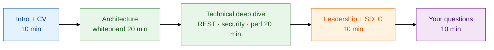

| Segment | Head of Tech cares about | Your anchor phrase |
|---------|--------------------------|-------------------|
| **Intro** | Senior = independent delivery, not ticket-closer | "I own spec → deploy → hypercare" |
| **Architecture** | Strategic fit with 24K/OMNI | "Experience layer, system of record stays in 24K" |
| **Technical** | Production-grade integration & security | "APIM, OAuth, SiteId filter, audit events" |
| **Leadership** | Scale a small OSE bench (~4 public certs) | "Standards, code review, reusable foundation modules" |
| **Close** | Culture fit, long-term digital roadmap | Ask about squad, Lifetime, 24K API ownership |

---

## 2. SJ business context (answer "why us?")

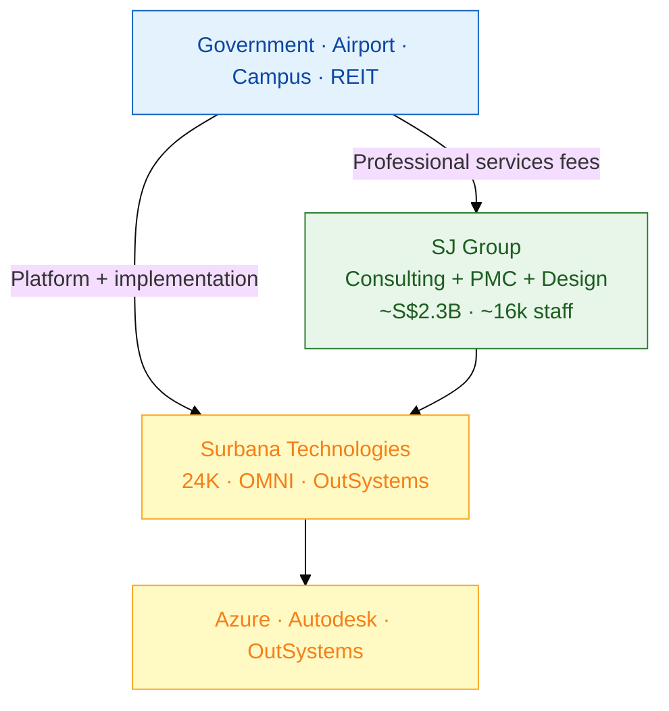

| Fact | Value | Why it matters in interview |
|------|-------|---------------------------|
| Revenue (FY2024) | ~**S$2.3B** | Enterprise scale — governance matters |
| Headcount | ~**16,000** | Global delivery, need repeatable SDLC |
| Active projects | ~**7,000** | Can't build custom portal per project |
| Digital products | **24K** (IoT/twin), **OMNI** (FM/BIM) | You integrate — don't replace |
| OSE bench (public) | ~**4 associate certs** | Senior = mentoring + standards |
| Cloud bias | **Azure** (24K on Marketplace) | Lead with AD, APIM, App Insights |

### Pain → why they hire you

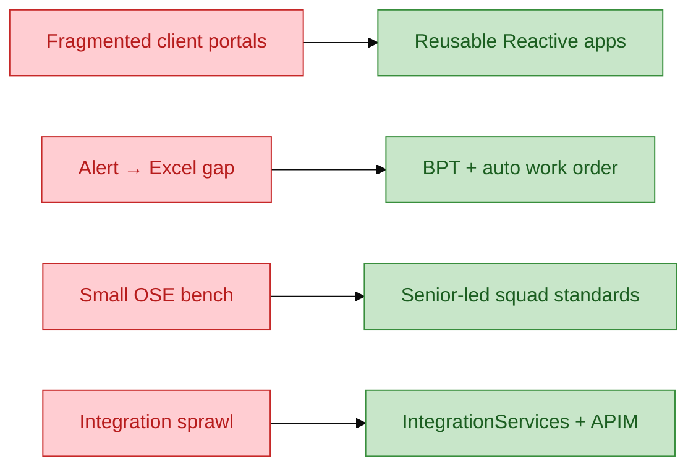

---

## 3. Core architecture answer (whiteboard in 5 min)

**Prompt you'll likely get:** *"Campus FM client uses 24K for IoT. Design work orders on OutSystems."*

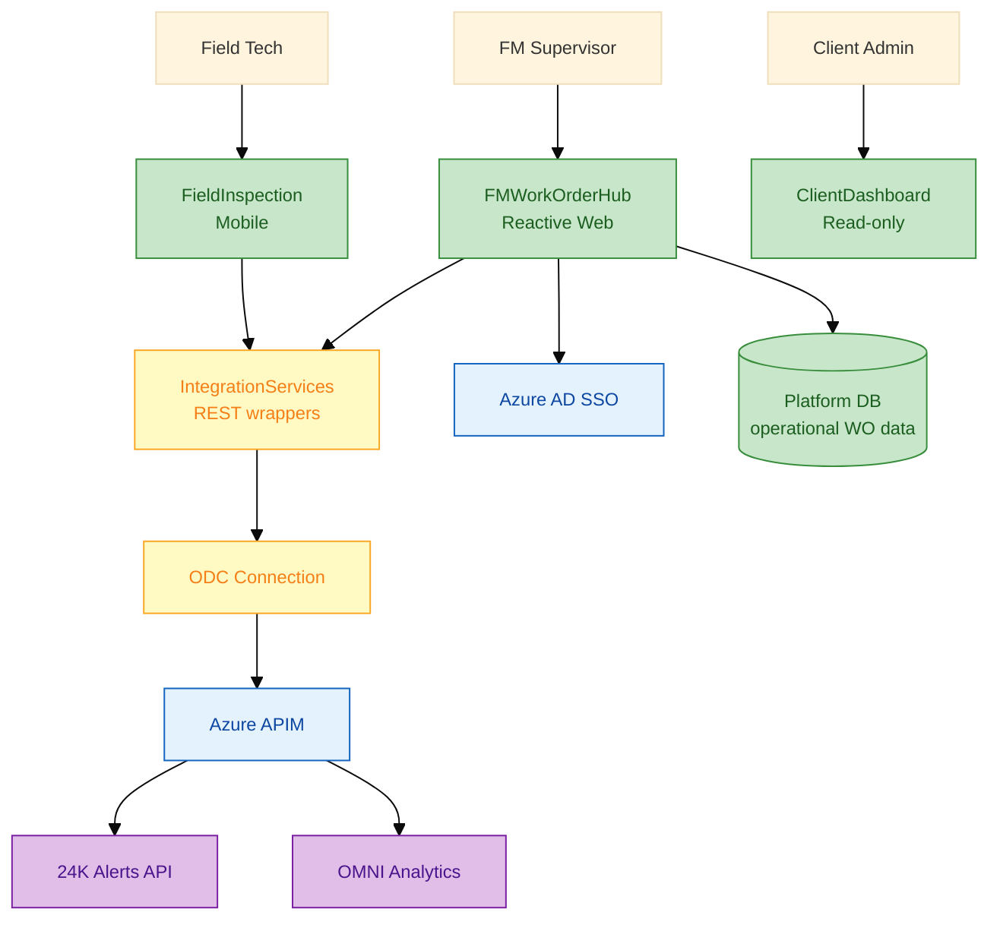

### As-Is → To-Be (one slide mental model)

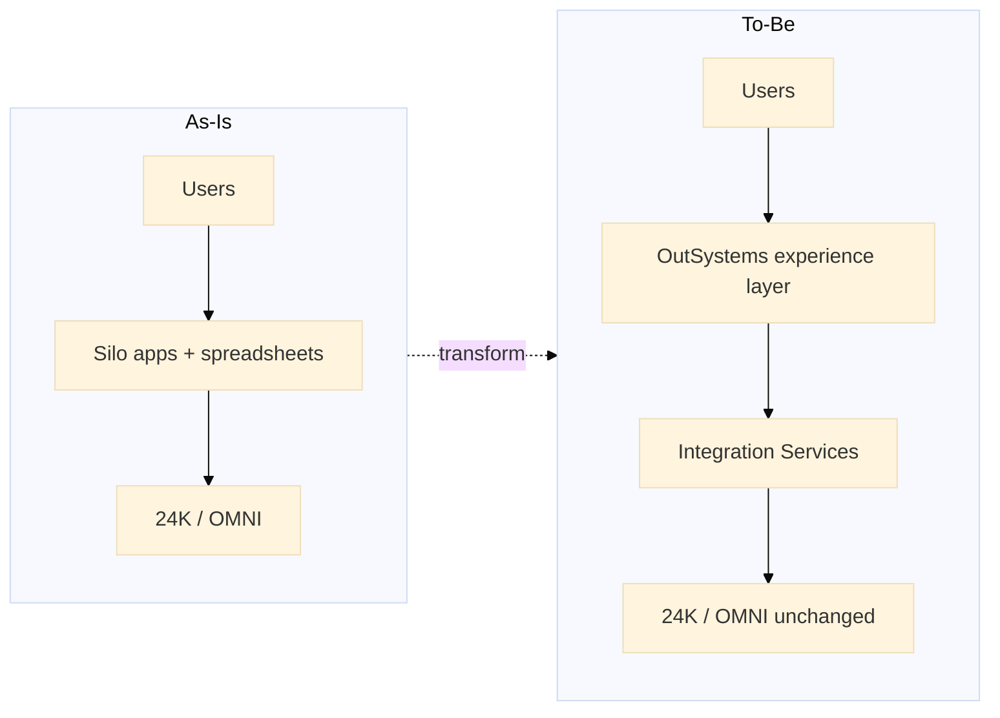

| Layer | System of record | OutSystems role |
|-------|------------------|-----------------|
| IoT / digital twin | **24K** | Consume alerts, acknowledge |
| FM analytics / BIM | **OMNI** | Read KPIs for dashboards |
| Work orders, assignments, audit | **Platform DB** | Own operational workflow |
| Identity | **Azure AD** | SSO + B2B client users |

**Golden rule (say this explicitly):** OutSystems = **governed experience layer** — not a replacement for 24K or OMNI.

---

## 4. Application portfolio (what you'd build)

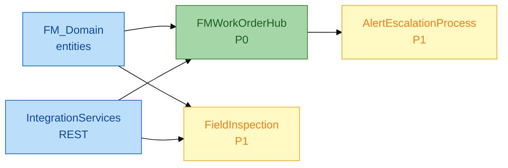

| App | Type | Priority | Users |
|-----|------|----------|-------|
| `FM_Domain` | Foundation (entities) | P0 | — |
| `IntegrationServices` | Foundation (REST) | P0 | — |
| `FMWorkOrderHub` | Reactive Web | P0 | FM supervisor, helpdesk |
| `FieldInspection` | Mobile / Reactive | P1 | Field technicians |
| `AlertEscalationProcess` | BPT workflow | P1 | Automated escalation |

---

## 5. Alert → Work Order flow (domain story)

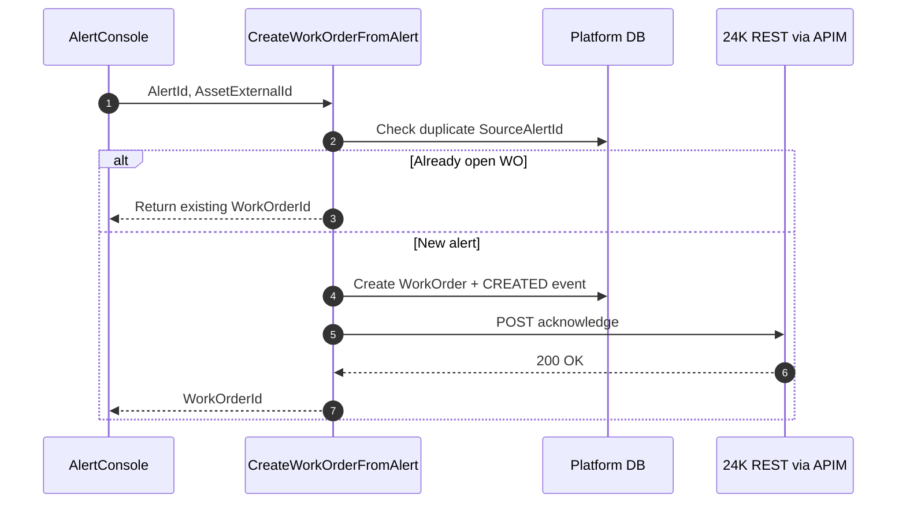

### Entity model (keep simple on whiteboard)

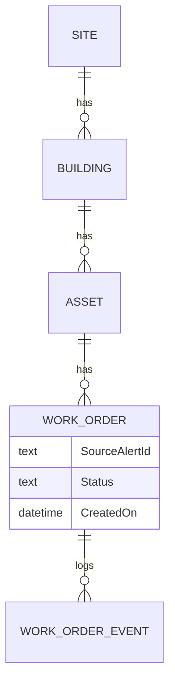

---

## 6. OutSystems four layers (technical depth)

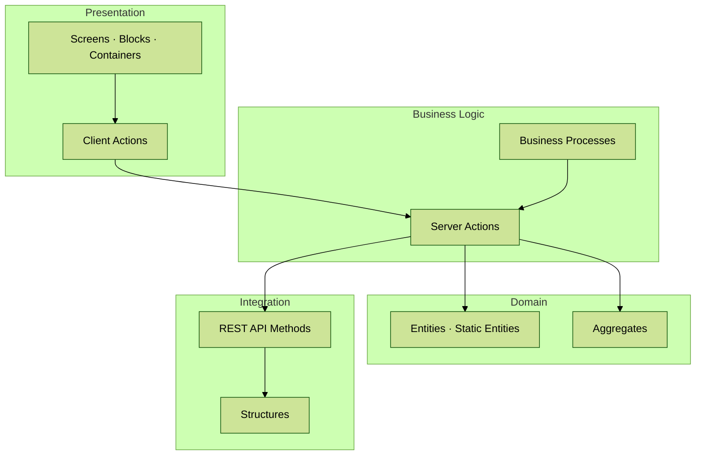

| Question | Short answer |
|----------|--------------|
| Client vs server action? | UI orchestration → client; business rules, DB, secrets → **server only** |
| Foundation vs app module? | `FM_Domain` + `IntegrationServices` shared; UI apps consume them |
| Reactive vs Traditional Web? | SJ greenfield FM portals → **Reactive** (mobile-first, modern UX) |
| Where do REST secrets live? | ODC Connection per env — **never** screen variables |

---

## 7. Integration pattern (REST + APIM)

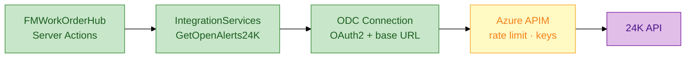

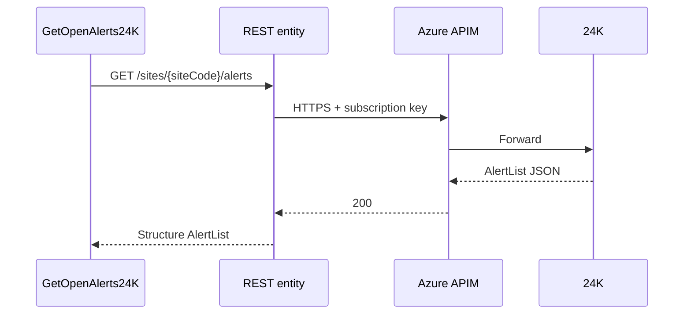

### Integration checklist (say out loud)

| # | Practice | Why |
|---|----------|-----|
| 1 | Wrapper server actions in `IntegrationServices` | UI never calls REST directly |
| 2 | Map HTTP errors to user message + log | 100% error visibility |
| 3 | Idempotency on `SourceAlertId` | No duplicate WOs in alert storm |
| 4 | `correlationId` in logs | Cross-system troubleshooting |
| 5 | Mock API in DEV (`mock-server.js` + ngrok) | Test without 24K prod access |
| 6 | Contract tests at APIM | Vendor upgrade won't break silently |

---

## 8. Security model (Head of Tech will drill here)

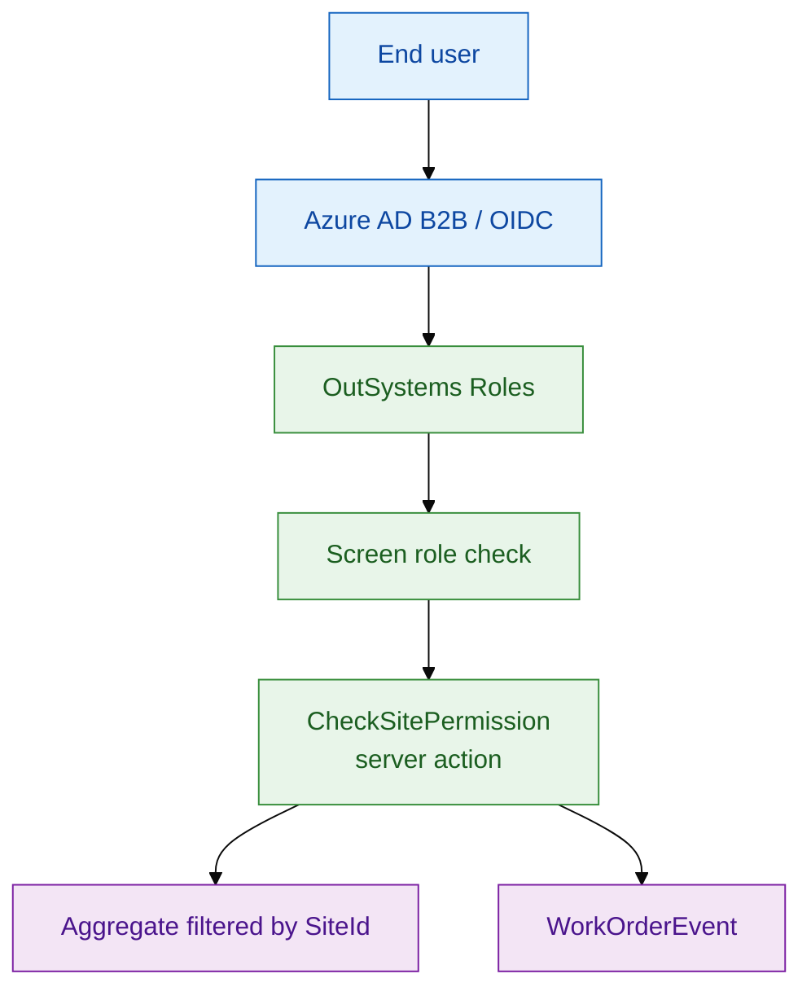

| Role | Access |
|------|--------|
| `FM_Supervisor` | Full work order CRUD, assign, close |
| `FieldTech` | Assigned WOs, status updates |
| `ClientReadOnly` | Dashboard filtered by site |
| `Admin` | Site config, user-site mapping |

**Critical line:** *"Never rely on UI filters alone — every server action checks SiteId."*

### Security incident response (scenario)

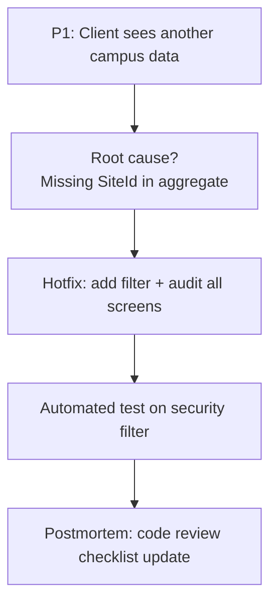

---

## 9. Performance & scalability

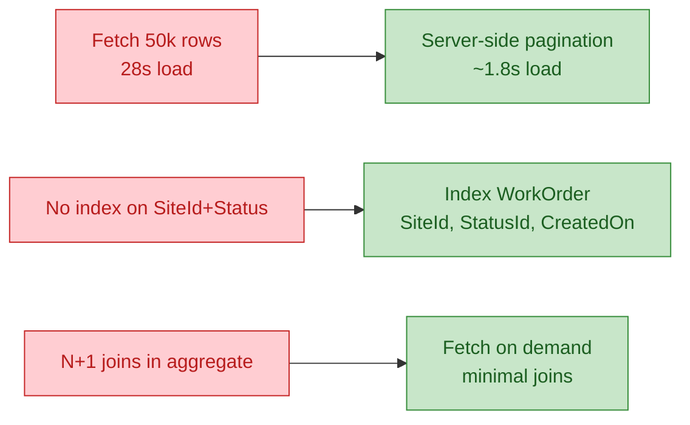

| KPI | Target language |
|-----|-----------------|
| Screen load (asset list) | < **2s** with pagination |
| Alert → work order | < **2 min** operator time |
| REST reliability | **99.5%** + circuit breaker when 24K down |
| Publish to TST | < **15 min** via Lifetime pipeline |
| Audit | Every status change → `WorkOrderEvent` |

---

## 10. BPT escalation (workflow depth)

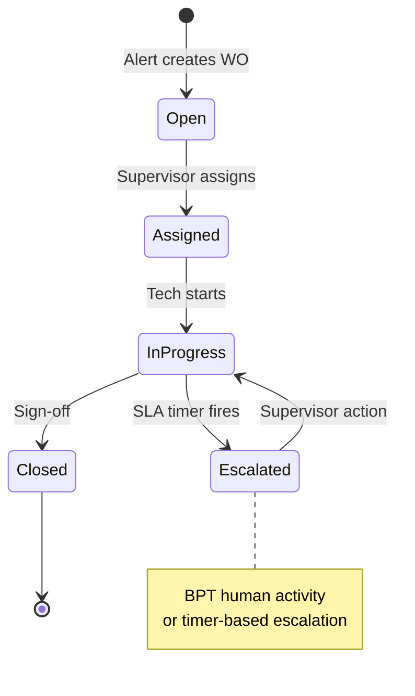

| BPT topic | Answer |
|-----------|--------|
| Human vs timer | Timer for SLA breach → human activity for supervisor |
| Cancel BPT | Close WO early → terminate process instance |
| Duplicate instances | Guard: one BPT per WorkOrderId |
| Maker-checker | Separate roles on approve/close actions |

---

## 11. CI/CD & SDLC (senior ownership)

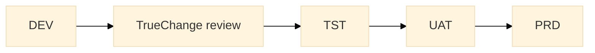

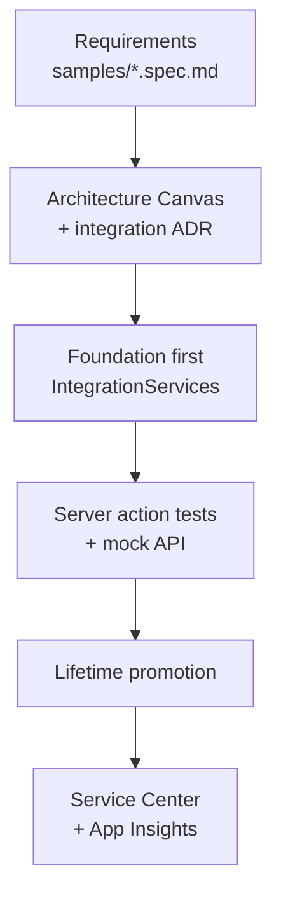

### Definition of Done (say confidently)

| DoD item | Detail |
|----------|--------|
| Spec updated | Entity table, screen map, acceptance criteria |
| Peer review | Server actions + aggregates reviewed |
| Security | SiteId filter verified |
| Integration | Error mapping + mock test passed |
| UAT script | Supervisor + field tech paths |
| No P1 in Service Center | Before promote to next env |

---

## 12. Code review scenario (spot the bugs)

**Given (intentionally bad pseudo-code):**

```text
Server Action CreateWorkOrderFromAlert(AlertId, SiteCode)
  Set APIKey = GetGlobalConfig().ApiKey   // from screen path
  REST GET http://24k.internal/alerts/{AlertId}
  Create WorkOrder (no duplicate check)
  Assign to "tech1@sj.com"
  // No audit log
```

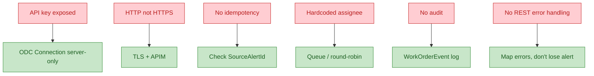

---

## 13. Decision tree — "how would you handle X?"

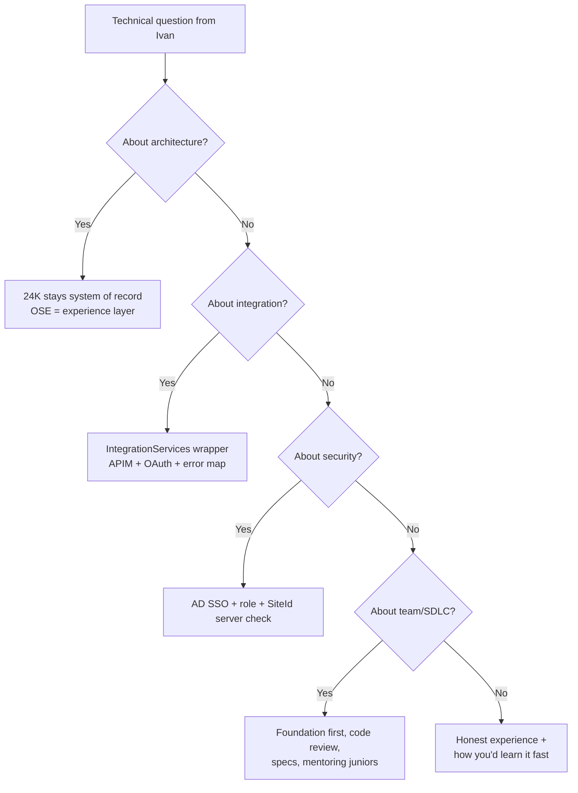

### Scenario quick answers

| Scenario | Root cause | Fix |
|----------|------------|-----|
| **100 alerts/min → duplicate WOs** | No dedupe on `SourceAlertId` | Idempotency + batch queue + flood dashboard |
| **One campus list timeout** | Data spike or missing pagination | Index + pagination; check alert storm |
| **24K API down** | External dependency | Graceful degradation, queue retry, manual reconcile screen |
| **Client cross-site data leak** | Aggregate missing SiteId filter | Hotfix + audit all queries + automated security test |

---

## 14. STAR stories (fill with your real projects)

```mermaid
flowchart LR
  subgraph star["STAR Framework"]
    S["Situation"] --> T["Task"] --> A["Action"] --> R["Result"]
  end
```

### Template 1 — Integration failure

| | |
|--|--|
| **S** | Production REST to external API returned 500 after vendor upgrade |
| **T** | Restore FM workflow without duplicate work orders |
| **A** | Circuit breaker, retry queue, manual reconcile screen; APIM contract tests |
| **R** | Zero duplicates; mean time to recover **X hours** |

### Template 2 — Performance

| | |
|--|--|
| **S** | Junior published aggregate fetching 50k rows — client UAT at risk |
| **T** | Fix before go-live |
| **A** | Code review, pagination pattern doc, pair programming |
| **R** | Load **28s → 1.8s**; pattern reused in second app |

### Template 3 — Business impact (SJ-aligned)

| | |
|--|--|
| **S** | Campus FM tracked WOs in Excel; 24K had alerts but no closed loop |
| **T** | Mobile-friendly WO app integrated to 24K in one quarter |
| **A** | Entity model, REST consumer, BPT escalation, Azure AD SSO; mentored 2 juniors |
| **R** | Alert acknowledge **4h → 45min**; **~30% less effort** on second campus |

---

## 15. Phased delivery roadmap (if asked "how would you start?")

```mermaid
gantt
    title FM Work Order Hub — Phased delivery
    dateFormat  YYYY-MM-DD
    section Foundation
    IntegrationServices + SSO + envs     :f0, 2026-07-01, 6w
    section MVP
    FMWorkOrderHub + 24K alerts          :f1, after f0, 8w
    section Mobile
    FieldInspection app                  :f2, after f1, 6w
    section Portal
    ClientDashboard                      :f3, after f2, 8w
```

| Phase | Weeks | Outcome |
|-------|-------|---------|
| **0 Foundation** | 1–6 | Integration Services, SSO, DEV/TST envs |
| **1 FM Hub** | 7–14 | Work orders + 24K alert integration |
| **2 Mobile** | 15–20 | Field inspection |
| **3 Portal** | 21–28 | Client-facing dashboard |
| **4 Decommission** | Ongoing | Retire silo apps |

---

## 16. Questions to ask Ivan (pick 3)

```mermaid
mindmap
  root((Ask Ivan))
    Strategy
      OSE vs 24K/OMNI positioning
      12-month digital roadmap
    Delivery
      Squad size and cert levels
      Lifetime env strategy
      APIM + Azure AD standard?
    Role
      Client-facing FM vs internal products
      Mentoring expectation
      Success in first 90 days
```

1. How is OutSystems positioned today — **experience layer** on 24K/OMNI, or also internal ERP replacement?
2. What does the OutSystems squad look like (size, cert levels), and what's the mentoring expectation for this Senior role?
3. Is Lifetime / DEV→TST→UAT→PRD already standard for client FM engagements?
4. Who owns the 24K API contract — your team or a separate integration group?
5. What would success look like in my **first 90 days**?

---

## 17. Red flags to avoid

```mermaid
%%{init: {'theme': 'base'}}%%
flowchart TD
    classDef bad fill:#ffcdd2,stroke:#c62828,color:#b71c1c

    R1["Replace 24K with OSE DB for IoT"]:::bad
    R2["Low-code = no code review"]:::bad
    R3["UI-only security filter"]:::bad
    R4["Ignore Azure stack"]:::bad
    R5["No documentation / SDLC"]:::bad
    R6["Secrets in client variables"]:::bad
```

---

## 18. Tech stack one picture

```mermaid
%%{init: {'theme': 'base'}}%%
flowchart TB
    classDef odc fill:#e3f2fd,stroke:#1565c0,color:#0d47a1
    classDef az fill:#fff9c4,stroke:#f9a825,color:#f57f17
    classDef sj fill:#e1bee7,stroke:#7b1fa2,color:#4a148c

    subgraph odc_layer["OutSystems ODC"]
        STU["ODC Studio"]:::odc
        APP["Reactive runtime"]:::odc
        DB[("Azure SQL platform DB")]:::odc
    end

    subgraph azure_layer["Azure"]
        AD["Azure AD B2B"]:::az
        APIM["API Management"]:::az
        AI["App Insights"]:::az
    end

    subgraph sj_core["SJ Digital Core"]
        K24["24K REST API"]:::sj
        OMNI["OMNI API"]:::sj
    end

    STU --> APP --> DB
    APP --> AD
    APP --> APIM --> K24
    APIM --> OMNI
    APP --> AI
```

---

## 19. Top 15 likely questions — flash answers

| # | Question | 20-second answer |
|---|----------|------------------|
| 1 | What is 24K in one sentence? | SJ's Azure-based IoT/digital twin platform — system of record for sensor and asset telemetry |
| 2 | OMNI vs OutSystems? | OMNI = FM/BIM analytics; OutSystems = workflows, portals, mobile execution |
| 3 | O11 vs ODC? | ODC = cloud-native studio + runtime; same concepts, different hosting/ops model |
| 4 | Foundation module? | Shared `FM_Domain` entities + `IntegrationServices` — DRY across apps |
| 5 | REST secrets? | ODC Connection per environment — rotated, never in code |
| 6 | Idempotency for alerts? | Check `SourceAlertId` before create; return existing WO if open |
| 7 | 100k work orders on list? | Server-side pagination, indexes on SiteId+Status+CreatedOn, minimal joins |
| 8 | Multi-tenant security? | `UserSiteMapping` + `CheckSitePermission` on every server action |
| 9 | 24K API down? | Circuit breaker, cached read-only mode, queue retries, supervisor manual path |
| 10 | BPT vs server action? | BPT for long-running human/timer workflows; server action for transactional steps |
| 11 | Test without prod 24K? | `mock-server.js` + ngrok in DEV; contract tests at APIM |
| 12 | Architecture Canvas? | Living diagram — modules, integrations, security boundaries for reviews |
| 13 | Your DoD? | Spec, peer review, security check, UAT script, no P1 in Service Center |
| 14 | Why SJ? | Rare combo: built-environment domain + 24K/OMNI + OutSystems partnership |
| 15 | Azure vs AWS here? | SJ is Azure-heavy; I'd lead with AD/APIM — AWS patterns transfer |

---

## 20. Day-of checklist

```mermaid
flowchart TD
    START["T-60 min"] --> T1["Re-read §0 pitch + §3 architecture"]
    T1 --> T2["Open repo: delivery/12-diagrams-atlas.md"]
    T2 --> T3["Test Teams link + mic/camera"]
    T3 --> T4["Paper: SiteId security + idempotency"]
    T4 --> JOIN["T-5 min: Join Teams"]
    JOIN --> INTRO["Intro: name, years OSE, FM repo ready"]
    INTRO --> WB["Whiteboard: §3 diagram"]
    WB --> CLOSE["Close: §16 questions + thank Ivan"]
```

| Item | Done |
|------|------|
| Teams link tested | ☐ |
| 30s pitch rehearsed out loud | ☐ |
| Whiteboard / share screen ready | ☐ |
| Repo link handy: `github.com/willtran112358/fm-work-order-hub-outsystems` | ☐ |
| Reply **Yes** to calendar invite if not yet confirmed | ☐ |
| Quiet room, stable internet | ☐ |

---

## 21. Repo deep-dive map (if Ivan asks "show me your work")

| Topic | File |
|-------|------|
| Solution overview | `delivery/01-solution-overview.md` |
| All diagrams | `delivery/12-diagrams-atlas.md` |
| REST integration spec | `samples/rest-integration-24k-iot.spec.md` |
| Work order portal spec | `samples/work-order-fm-portal.spec.md` |
| Security & RBAC | `delivery/08-security-authentication.md` |
| Business context | `docs/01-business-context.md` |
| As-Is → To-Be summary | `docs/04-as-is-to-be-summary.md` |
| Mock 24K API | `resources/mock-server.js` |
| Build guide | `delivery/11-fm-work-order-hub-guide.md` |

---

## 22. 90-second closing (memorize)

> "I'm excited about Surbana Technologies because you're one of few built-environment firms with both a **digital twin platform** and an **OutSystems partnership** — the Senior role is about turning that into **repeatable client delivery**. I'd bring full SDLC ownership, integration discipline with 24K, site-scoped security, and the mentoring needed to grow your OSE bench. I've documented an FM Work Order Hub approach in my GitHub repo and I'm ready to contribute from day one."

---

**Good luck tomorrow, Tu.** Lead with architecture clarity, prove production thinking, and ask Ivan about squad strategy — Heads of Tech hire for **scale**, not just syntax.
