# SJ OutSystems Team — Profiles, PM Collab & Certification Prep

**Purpose:** Visual cheat sheet for joining the **SJ Group OutSystems squad** — know your teammates, collaborate with PM/architect, and prep **OutSystems certifications**.  
**Companion:** [interview-prep-head-of-tech-ivan-sj.md](interview-prep-head-of-tech-ivan-sj.md) · [01-business-context.md](01-business-context.md)

> **Disclaimer:** Profiles from **public LinkedIn** only — not affiliated with Surbana Jurong. Verify org chart with Ivan / hiring manager on day one.

---

## 0. Squad at a glance

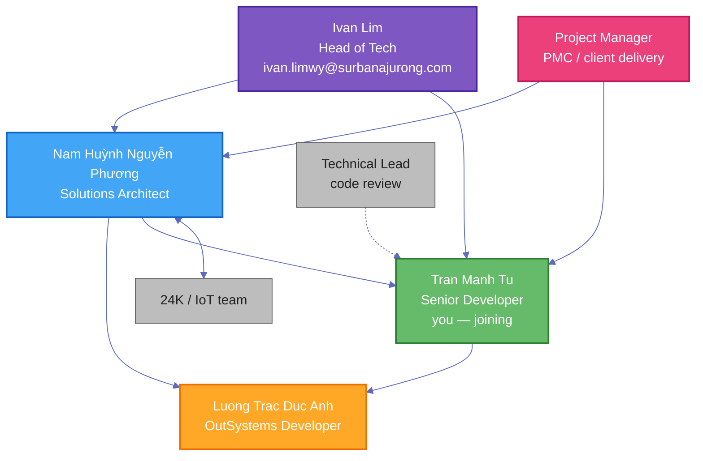

| Role | Person | Location | Since | Cert / highlight |
|------|--------|----------|-------|------------------|
| **Head of Tech** | Ivan Lim | SJ | — | Interview lead |
| **Solutions Architect** | Nam Huỳnh Nguyễn Phương | Da Nang · Remote SG | Dec 2025 | Associate Tech Lead · ex-OutSystems PS TL |
| **OutSystems Developer** | Luong Trac Duc Anh | Hanoi · Remote SG | Mar 2026 | OutSystems Certificates · Forge author |
| **Senior Developer** | **You** (Tran Manh Tu) | — | Joining | 3+ yrs OSE · FM Work Order Hub repo |

---

## 1. Employee profile — Luong Trac Duc Anh

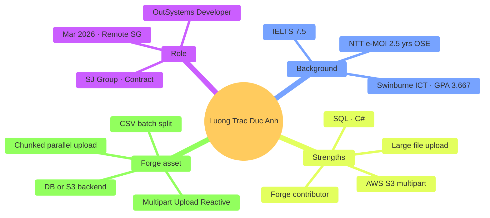

### Experience timeline

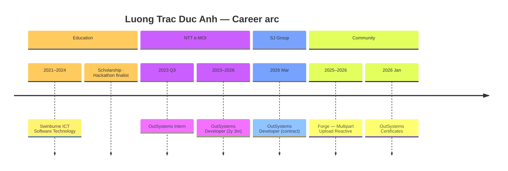

| Attribute | Detail |
|-----------|--------|
| **Current title** | OutSystems Developer @ SJ Group |
| **Tenure at SJ** | ~4 months (contract, remote Singapore) |
| **Prior employer** | NTT e-MOI — 2 yrs 3 mos full-time OSE + 3 mos intern |
| **Education** | B.ICT Software Technology, Swinburne (2021–2024), GPA **3.667** |
| **Languages** | English (professional) · Vietnamese (native) |
| **Certs** | OutSystems Certificates (Jan 2026) · HackerRank C# Basic |
| **Notable project** | **[Multipart Upload Reactive](https://www.outsystems.com/forge/component-overview/21950/multipart-upload-reactive)** — Forge OSS component |

### Technical fingerprint

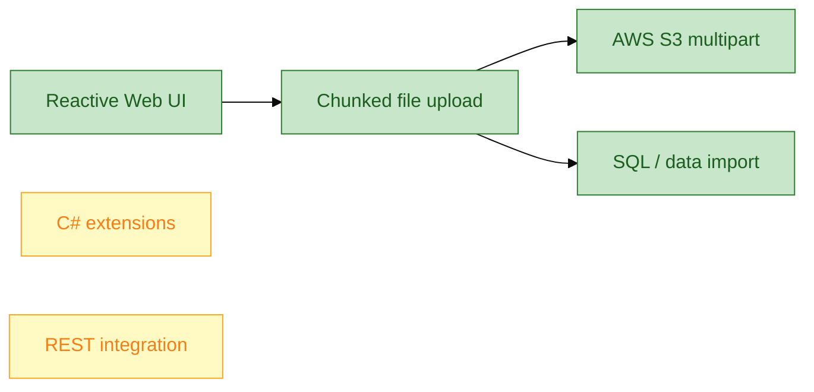

**What Duc Anh likely owns on FM Work Order Hub:**

| Area | Fit | Collaboration tip |
|------|-----|-------------------|
| Reactive UI blocks | High | Pair on upload widgets (inspection photos, CSV asset import) |
| Integration plumbing | Medium | You lead `IntegrationServices`; he implements screen wiring |
| Architecture decisions | Lower | Route through **Nam** (architect) |
| Forge reuse | High | Ask if Multipart Upload fits `FieldInspection` photo batch |

**Conversation starters (build rapport):**

- "Saw your Forge component — did you hit ODC timeout limits before chunking?"
- "NTT e-MOI → SJ — what integration pattern changed most for you?"
- "For FM hub, would you extend Multipart Upload for technician site photos?"

---

## 2. Employee profile — Nam Huỳnh Nguyễn Phương

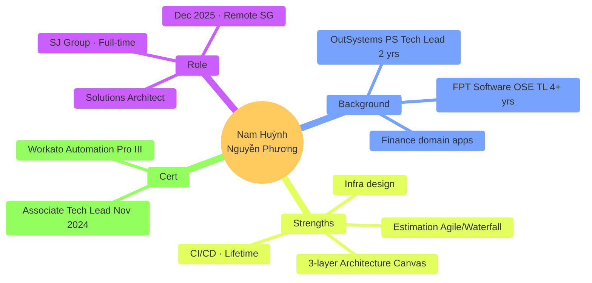

### Experience timeline

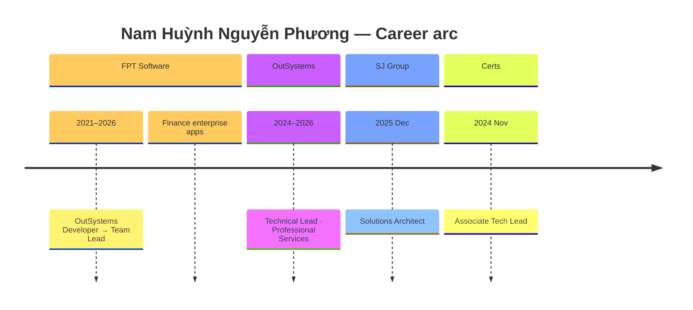

| Attribute | Detail |
|-----------|--------|
| **Current title** | Solutions Architect @ SJ Group |
| **Tenure at SJ** | ~7 months (full-time, remote Singapore) |
| **Prior** | **Technical Lead** @ OutSystems Professional Services (2 yrs) · **Team Lead** @ FPT Software (4+ yrs OSE) |
| **Domain** | **Finance** — enterprise web + mobile, complex business logic |
| **Education** | B.Software Engineering, FPT University |
| **Certs** | **Associate Tech Lead** (Nov 2024) · Workato Automation Pro III |
| **Self-described skills** | 3-layer canvas · API design · CI/CD · infra · estimation · Java · SQL |

### Architecture lens (how Nam thinks)

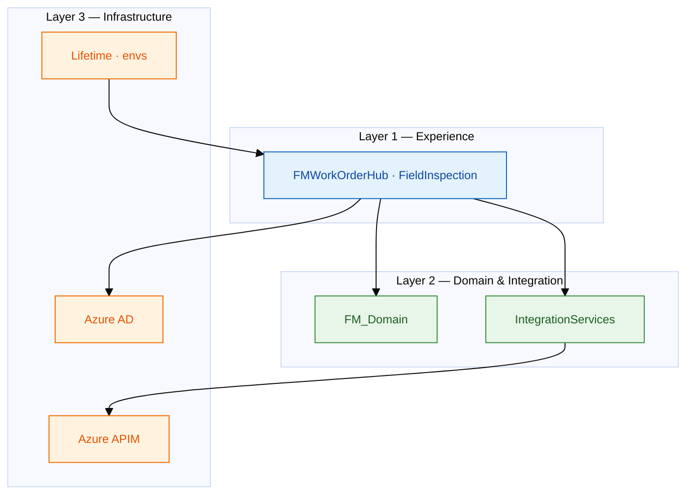

**Your relationship with Nam (Senior Dev ↔ Architect):**

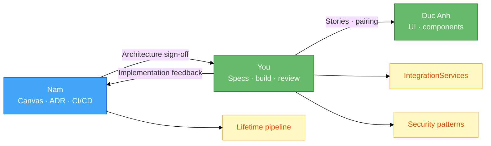

| Topic | Nam leads | You lead | Escalate to Ivan when |
|-------|-----------|----------|----------------------|
| Architecture Canvas | ✓ | Input | Cross-programme dependency |
| REST contract with 24K | Review | ✓ draft spec | API ownership unclear |
| CI/CD / env strategy | ✓ | Implement modules | Budget / license blocker |
| Sprint estimation | Joint | ✓ story breakdown | Scope creep from client |
| Code review standards | ✓ policy | ✓ execution | Repeated P1 escapes |

**Conversation starters:**

- "You came from OutSystems PS — is Lifetime already wired for SJ client envs?"
- "For FM hub, do you want IntegrationServices as a separate foundation app from day one?"
- "Finance patterns at FPT — any maker-checker we should reuse for work order close-out?"

---

## 3. Team dynamics — who does what (RACI)

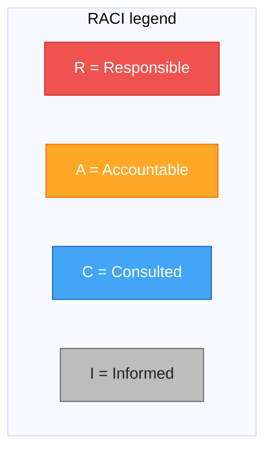

### FM Work Order Hub — RACI matrix

| Activity | Ivan (HoT) | Nam (Arch) | You (Senior) | Duc Anh (Dev) | PM |
|----------|:----------:|:----------:|:------------:|:-------------:|:--:|
| Client scope / milestone | I | C | C | I | **A/R** |
| Architecture Canvas | I | **A/R** | R | C | I |
| Integration spec (24K) | I | C | **A/R** | C | I |
| Foundation modules build | I | C | **A/R** | R | I |
| Reactive UI screens | I | C | C | **R** | I |
| Code review | I | C | **A/R** | R | I |
| UAT / hypercare | I | C | R | R | **A** |
| Lifetime promotion | C | **A/R** | R | I | I |
| Forge / component reuse | I | C | C | **R** | I |

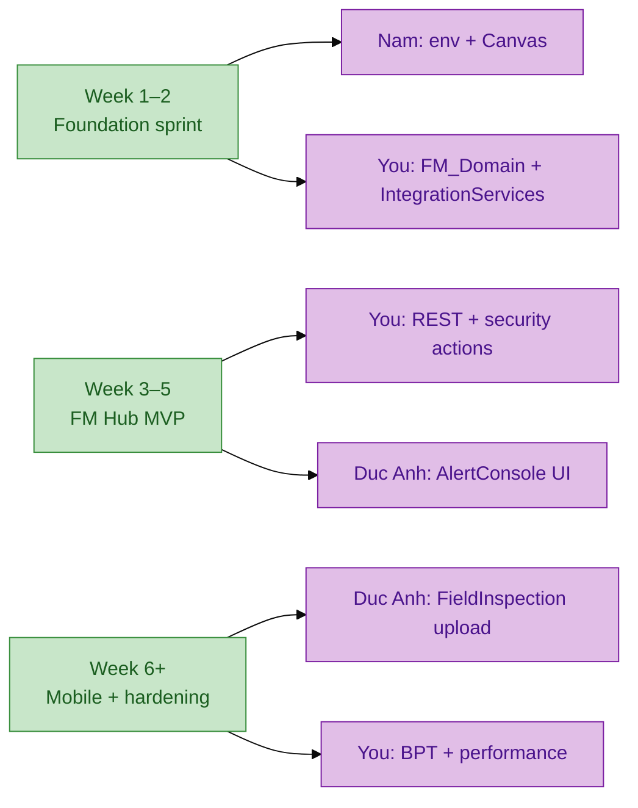

---

## 4. PM collaboration — ceremonies & communication

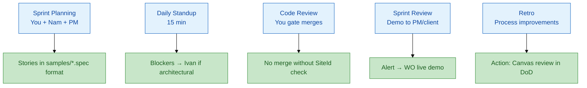

### Senior Dev ↔ PM — language that lands

| PM asks | You answer (structure) |
|---------|------------------------|
| "When can we demo to client?" | "Foundation + AlertConsole = **week 5** if 24K mock ready; need APIM creds for TST." |
| "Why is integration slow?" | "Dependency-first: **IntegrationServices** before UI — prevents rework. Spike done in 2 days." |
| "Can we add client dashboard?" | "P1 scope — yes in phase 3. For this sprint, **read-only WO list** is 3 points." |
| "Risk?" | "24K API contract ownership — need architect + IoT team sign-off by **date**." |

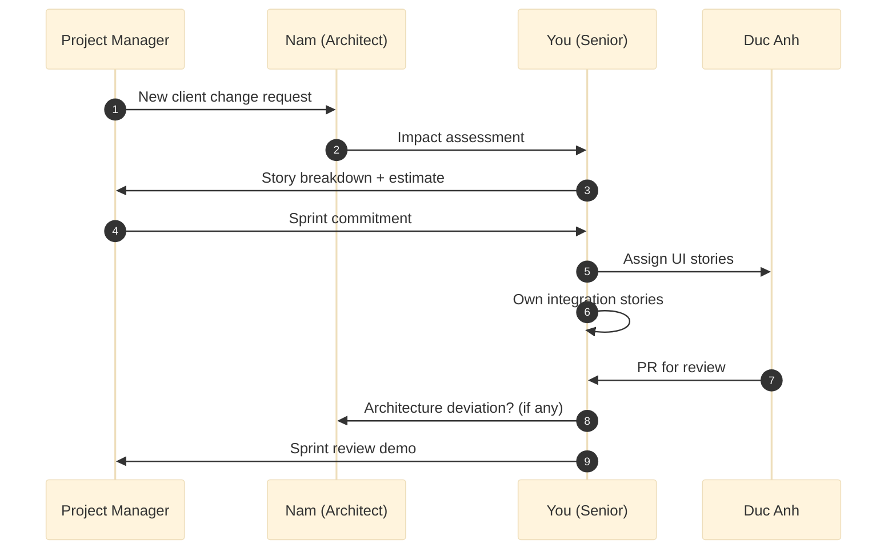

### Definition of Ready / Done (team-aligned)

```mermaid
%%{init: {'theme': 'base'}}%%
flowchart LR
    classDef ready fill:#bbdefb,stroke:#1565c0,color:#0d47a1
    classDef done fill:#a5d6a7,stroke:#2e7d32,color:#1b5e20

    subgraph DOR["Definition of Ready"]
        R1["Spec in samples/ format"]:::ready
        R2["API contract linked"]:::ready
        R3["Roles + SiteId noted"]:::ready
        R4["Nam reviewed if arch touch"]:::ready
    end

    subgraph DOD["Definition of Done"]
        D1["Peer review passed"]:::done
        D2["Mock integration test"]:::done
        D3["UAT script updated"]:::done
        D4["No P1 in Service Center"]:::done
    end

    DOR --> BUILD["Development"] --> DOD
```

---

## 5. Skill complementarity — where you add value

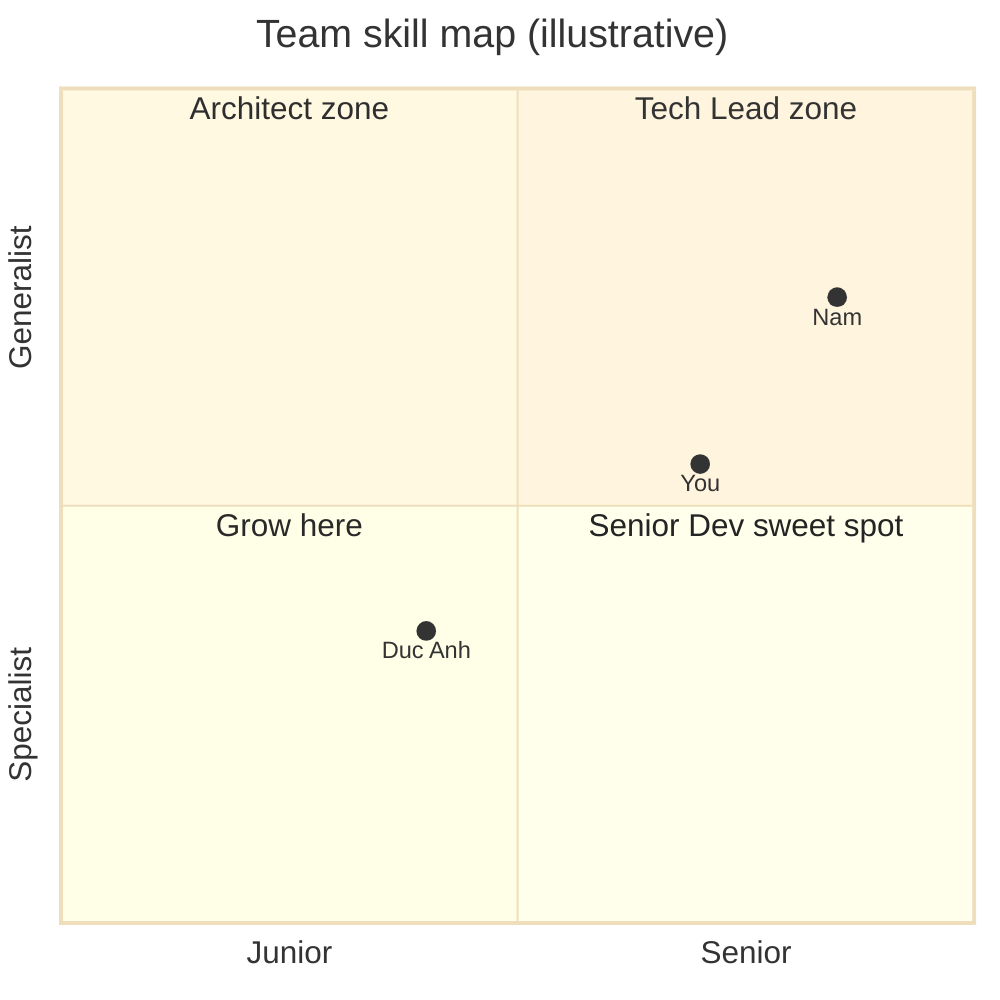

| Dimension | Nam | Duc Anh | You (target positioning) |
|-----------|-----|---------|--------------------------|
| Architecture Canvas | ●●●●● | ●●○○○ | ●●●●○ — implement + challenge |
| CI/CD / Lifetime | ●●●●○ | ●○○○○ | ●●●○○ — promote modules |
| Reactive UI | ●●●○○ | ●●●●○ | ●●●●○ — patterns + review |
| REST / APIM integration | ●●●○○ | ●●○○○ | ●●●●● — **your differentiator** |
| Finance / enterprise SDLC | ●●●●○ | ●●○○○ | ●●●○○ — FM domain learn |
| Forge / components | ●●○○○ | ●●●●● | ●●●○○ — adopt Duc Anh's upload |
| Mentoring | ●●●●○ | ●○○○○ | ●●●●○ — grow Duc Anh |

**One-liner for Ivan / Nam:**

> "Nam shapes the canvas and deployment; Duc Anh accelerates UI and Forge components; I own **integration discipline**, **security patterns**, and **senior code review** so we ship FM hub without reinventing 24K."

---

## 6. OutSystems certification landscape

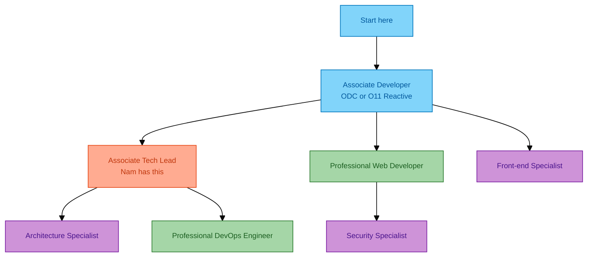

Official reference: [OutSystems Certifications](https://www.outsystems.com/certifications/)

### SJ squad cert context

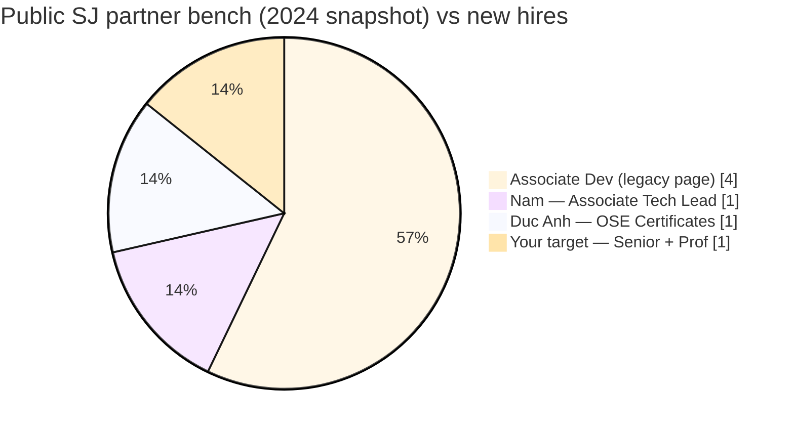

| Person | Known certs | Gap / opportunity |
|--------|-------------|-------------------|
| **Nam** | Associate Tech Lead | Architecture Specialist · Prof DevOps |
| **Duc Anh** | OutSystems Certificates (2026) | Associate Developer formal · Web Specialist |
| **You** | (fill your certs) | **Professional Web Developer** + Security Specialist |
| **SJ partner page** | 2× Assoc Dev, 2× Assoc Trad Web | Bench growing — **you help raise bar** |

---

## 7. Certification prep — Associate Developer (ODC)

**Prerequisite for all advanced paths.** Duc Anh recently completed; use as team baseline.

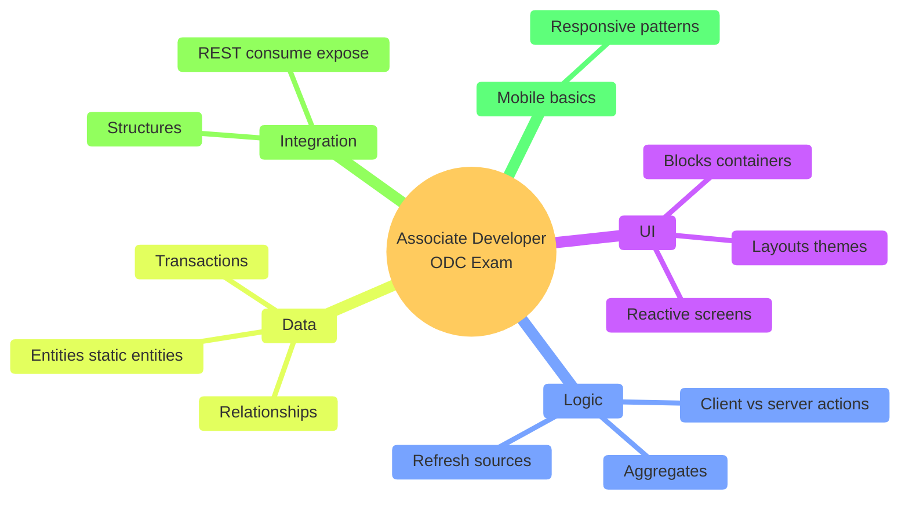

### Topic weight — study plan (4 weeks)

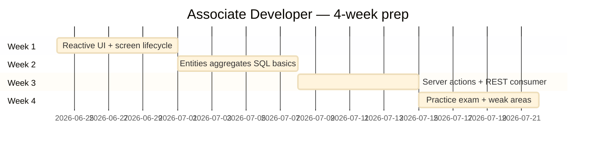

| Topic | Exam focus | FM Hub lab tie-in |
|-------|------------|-------------------|
| Reactive lifecycle | On Initialize, events | `AlertConsole` screen |
| Aggregates | Filters, joins, pagination | `WorkOrderList` 100k rows |
| Server actions | Validation, exceptions | `CreateWorkOrderFromAlert` |
| REST | Consume API, map structures | `GetOpenAlerts24K` |
| Security | Roles, screen checks | `FM_Supervisor` vs `FieldTech` |

**Learn path:** [OutSystems Learn](https://learn.outsystems.com/) → Associate Developer (ODC)

---

## 8. Certification prep — Associate Tech Lead (Nam's level)

**Four exam pillars** — even if you don't sit immediately, **Nam will think in these categories**.

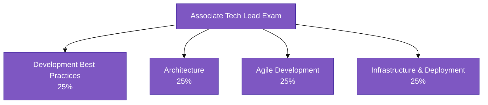

### Pillar 1 — Development best practices

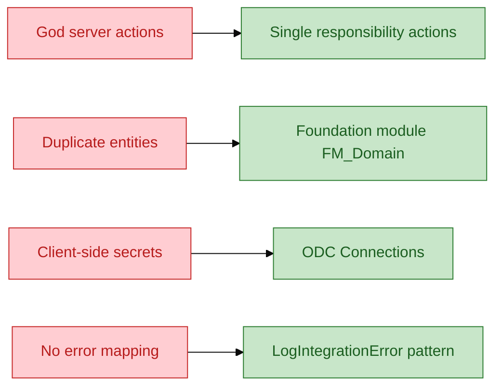

| Study | Key question |
|-------|--------------|
| Module boundaries | When split UI vs foundation? |
| Code review | What blocks a merge? |
| Performance | Pagination vs fetch-all? |
| Reuse | Forge vs internal blocks? |

### Pillar 2 — Architecture

```mermaid
%%{init: {'theme': 'base'}}%%
flowchart TB
    classDef canvas fill:#e3f2fd,stroke:#1565c0,color:#0d47a1

    CANVAS["Architecture Canvas<br/>3 layers"]:::canvas
    L1["End-user apps"]:::canvas
    L2["Core services · integration"]:::canvas
    L3["External systems 24K OMNI AD"]:::canvas
    CANVAS --> L1 --> L2 --> L3
```

| Exam concept | FM Hub example |
|--------------|----------------|
| Layer separation | `FMWorkOrderHub` never calls 24K directly |
| Coupling | UI depends on `IntegrationServices` interface |
| Scalability | Stateless server actions; paginated aggregates |
| Extensibility | New campus = new SiteId, same modules |

### Pillar 3 — Agile development

```mermaid
%%{init: {'theme': 'base'}}%%
flowchart LR
    classDef agile fill:#fff9c4,stroke:#f9a825,color:#e65100

    VISION["Product vision"]:::agile
    EPIC["Epic: FM client experience"]:::agile
    STORY["Story: Alert to WO"]:::agile
    TASK["Task: REST wrapper"]:::agile
    VISION --> EPIC --> STORY --> TASK
```

| Topic | Know for exam + PM meetings |
|-------|----------------------------|
| Estimation | Story points; spike for unknown API |
| DoD | Spec, review, test, deploy |
| Technical debt | When to refactor IntegrationServices |
| Stakeholders | PM vs architect vs dev responsibilities |

### Pillar 4 — Infrastructure & deployment

```mermaid
%%{init: {'theme': 'base'}}%%
flowchart LR
    classDef env fill:#b2dfdb,stroke:#00695c,color:#004d40

    DEV["DEV"]:::env --> TST["TST"]:::env --> UAT["UAT"]:::env --> PRD["PRD"]:::env
    DEV -.->|TrueChange| TC["Code review gate"]:::env
    TC -.-> TST
```

| Topic | FM Hub application |
|-------|-------------------|
| Lifetime | Module publish across envs |
| Solution merge | Foundation first, then UI apps |
| Rollback | Hotfix branch strategy |
| Monitoring | Service Center + App Insights |

**Learn path:** [Becoming a Tech Lead](https://www.outsystems.com/learn/paths/17/becoming-a-tech-lead/)

---

## 9. Certification prep — Professional Web Developer (your target)

```mermaid
%%{init: {'theme': 'base'}}%%
mindmap
  root((Professional Web<br/>Developer))
    Advanced UI
      Async patterns
      Performance tuning
      Complex layouts
    Advanced logic
      Caching strategies
      Batch processing
      Error handling patterns
    Data at scale
      Advanced aggregates
      SQL optimization
      Indexes
    Security
      OWASP awareness
      Server-side auth
    Integration
      Complex REST
      Timeouts retries
```

### Study roadmap — 6 weeks

```mermaid
%%{init: {'theme': 'base'}}%%
flowchart TD
    classDef w fill:#e1bee7,stroke:#7b1fa2,color:#4a148c
    classDef lab fill:#c8e6c9,stroke:#388e3c,color:#1b5e20

    W1["Week 1–2<br/>Advanced Reactive"]:::w
    W2["Week 3<br/>Performance + SQL"]:::w
    W3["Week 4<br/>Security Specialist topics"]:::w
    W4["Week 5<br/>Integration patterns"]:::w
    W5["Week 6<br/>Practice tests"]:::w

    W1 --> L1["Lab: lazy load WorkOrderList"]:::lab
    W2 --> L2["Lab: index SiteId+Status"]:::lab
    W3 --> L3["Lab: CheckSitePermission audit"]:::lab
    W4 --> L4["Lab: circuit breaker 24K down"]:::lab
```

| Advanced topic | Exam-style question | Repo practice |
|----------------|---------------------|---------------|
| Async UI | How show progress on long REST? | Loading states on `AlertConsole` |
| Performance | 100k rows — your approach? | `delivery/09-database-persistence.md` |
| Security | UI filter enough? | **No** — server SiteId check |
| Idempotency | Duplicate alerts? | `SourceAlertId` unique constraint |

---

## 10. Certification prep — Architecture & Security specialists

```mermaid
%%{init: {'theme': 'base'}}%%
flowchart TB
    classDef arch fill:#42a5f5,stroke:#1565c0,color:#fff
    classDef sec fill:#ef5350,stroke:#c62828,color:#fff

    subgraph ARCH["Architecture Specialist"]
        A1["Canvas layering"]:::arch
        A2["Module dependencies"]:::arch
        A3["Integration boundaries"]:::arch
        A4["Non-functional reqs"]:::arch
    end

    subgraph SEC["Security Specialist"]
        S1["Auth OIDC Azure AD"]:::sec
        S2["RBAC roles"]:::sec
        S3["Row-level security"]:::sec
        S4["Secrets management"]:::sec
    end

    ARCH --> FM["FM Work Order Hub design"]:::arch
    SEC --> FM
```

### Cross-cert concept map

```mermaid
%%{init: {'theme': 'base'}}%%
flowchart LR
    classDef concept fill:#fff9c4,stroke:#f9a825,color:#e65100

    C1["Foundation module"]:::concept
    C2["SiteId tenant isolation"]:::concept
    C3["REST via APIM"]:::concept
    C4["Audit WorkOrderEvent"]:::concept
    C5["Lifetime CI/CD"]:::concept

    C1 --> ADO["Associate Dev"]
    C1 --> ATL["Tech Lead"]
    C2 --> SEC["Security Spec"]
    C3 --> PWD["Prof Web Dev"]
    C4 --> PWD
    C5 --> ATL
    C1 --> ARCH["Architecture Spec"]
```

---

## 11. Exam day mind map — all certs

```mermaid
%%{init: {'theme': 'base'}}%%
flowchart TD
    classDef check fill:#a5d6a7,stroke:#2e7d32,color:#1b5e20

    START["Exam starts"] --> Q{"Question type?"}
    Q -->|UI| A1["Reactive lifecycle?<br/>Client vs server?"]:::check
    Q -->|Data| A2["Aggregate vs SQL?<br/>Index needed?"]:::check
    Q -->|Arch| A3["Which layer?<br/>Coupling?"]:::check
    Q -->|Agile| A4["Who accountable?<br/>DoD?"]:::check
    Q -->|Infra| A5["Which env?<br/>Lifetime step?"]:::check
    Q -->|Security| A6["Server-side check?<br/>Secrets location?"]:::check
    A1 --> ELIM["Eliminate 2 wrong answers"]
    A2 --> ELIM
    A3 --> ELIM
    A4 --> ELIM
    A5 --> ELIM
    A6 --> ELIM
    ELIM --> FM["Map to FM Hub example"]
    FM --> PICK["Pick best answer"]
```

### Flash cards — cert gold phrases

| Phrase | Meaning |
|--------|---------|
| "Business logic on server" | Never trust client for auth or secrets |
| "Foundation module first" | Entities + integration before UI |
| "Architecture Canvas" | Living map of layers and dependencies |
| "TrueChange" | Controlled merge between envs |
| "Fetch on demand" | Reactive performance pattern |
| "CheckSitePermission" | Row-level security server action |

---

## 12. First 30 days — team integration plan

```mermaid
%%{init: {'theme': 'base'}}%%
gantt
    title Your first 30 days with Nam + Duc Anh
    dateFormat  YYYY-MM-DD
    section Week 1
    Meet Nam — Canvas walkthrough           :w1a, 2026-06-24, 3d
    Meet Duc Anh — Forge + UI norms           :w1b, 2026-06-24, 3d
    Clone FM hub repo · mock API running      :w1c, 2026-06-24, 5d
    section Week 2
    Own IntegrationServices spike             :w2a, after w1c, 5d
    Code review pairing with Duc Anh          :w2b, after w1b, 5d
    section Week 3
    First story merged to TST                 :w3a, after w2a, 5d
    Cert study — Associate Dev refresh        :w3b, after w2a, 7d
    section Week 4
    Sprint demo with PM                       :w4a, after w3a, 2d
    Cert plan agreed with Ivan                :w4b, after w4a, 3d
```

| Day | Action | With whom |
|-----|--------|-----------|
| 1 | Read Nam's Canvas (or draft from `docs/03-to-be-architecture.md`) | Nam |
| 2 | Run `mock-server.js` + ngrok; show Duc Anh | Duc Anh |
| 3 | Agree code review checklist | Nam + you |
| 5 | First PR: `GetOpenAlerts24K` wrapper | You → Nam review |
| 10 | Pair with Duc Anh on `AlertConsole` | Duc Anh |
| 15 | Demo alert → WO to PM | PM + team |
| 30 | Cert exam scheduled (Prof Web or Security) | Ivan |

---

## 13. Questions to ask teammates

### For Nam (Architect)

1. Is the **3-layer canvas** already approved for FM programme, or greenfield?
2. **Lifetime** — do we promote per module or full solution?
3. Who signs **24K API** changes — your team or IoT platform?
4. **Finance patterns** from FPT — reuse for approval workflows?

### For Duc Anh (Developer)

1. **Multipart Upload** — production usage on SJ project yet?
2. Preferred **UI pattern library** — Forge first or internal blocks?
3. What did you wish you'd known in **first month at SJ**?

### For PM

1. Current sprint cadence — **2 or 3 weeks**?
2. Client demo dates for FM hub?
3. UAT owners on SJ side vs client side?

---

## 14. Repo cross-reference

| Need | File |
|------|------|
| Ivan interview prep | [interview-prep-head-of-tech-ivan-sj.md](interview-prep-head-of-tech-ivan-sj.md) |
| Business context | [01-business-context.md](01-business-context.md) |
| To-Be architecture | [03-to-be-architecture.md](03-to-be-architecture.md) |
| All diagrams | [../delivery/12-diagrams-atlas.md](../delivery/12-diagrams-atlas.md) |
| REST spec | [../samples/rest-integration-24k-iot.spec.md](../samples/rest-integration-24k-iot.spec.md) |
| ODC quickstart | [../resources/odc-studio-quickstart.md](../resources/odc-studio-quickstart.md) |
| Legacy cert Q&A | [../archive/interview-prep/interview/02-practice-questions.md](../archive/interview-prep/interview/02-practice-questions.md) |

---

## 15. Quick reference card (screenshot this)

```mermaid
%%{init: {'theme': 'base'}}%%
flowchart TB
    classDef box fill:#e8eaf6,stroke:#3f51b5,color:#1a237e,stroke-width:2px

    subgraph TEAM["SJ OSE Squad"]
        N["Nam = Canvas CI/CD arch"]:::box
        D["Duc Anh = UI Forge upload"]:::box
        Y["You = Integration security review"]:::box
    end

    subgraph CERT["Cert path"]
        C1["Associate Dev — baseline"]:::box
        C2["Tech Lead — Nam's level"]:::box
        C3["Prof Web + Security — yours"]:::box
    end

    subgraph PM["PM rhythm"]
        P1["Spec first samples/"]:::box
        P2["Foundation before UI"]:::box
        P3["Demo Alert to WO"]:::box
    end
```

**Remember:** Align with **Nam** on architecture, **grow Duc Anh** through review and pairing, show **PM** predictable demos, and cert study maps directly to **FM Work Order Hub** labs in this repo.
