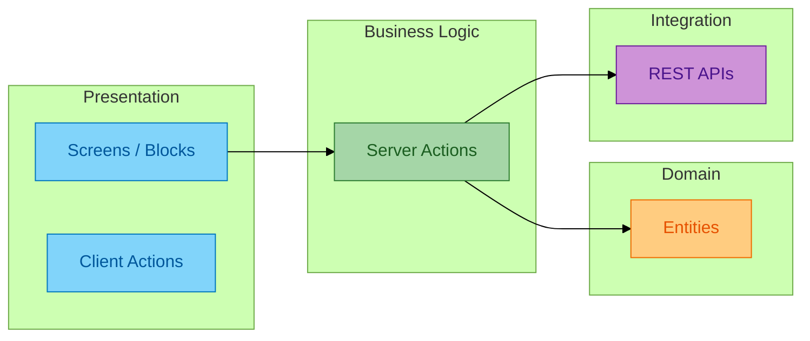
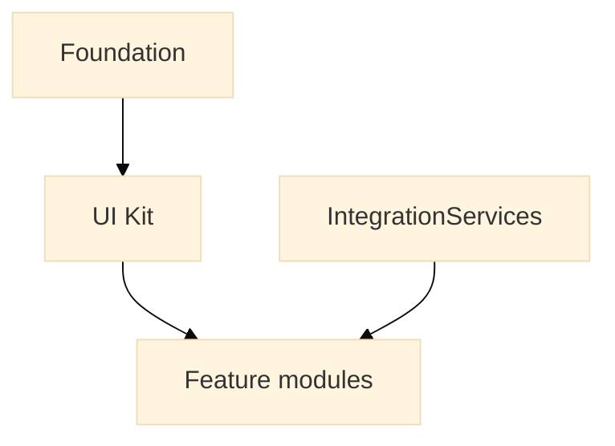

# Reference — OutSystems platform patterns (banking programme)

Reusable patterns from a parallel **banking / client-bid** programme. Same ODC primitives apply to the FM Work Order Hub.

---

## 1. Four-layer architecture

| FM equivalent | Banking equivalent |
|---------------|-------------------|
| `FMWorkOrderHub` | `OnlineBankingApp` |
| `IntegrationServices` (24K) | `IntegrationServices` (core banking) |
| `WorkOrder` entity | `LoanApplication` entity |
| `AlertConsole` | `TransactionList` screen |

---

## 2. Module governance

**Rule (both programmes):** Integration module has no UI — contract changes isolated from screens.

---

## 3. FM mapping

| Banking pattern | FM application |
|-----------------|----------------|
| Maker-checker loan approval | Supervisor assign → close WO |
| Idempotent `ClientRequestId` on POST | Idempotent `AcknowledgeAlert24K` on 409 |
| `AuditLog` entity | `WorkOrderEvent` entity |
| Role `Registered` on screens | `FM_Supervisor` / `FieldTech` roles |
| Core banking REST structures | 24K `Alert` / `AlertList` structures |

Full banking specs: [samples/](samples/) in this folder.
