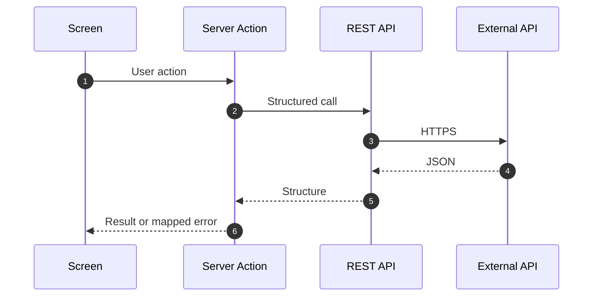

# Reference — Integration patterns (banking programme)

Patterns for REST integration, error mapping, and audit — directly applicable to **24K integration** in FM Work Order Hub.

---

## 1. Integration flow



---

## 2. Idempotency pattern

```text
// Banking: duplicate loan booking
If Response.StatusCode = 409 Then treat as success

// FM equivalent: duplicate alert acknowledge
If Response.StatusCode = 409 Then LogIntegration("ACK_DUPLICATE") ; Return
```

---

## 3. Error mapping table (template)

| HTTP | Action |
|------|--------|
| 400 | Show validation message |
| 401 | "Contact administrator" |
| 404 | "Record not found" |
| 409 | Idempotent success |
| 429 | Retry with backoff |
| 500+ | Generic + correlation ID |

FM 24K mapping: [delivery/07-integration-rest.md](../../delivery/07-integration-rest.md)

---

## 4. Audit trail pattern

```text
Every state change:
  1. Update entity
  2. Insert audit/event record
  3. Optional: notify external system
```

Banking spec: [samples/loan-approval-action-flow.spec.md](samples/loan-approval-action-flow.spec.md)  
FM spec: [samples/work-order-fm-portal.spec.md](../../samples/work-order-fm-portal.spec.md)
