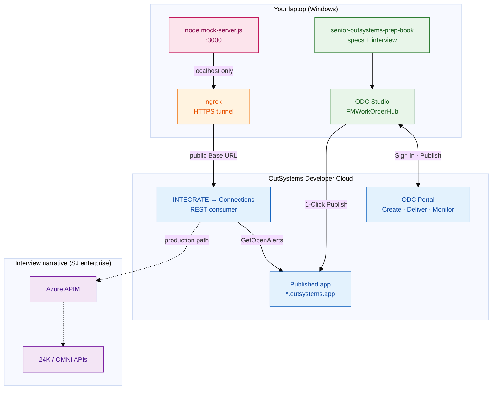
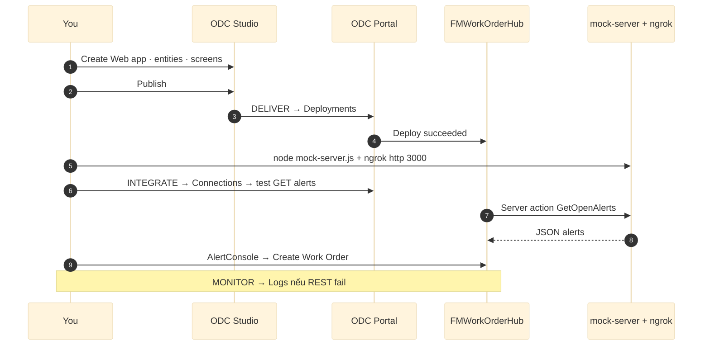
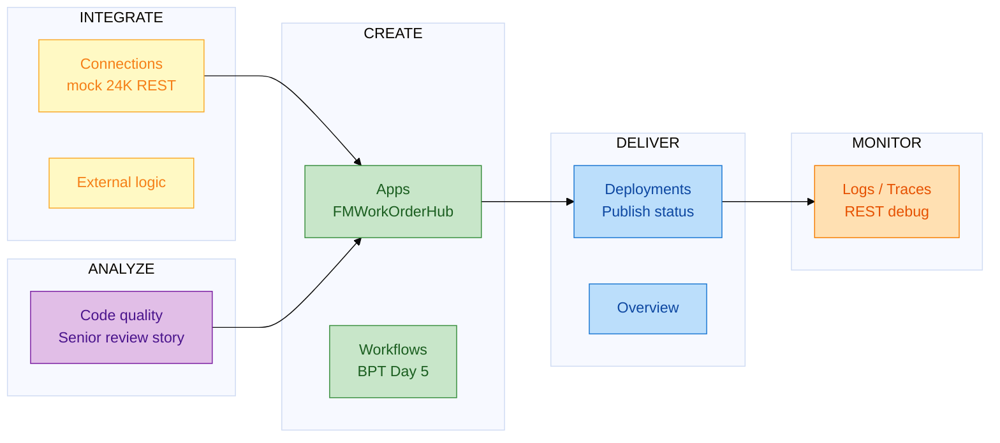
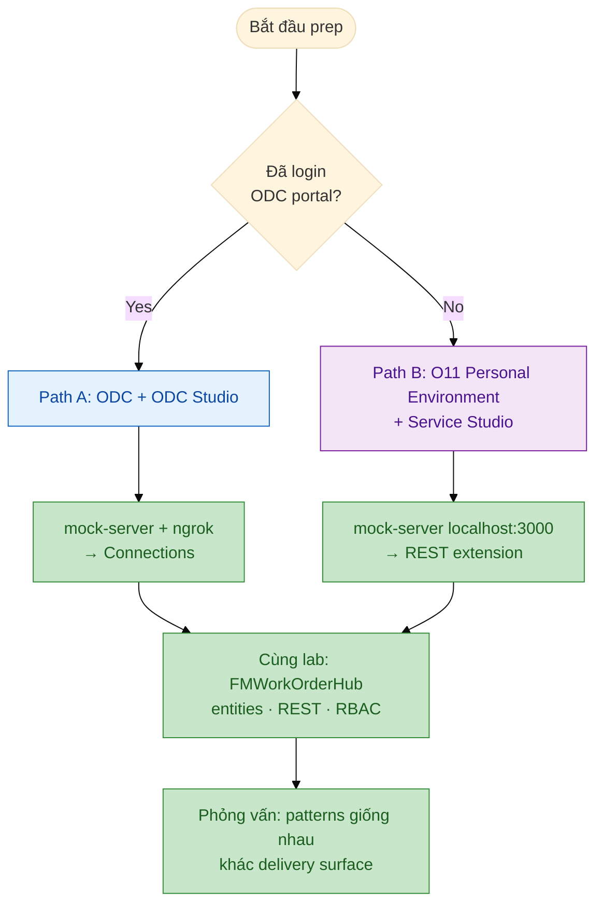
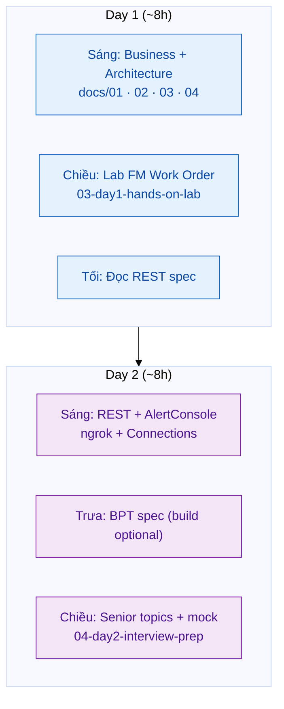
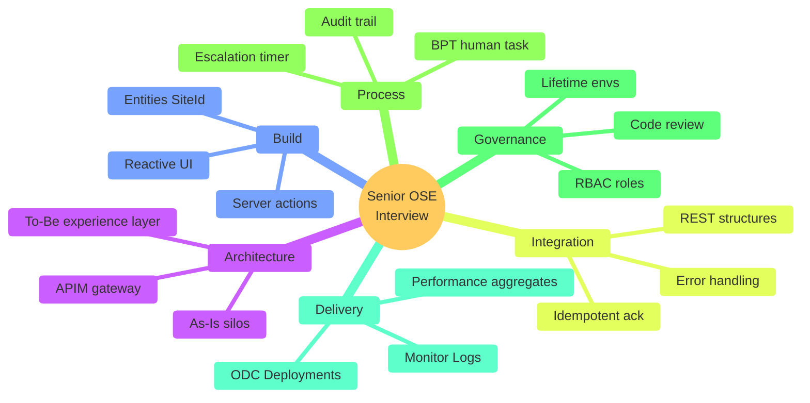
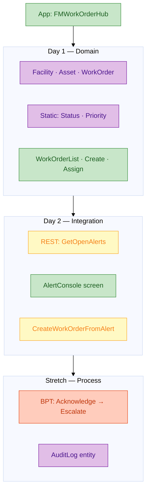
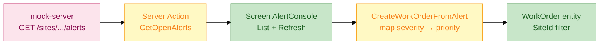
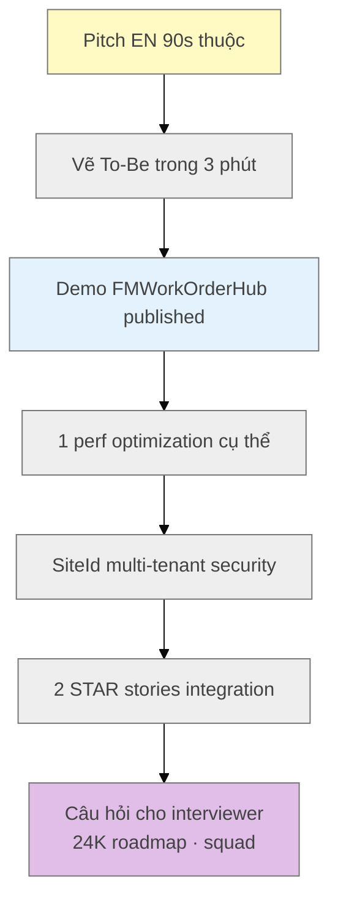

# Dev environment & senior practice — visual guide

**Mục tiêu:** Nhìn một lần hiểu **máy bạn + ODC cloud + mock 24K** và **lộ trình practice** để phỏng vấn Senior OutSystems (SJ / built-environment context).

> Render tốt trên **GitHub**, **VS Code/Cursor** (Markdown preview), **Obsidian**. Dùng theme `base` + `classDef` để màu nhẹ, dễ in.

**Liên quan:** [`odc-studio-quickstart.md`](odc-studio-quickstart.md) · [`free-hands-on.md`](free-hands-on.md) · [`OUTSYSTEMS-SENIOR-Prep-7-Ngay.md`](../OUTSYSTEMS-SENIOR-Prep-7-Ngay.md)

---

## 1. Dev environment — toàn cảnh (ODC prep)

**Ghi nhớ senior (30s):** *"ODC app chạy cloud — REST tới `localhost` không được; dev dùng ngrok hoặc Postman Mock; pattern giống enterprise qua APIM."*

---

## 2. Luồng publish & debug (Day 0 → demo)

---

## 3. ODC Portal map (sidebar bạn thấy)

---

## 4. ODC vs O11 — chọn môi trường practice

| | **ODC (repo ưu tiên)** | **O11 PE (backup)** |
|--|------------------------|---------------------|
| IDE | ODC Studio | Service Studio |
| Admin | Portal | Service Center |
| REST dev | **ngrok / cloud mock** | `localhost:3000` |
| SJ story | App mới, cloud-native | Nhiều partner legacy |

---

## 5. Senior practice plan — 7 ngày (extended)

```mermaid
%%{init: {'theme': 'base', 'themeVariables': {'fontSize': '11px'}}}%%
flowchart LR
    classDef d1 fill:#ffcdd2,stroke:#c62828,color:#b71c1c
    classDef d2 fill:#ffe0b2,stroke:#ef6c00,color:#e65100
    classDef d3 fill:#fff9c4,stroke:#f9a825,color:#f57f17
    classDef d4 fill:#dcedc8,stroke:#689f38,color:#33691e
    classDef d5 fill:#c8e6c9,stroke:#388e3c,color:#1b5e20
    classDef d6 fill:#b2dfdb,stroke:#00796b,color:#004d40
    classDef d7 fill:#bbdefb,stroke:#1976d2,color:#0d47a1

    D1["Day 1<br/>Business + JD<br/>Pitch EN 90s"]:::d1
    D2["Day 2<br/>As-Is / To-Be<br/>Whiteboard 5 min"]:::d2
    D3["Day 3<br/>FM entities + portal<br/>FMWorkOrderLab"]:::d3
    D4["Day 4<br/>REST 24K mock<br/>Alert → WO"]:::d4
    D5["Day 5<br/>BPT escalation<br/>Timer + audit"]:::d5
    D6["Day 6<br/>Perf · Security<br/>Lifetime cheat sheet"]:::d6
    D7["Day 7<br/>Mock interview<br/>STAR + code review"]:::d7

    D1 --> D2 --> D3 --> D4 --> D5 --> D6 --> D7
```

### 5b. Gộp 7 ngày → 2 ngày (gấp)

Chi tiết giờ: [`OUTSYSTEMS-SENIOR-Sach-2-Ngay.md`](../OUTSYSTEMS-SENIOR-Sach-2-Ngay.md) · [`OUTSYSTEMS-SENIOR-Prep-7-Ngay.md`](../OUTSYSTEMS-SENIOR-Prep-7-Ngay.md)

---

## 6. Senior skill pillars — practice có chủ đích

---

## 7. Hands-on stack — bạn build gì trong OutSystems

Specs: [`samples/`](../samples/) · Lab steps: [`03-day1-hands-on-lab.md`](../03-day1-hands-on-lab.md)

---

## 8. REST lab — alert → work order (end-to-end)

---

## 9. Checklist trước phỏng vấn (visual)

Đánh dấu `[x]` trong [`OUTSYSTEMS-SENIOR-Prep-7-Ngay.md`](../OUTSYSTEMS-SENIOR-Prep-7-Ngay.md) khi xong từng mục.

---

## 10. Setup nhanh — thứ tự lệnh

| Bước | Lệnh / hành động |
|------|------------------|
| 1 | Portal → **Download ODC Studio** → Sign in |
| 2 | **Create → App → Web** → `FMWorkOrderHub` → Publish |
| 3 | `cd resources && node mock-server.js` |
| 4 | Terminal 2: `ngrok http 3000` → copy HTTPS URL |
| 5 | **INTEGRATE → Connections** → REST → Base URL = ngrok |
| 6 | Lab theo [`03-day1-hands-on-lab.md`](../03-day1-hands-on-lab.md) |

---

*Educational prep only — not affiliated with OutSystems or Surbana Jurong.*
