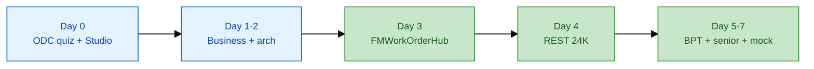

# ODC — Becoming a web developer (official ↔ Senior prep)

**Nguồn:** [learn.outsystems.com](https://learn.outsystems.com) → guided path **Becoming a web developer** (Platform: **ODC**, ~161 lessons / ~11h).

**Mục tiêu path (OutSystems):** Nền tảng web trên ODC — data, UI, logic, auth — và **platform fluency cho AI-assisted development**: hiểu output AI, sửa data model / logic / aggregate khi cần.

Repo này **map** từng module sang lab `FMWorkOrderHub`, REST 24K, BPT — không thay khóa học chính thức.

**Liên quan:** [`odc-studio-quickstart.md`](odc-studio-quickstart.md) · [`03-day1-hands-on-lab.md`](../03-day1-hands-on-lab.md) · [`dev-environment-and-practice-diagrams.md`](dev-environment-and-practice-diagrams.md)

---

## 1. Day 0 — enroll trên Learn

| Bước | Việc |
|------|------|
| 1 | [Guided paths](https://learn.outsystems.com/training/decision/guided-paths) → **Becoming a web developer** (ODC) |
| 2 | Làm *ODC overview* + *Capabilities Quiz* (~15 min) |
| 3 | **Download ODC Studio** → publish `FMWorkOrderHub` — [`odc-studio-quickstart.md`](odc-studio-quickstart.md) |
| 4 | Day 2 REST: `node mock-server.js` + **ngrok** |

Chưa có ODC portal? Path B — O11 PE + Service Studio: [`free-hands-on.md`](free-hands-on.md).

---

## 2. Curriculum chính thức → senior prep (bảng map)

| # | Module (official path) | Learn (~) | Map vào prep SJ |
|---|------------------------|-----------|-----------------|
| | **ODC overview** | | |
| 1 | Getting Started with ODC Overview | 7 min | Day 0 |
| 2 | ODC Capabilities | 3 min | `docs/03-to-be-architecture.md` |
| 3 | ODC Portal Overview | 5 min | `odc-studio-quickstart.md` §1 |
| 4 | ODC Capabilities Quiz | — | Day 0 — pass trước lab |
| | **ODC Studio overview** | | |
| 5 | ODC Studio overview | — | Day 0 — cài IDE |
| | **Foundations** | | |
| 6 | Intro to OutSystems development | — | Day 2 arch — 4-layer app |
| 7 | Modeling data | — | **Day 3** — `entity-model-facility-asset.spec.md` |
| 8 | Modeling Data Relationships | — | Facility → Asset → WorkOrder FK |
| 9 | Data Model Integrity | — | Required fields; WO không xóa khi InProgress |
| | **UI & data on screen** | | |
| 10 | UI Development 101 | — | Day 3 — WorkOrderList, OutSystems UI |
| 11 | Aggregates 101 | — | Day 3 — list aggregate |
| 12 | Building Screens with Data | — | WorkOrderList + Detail bind |
| 13 | Building Web Forms | — | Create / assign forms |
| | **Logic & quality** | | |
| 14 | Logic | — | Day 3 — server actions assign / validate |
| 15 | Form Validations | — | Client + server trên WO create |
| 16 | Advanced Aggregates | — | **Day 6** — SiteId filter, perf |
| | **Security & ops** | | |
| 17 | Role-based security | — | Day 3 + **Day 6** — technician vs FM manager |
| 18 | Debugging in OutSystems | — | **Day 4** — MONITOR → Logs (REST/ngrok) |
| 19 | Pagination and Sorting | — | Day 3 WorkOrderList |
| | **Reactive patterns** | | |
| 20 | Blocks and Events | — | Optional — header block + refresh event |
| 21 | Reactive Programming Model | — | Client vs server actions |
| 22 | Client Variables | — | Session `SiteId` filter |
| 23 | Settings | — | Day 6 — config vs hardcode (senior) |
| 24 | SQL Queries | — | Day 6 + `samples/reference/sql_asset_maintenance_queries.sql` |

**Ngoài Web Developer path (Learn riêng):**

| Topic | Senior day | Repo |
|-------|------------|------|
| Integrate with external systems | **Day 4** | `rest-integration-24k-iot.spec.md` |
| Security (enterprise) | **Day 6** | SiteId, RBAC — `interview/02-practice-questions.md` |
| BPT / Processes | **Day 5** | `iot-alert-escalation-bpt.spec.md` |

---

## 3. AI-assisted dev — senior review checklist

OutSystems nhấn **conversational AI** trong Studio: mô tả screen / entity / logic → sinh draft.

| AI output | Senior checks |
|-----------|---------------|
| Entity model | Multi-tenant `SiteId`, audit, FK integrity |
| Aggregate | Index-friendly filters; no N+1 on alert list |
| Integration action | Timeout, retry, idempotency on acknowledge POST |
| BPT | Escalation timer + audit trail |

**Interview line (30s):** *"I use AI to accelerate scaffolding but review data model integrity, aggregate filters, and integration contracts—the same rigor as senior code review."*

---

## 4. Lộ trình Learn + repo



| Edition | Learn priority | Chi tiết |
|---------|----------------|----------|
| **2 ngày gấp** | Quiz + Modeling §7–9; lab §10–15; REST path + §17–18 | [`OUTSYSTEMS-SENIOR-Sach-2-Ngay.md`](../OUTSYSTEMS-SENIOR-Sach-2-Ngay.md) |
| **7 ngày** | Hoàn thành path dần theo bảng §2 | [`OUTSYSTEMS-SENIOR-Prep-7-Ngay.md`](../OUTSYSTEMS-SENIOR-Prep-7-Ngay.md) |

---

## 5. Checklist interview ready

```text
[ ] ODC Capabilities Quiz passed
[ ] FMWorkOrderHub published (entities + WorkOrderList + server actions)
[ ] Role technician / FM manager tested
[ ] GetOpenAlerts qua Connections + ngrok
[ ] Giải thích Aggregate vs SQL Query (Day 6)
[ ] Pitch EN 90s — README
```

---

## 6. ODC vs O11 Learn path

| | **Becoming a web developer** | **Become a Reactive Web Developer** |
|--|------------------------------|---------------------------------------|
| Platform | **ODC** | Thường **O11** |
| IDE | ODC Studio | Service Studio |
| REST localhost | **Không** — ngrok | PE thường OK |
| Repo prep | **Ưu tiên** nếu đã login ODC | Path B backup |

---

## Links

| Resource | URL |
|----------|-----|
| Guided paths | https://learn.outsystems.com/training/decision/guided-paths |
| Free / Personal Edition | https://www.outsystems.com/low-code-platform/free/ |
| Surbana partner | https://www.outsystems.com/partners/surbana-technologies-pte-ltd/ |
