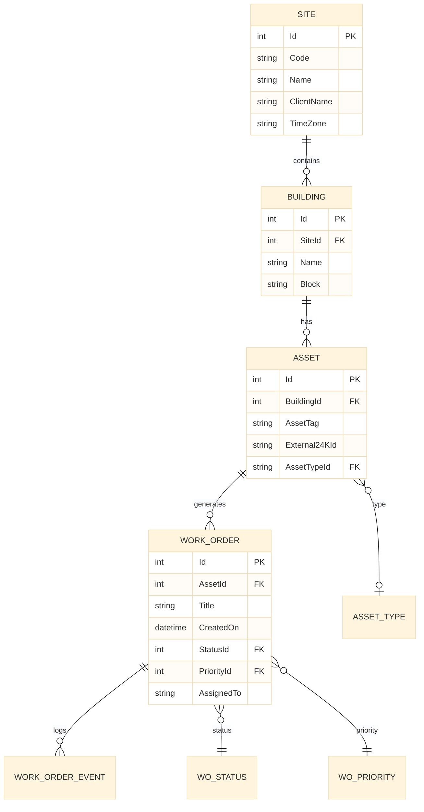

# Engineering spec (no code): Entity model — Facility & Asset

**Module:** `FM_Domain` (foundation — shared entities)  
**Consumers:** `FMWorkOrderHub`, `FieldInspection`, `ClientPortal`

---

## 1. Domain context

SJ FM engagements track **sites** (campus, airport terminal, building), **assets** (AHU, lift, chiller), and **work orders** (corrective/preventive). OutSystems holds **operational subset** — full digital twin stays in **24K**.

---

## 2. Entity relationship diagram



---

## 3. Entities (OutSystems)

### `Site`

| Attribute | Type | Notes |
|-----------|------|-------|
| Id | Site Identifier | Auto |
| Code | Text (20) | Unique — `SIN-CAMPUS-01` |
| Name | Text (150) | |
| ClientName | Text (150) | |
| TimeZone | Text (50) | `Asia/Singapore` |
| IsActive | Boolean | Default True |

### `Building`

| Attribute | Type | Notes |
|-----------|------|-------|
| Id | Building Identifier | Auto |
| SiteId | Site Identifier | FK |
| Name | Text (100) | |
| Block | Text (20) | Optional |

### `Asset`

| Attribute | Type | Notes |
|-----------|------|-------|
| Id | Asset Identifier | Auto |
| BuildingId | Building Identifier | FK |
| AssetTag | Text (50) | Plate on equipment |
| External24KId | Text (50) | Link to 24K asset |
| AssetTypeId | AssetType Identifier | FK static |
| LastServiceOn | Date | |

### `WorkOrder`

| Attribute | Type | Notes |
|-----------|------|-------|
| Id | WorkOrder Identifier | Auto |
| AssetId | Asset Identifier | FK |
| Title | Text (200) | |
| Description | Text (2000) | |
| StatusId | WOStatus Identifier | FK static |
| PriorityId | WOPriority Identifier | FK static |
| AssignedTo | Text (100) | User name or email |
| SourceAlertId | Text (50) | From 24K if auto-created |
| CreatedOn | Date Time | Default Current |
| DueOn | Date Time | |
| CreatedBy | Text | Audit |

### `WorkOrderEvent` (audit trail)

| Attribute | Type | Notes |
|-----------|------|-------|
| Id | Event Identifier | Auto |
| WorkOrderId | WorkOrder Identifier | FK |
| EventType | Text (50) | CREATED, ASSIGNED, STATUS_CHANGE |
| EventOn | Date Time | |
| EventBy | Text | |
| Notes | Text (500) | |

---

## 4. Static entities

### `WOStatus`

| Id | Label | IsClosed |
|----|-------|----------|
| 1 | Open | No |
| 2 | In Progress | No |
| 3 | Pending Parts | No |
| 4 | Completed | Yes |
| 5 | Cancelled | Yes |

### `WOPriority`

| Id | Label | SLA hours |
|----|-------|-----------|
| 1 | Critical | 4 |
| 2 | High | 24 |
| 3 | Medium | 72 |
| 4 | Low | 168 |

### `AssetType`

| Id | Label |
|----|-------|
| 1 | HVAC |
| 2 | Lift |
| 3 | Fire system |
| 4 | Electrical |

---

## 5. Indexes (SQL — apply on extension DB or document for DBA)

See [`reference/sql_asset_maintenance_queries.sql`](reference/sql_asset_maintenance_queries.sql) — indexes:

- `IX_WorkOrder_AssetId_StatusId`
- `IX_WorkOrder_CreatedOn`
- `IX_Asset_External24KId`

---

## 6. Security — row-level filter

Every aggregate **must** filter:

```text
Site.Id = GetSiteIdForUser()
```

`GetSiteIdForUser()` — server action: map `Users.Username` → `SiteUser` mapping entity (add in security module).

---

## 7. Seed data (Personal Environment)

| Site | Building | Asset | WorkOrder |
|------|----------|-------|-----------|
| NTU Campus | Block 57 | AHU-B57-01 | WO-001 Open Critical |
| Changi T3 | T3 | Lift-L12 | WO-002 In Progress High |

---

## 8. Acceptance criteria (interview demo)

- [ ] List work orders filtered by site  
- [ ] Create work order linked to asset  
- [ ] Status dropdown from static entity  
- [ ] Audit event on status change  
