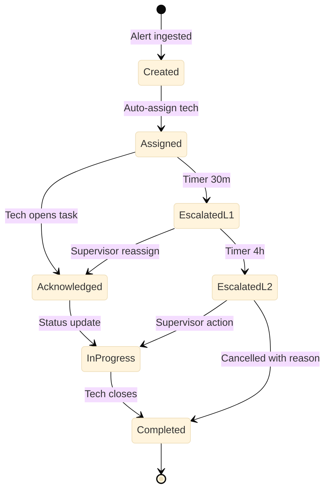

# Engineering spec (no code): IoT alert escalation — BPT

**Application:** `FMWorkOrderHub`  
**Process:** `AlertEscalationProcess` (Business Process Technology)

---

## 1. Business scenario

24K raises **CRITICAL** temperature alert → OutSystems auto-creates work order → assigns field technician → if **not acknowledged within 30 minutes**, escalate to FM supervisor → if **not in progress within 4 hours**, notify client liaison.

**JD mapping:** BPT, timers, Agile story with acceptance criteria, production troubleshooting.

---

## 2. Process diagram

---

## 3. Trigger

### `StartAlertEscalationProcess`

**Called from:** `CreateWorkOrderFromAlert` server action when Priority = Critical.

| Input | Type |
|-------|------|
| WorkOrderId | Identifier |
| AlertId | Text |
| AssignedTo | Text |

---

## 4. BPT activities

| Activity | Type | Details |
|----------|------|---------|
| Wait for Acknowledge | Human Activity | Assignee = AssignedTo; form: Confirm + optional note |
| Escalation Timer L1 | Wait | 30 minutes — **configurable Site setting** |
| Notify Supervisor | Automated | Server action SendEscalationEmail |
| Wait for Progress | Human Activity | Supervisor or tech — mark In Progress |
| Escalation Timer L2 | Wait | 4 hours |
| Notify Client Liaison | Automated | Email + optional Teams webhook |
| Close Process | End | On WO status Completed/Cancelled |

---

## 5. Human activity UI (task form)

**Fields:**

- Work Order summary (read-only)  
- Asset location, alert message  
- Buttons: **Acknowledge**, **Reassign**, **Mark In Progress**  
- Comment (required on Reassign)  

**UX:** Mobile-friendly — technicians use phone on site.

---

## 6. Server actions supporting BPT

### `CreateWorkOrderFromAlert`

1. Map alert → Asset via `External24KId`  
2. Create WO — Priority Critical, SourceAlertId  
3. `AcknowledgeAlert24K` (optional async if 24K down)  
4. Start BPT  
5. Log audit  

### `SendEscalationEmail`

- Template per escalation level  
- Include deep link to WorkOrderDetail  

### `CancelEscalationProcess`

- Called when WO closed early — terminate BPT instance  

---

## 7. Exception paths (troubleshooting)

| Issue | Symptom | Resolution |
|-------|---------|------------|
| BPT stuck | Timer not firing | Check Service Center timers; timezone Site config |
| Duplicate BPT | Two alerts same asset | Dedupe: query open WO same SourceAlertId |
| User not found | Task unassigned | Fallback group `FM_Supervisors` |
| 24K ack fails | WO exists, alert OPEN in 24K | Retry queue; manual reconcile screen |

---

## 8. Agile story example (Scrum)

**Story:** As an FM supervisor, I want unacknowledged critical alerts to escalate automatically so SLAs are met.

**Acceptance criteria:**

- Given critical alert, When WO created, Then BPT starts  
- Given tech does not ack in 30m, When timer fires, Then supervisor notified  
- Given WO completed, When status = Completed, Then BPT ends  

**Tasks:** Entity, server actions, BPT, email template, unit tests on dedupe.

---

## 9. Code review checklist (Senior)

- [ ] No hardcoded timer — Site configuration entity  
- [ ] Idempotent alert → WO creation  
- [ ] Process cancelled on terminal WO status  
- [ ] Audit events for escalation steps  
- [ ] Email failures logged, do not block process  

---

## 10. Current vs future

| | Current | Future (BPT) |
|--|---------|--------------|
| Escalation | Phone tree / manual | Automated timers |
| Audit | Email threads | WorkOrderEvent + BPT history |
| SLA tracking | Spreadsheet | Dashboard from BPT metrics |
| Change SLA | Rebuild custom code | Update Site config row |
