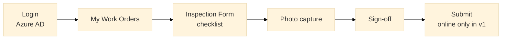

# Engineering spec (no code): Field inspection mobile

**Application:** `FieldInspection` (Mobile / Reactive optimized for phone)  
**Users:** Field technicians, QA inspectors on construction or FM sites

---

## 1. Scenario (SJ context)

Technician performs **scheduled inspection** on asset (lift, fire panel, structural item) at airport or campus — capture checklist, photos, GPS, sign-off. Data links to work order or standalone inspection record; optional sync to 24K asset history.

---

## 2. Screen flow

---

## 3. Entities (extend FM_Domain)

### `Inspection`

| Field | Type |
|-------|------|
| Id | Identifier |
| WorkOrderId | FK optional |
| AssetId | FK |
| InspectorUser | Text |
| InspectedOn | Date Time |
| Result | Text PASS/FAIL/PARTIAL |
| Latitude | Decimal |
| Longitude | Decimal |
| Notes | Text |

### `InspectionItem`

| Field | Type |
|-------|------|
| Id | Identifier |
| InspectionId | FK |
| ChecklistItemId | FK static |
| Answer | Text OK/NA/FAIL |
| Comment | Text |

### `InspectionPhoto`

| Field | Type |
|-------|------|
| Id | Identifier |
| InspectionId | FK |
| BlobUrl | Text — Azure Blob after upload |
| TakenOn | Date Time |

---

## 4. Checklist (static entity `ChecklistItem`)

Per `AssetType` — e.g. Lift: door operation, emergency phone, certificate expiry.

---

## 5. Client actions & JS extension

### Geofence validation (optional)

Use [`reference/js_geofence_validation.js`](reference/js_geofence_validation.js) — verify inspector within 200m of building coordinates before sign-off.

### Photo upload

1. Client action compress image  
2. Server action upload to Azure Blob via REST extension  
3. Store BlobUrl on InspectionPhoto  

---

## 6. Offline scope (v1 vs v2 — interview answer)

| Version | Capability |
|---------|------------|
| **v1 (MVP)** | Online-only; show friendly message if no network |
| **v2** | Local storage sync pattern — OutSystems mobile offline limited; may use PWA + queue |

**Senior honesty:** Full offline on O11 mobile requires careful design — propose v1 online for SJ pilot sites with good Wi-Fi.

---

## 7. Integration

On submit PASS:

- Update linked WorkOrder status → Completed  
- POST inspection summary to 24K `/assets/{id}/inspections` (future API)  

---

## 8. Security

- Inspector only sees **assigned** work orders  
- Photos — SAS token, expire 24h for client portal thumbnails  
- GPS — consent banner on first use  

---

## 9. Performance

- Max 5 photos per inspection, 2MB each after compress  
- Checklist lazy load per asset type  
- Submit batch insert InspectionItems in one server action  

---

## 10. Current vs future

| | Current (As-Is) | Future |
|--|-----------------|--------|
| Capture | Paper checklist | Mobile app |
| Photos | WhatsApp / email | Blob + linked to asset |
| Location | Not captured | Geofence validation |
| Client report | Manual Word | Auto PDF from inspection (Forge) |
