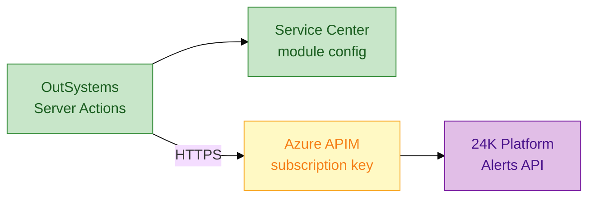

# Engineering spec (no code): REST integration — 24K IoT alerts

**Module:** `IntegrationServices` (foundation — no UI)  
**Consumers:** `FMWorkOrderHub`, `AlertConsole` lab

---

## 1. Integration landscape



---

## 2. Environment endpoints

| Env | Base URL | Auth |
|-----|----------|------|
| DEV | `https://apim-dev.sj.internal/24k/v1` | OAuth2 client credentials |
| TST | `https://apim-tst.sj.internal/24k/v1` | OAuth2 client credentials |
| PRD | `https://apim.sj.internal/24k/v1` | OAuth2 + IP allowlist |

**Prep mock API:**

| Runtime | Base URL |
|---------|----------|
| **ODC (cloud)** | `https://xxxx.ngrok-free.app` — `node mock-server.js` + ngrok |
| **O11 PE** | `http://localhost:3000` |

See `resources/mock-24k-alerts.json` + `resources/odc-studio-quickstart.md` §5.

---

## 3. REST API methods (OutSystems REST consumed)

### `GET /sites/{siteCode}/alerts`

**Query params:** `status=OPEN`, `severity=CRITICAL|HIGH`, `since=ISO8601`

**Response structure `AlertList`:**

| Field | Type | Example |
|-------|------|---------|
| alerts | Alert[] | |
| totalCount | Integer | 42 |

**Structure `Alert`:**

| Field | Type | Example |
|-------|------|---------|
| alertId | Text | ALT-2024-8891 |
| siteCode | Text | SIN-CAMPUS-01 |
| assetExternalId | Text | 24K-AHU-991 |
| sensorType | Text | TEMPERATURE |
| severity | Text | CRITICAL |
| message | Text | Chiller temp > threshold |
| raisedAt | Date Time | |
| status | Text | OPEN / ACKNOWLEDGED |

### `POST /alerts/{alertId}/acknowledge`

**Body `AckRequest`:**

| Field | Type |
|-------|------|
| acknowledgedBy | Text |
| workOrderRef | Text |
| clientRequestId | Text (UUID) |

**Response `AckResponse`:**

| Field | Type |
|-------|------|
| alertId | Text |
| status | Text |
| acknowledgedAt | Date Time |

### `GET /assets/{externalId}`

**Response `Asset24K`:** assetTag, buildingName, lastReading, coordinates.

---

## 4. Server actions (IntegrationServices)

### `GetOpenAlerts`

```text
Input: SiteCode, Severity (optional)
Output: AlertList
Steps:
  1. Build URL from site config
  2. REST GET with timeout 30s
  3. If 401 → log + raise IntegrationException
  4. If 404 → empty list
  5. Deserialize to AlertList
  6. Return
```

### `AcknowledgeAlert24K`

```text
Input: AlertId, WorkOrderId, UserName
Output: Success Boolean
Steps:
  1. Generate clientRequestId (UUID server action)
  2. POST acknowledge
  3. On 409 (already ack) → treat as success idempotent
  4. Log correlation id
```

### `GetAssetFrom24K`

- Cache result 15 minutes per asset id (server cache).

---

## 5. Error mapping

| HTTP | 24K code | User message |
|------|----------|--------------|
| 400 | INVALID_SITE | "Site configuration error — contact admin" |
| 401 | AUTH_FAILED | "Integration auth failed" (log detail) |
| 404 | NOT_FOUND | Empty / "Asset not in 24K" |
| 429 | RATE_LIMIT | "System busy — retry in a minute" |
| 500 | INTERNAL | "24K unavailable — work order saved locally" |
| Timeout | — | Same as 500; **do not lose WO** |

**Senior pattern:** On 500 during acknowledge, **still save work order**; queue retry via Timer or BPT.

---

## 6. Security

- Store `ClientId`, `ClientSecret`, `SubscriptionKey` in **module configuration** — not hardcoded  
- No alert payload logged at INFO if contains PII  
- APIM enforces TLS 1.2+  

---

## 7. Testing (Personal Environment)

```bash
cd interview/surbana-jurong-outsystems-senior/resources
npx json-server --watch mock-24k-alerts.json --port 3000
```

Test cases:

| # | Call | Expected |
|---|------|----------|
| 1 | GET alerts OPEN | List ≥ 1 |
| 2 | POST acknowledge | 200 + status ACK |
| 3 | GET invalid site | 404 → empty |
| 4 | POST duplicate ack | 409 → idempotent success |

---

## 8. Documentation deliverable (JD)

For each method maintain in Confluence:

- Sample request/response JSON  
- Error codes  
- SLA (p99 latency)  
- Owner team (24K platform squad)  
- Change log  

---

## 9. Current vs future integration

| | Current (As-Is) | Future (this spec) |
|--|-----------------|---------------------|
| Contract | Undocumented REST | Versioned `/v1/` + APIM |
| Auth | Shared API key in config file | OAuth2 + Key Vault |
| Error handling | Screen-level try/catch inconsistent | Central `IntegrationException` handler |
| Idempotency | None | `clientRequestId` on ack |
| Observability | Email on failure | App Insights + correlationId |
