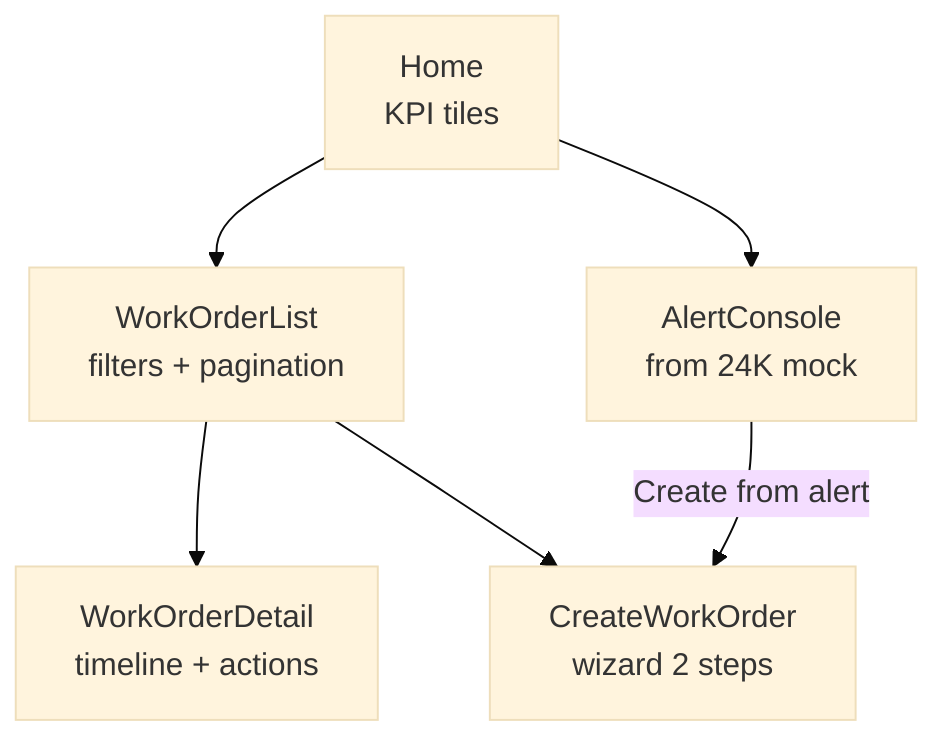

# Engineering spec (no code): FM Work Order Portal

**Application:** `FMWorkOrderHub` (Reactive Web)  
**Foundation:** `FM_Domain`, `IntegrationServices`

---

## 1. User roles

| Role | Permissions |
|------|-------------|
| `FM_Supervisor` | CRUD work orders, assign, close |
| `FieldTech` | View assigned, update status, add notes |
| `ClientReadOnly` | View open/completed for their site only |
| `Admin` | Site config, user mapping |

---

## 2. Screen map



---

## 3. Screen: WorkOrderList

### UI elements

- Filters: Status, Priority, Building, AssignedTo, Date range  
- Table: Id, Title, AssetTag, Priority badge, Status, AssignedTo, DueOn  
- Pagination: 20 rows — **server-side** aggregate  
- Actions: New Work Order, Export CSV (optional Forge)

### Aggregate `GetWorkOrders`

```text
Source: WorkOrder
Joins: Asset, Building, Site, WOStatus, WOPriority
Filters:
  - Site.Id = GetSiteIdForUser()
  - optional filter inputs
Sort: Priority asc, CreatedOn desc
Max records: StartIndex / MaxRecords pagination
```

---

## 4. Server actions

### `CreateWorkOrder`

| Input | Type |
|-------|------|
| AssetId | Asset Identifier |
| Title | Text |
| Description | Text |
| PriorityId | Identifier |
| AssignedTo | Text |

**Logic:**

1. Validate asset belongs to user's site  
2. Insert `WorkOrder` — Status = Open  
3. Insert `WorkOrderEvent` — CREATED  
4. If `SourceAlertId` provided → call `AcknowledgeAlert24K`  
5. Return WorkOrder Id  

### `AssignWorkOrder`

- Update `AssignedTo`, event ASSIGNED  
- Optional: notify via email extension  

### `ChangeWorkOrderStatus`

- Validate transition (e.g. cannot reopen Completed without supervisor)  
- Update StatusId, log event  
- If Completed → set `CompletedOn`  

---

## 5. Validations (senior talking point)

| Rule | Layer |
|------|-------|
| Title required, max 200 | Server action |
| Asset must exist in site | Server action |
| ClientReadOnly cannot change status | Check role in action |
| DueOn >= Today for new Critical | Server action |

---

## 6. UI/UX best practices (JD)

- Priority color badges (Critical = red) — theme tokens  
- Mobile-responsive list (Reactive breakpoints)  
- Empty state: "No open work orders" + CTA  
- Loading feedback on slow REST calls  
- Error messages from `ErrorHandler` — no stack trace to user  

---

## 7. Performance

- Do **not** load Description in list aggregate  
- Use **Data Fetch** on detail screen only  
- Cache `WOStatus` / `WOPriority` static lists client-side  

---

## 8. Acceptance criteria

- [ ] Supervisor creates and assigns work order  
- [ ] FieldTech marks In Progress → Completed  
- [ ] ClientReadOnly sees list but no edit buttons  
- [ ] Audit trail visible on detail screen  
- [ ] List loads < 2s with 500 seed work orders (PE test)  

---

## 9. Current vs future (JD solution evolution)

| Aspect | Current (As-Is silo) | Future (this app) |
|--------|----------------------|-------------------|
| UI | Legacy FM web / Excel | Reactive OutSystems |
| Alert intake | Manual email | AlertConsole + auto WO |
| Integration | Ad-hoc | Integration Services |
| Reuse | None | Shared `FM_Domain` module |
| Deploy | Per client custom | Lifetime promote + config by Site |
